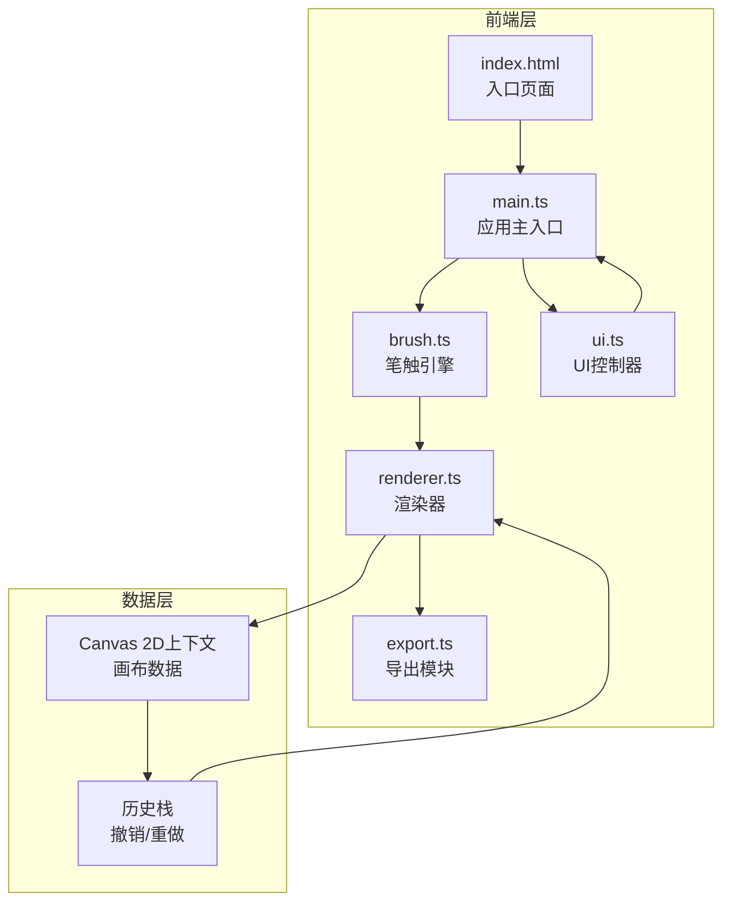

## 1. 架构设计



### 数据流向

1. 用户输入（鼠标/触控事件） → `main.ts` 接收并转发
2. `main.ts` → `brush.ts`：传递鼠标位置、速度、压感参数
3. `brush.ts` → `renderer.ts`：输出笔触渲染指令（宽度、透明度、扩散参数）
4. `renderer.ts` → Canvas：绘制笔迹、飞白、墨点粒子
5. `renderer.ts` → `export.ts`：提供画布数据用于导出
6. `ui.ts` → `main.ts`：返回工具参数（笔刷大小、墨色、纹理）

## 2. 技术说明

- 前端：TypeScript + Canvas 2D API + Vite
- 初始化工具：Vite
- 后端：无（纯前端应用）
- 数据库：无（状态保存在内存中）

## 3. 路由定义

| 路由 | 用途 |
|------|------|
| / | 创作页面（单页应用，无路由切换） |

## 4. 文件结构

```
├── package.json
├── vite.config.js
├── tsconfig.json
├── index.html
└── src/
    ├── main.ts        # 应用主入口，初始化画布和事件绑定
    ├── brush.ts       # 书法笔触引擎
    ├── renderer.ts    # 渲染器
    ├── export.ts      # 导出模块
    └── ui.ts          # UI控制器
```

### 文件间调用关系

| 文件 | 调用 | 被调用 |
|------|------|--------|
| main.ts | brush.ts, ui.ts, renderer.ts | index.html |
| brush.ts | renderer.ts | main.ts |
| renderer.ts | export.ts | brush.ts, main.ts |
| export.ts | 无 | renderer.ts, main.ts |
| ui.ts | 无 | main.ts |

## 5. 核心算法设计

### 5.1 笔触计算（brush.ts）

- **宽度计算**：`width = baseSize * (1 - speed / maxSpeed)`，范围1-20像素
- **透明度计算**：`alpha = 0.3 + (pressure * 0.7)`，范围30%-100%
- **水扩散**：笔触绘制后0.2秒内，在边缘随机方向产生扩散，半径3-8像素
- **飞白**：笔划末端墨量减少时，随机生成飞白点，密度随速度增加（最多15个）

### 5.2 渲染策略（renderer.ts）

- 双Canvas架构：底层Canvas存储已完成笔迹，顶层Canvas用于实时预览
- 笔迹使用贝塞尔曲线平滑连接
- 飞白效果：在笔划末端随机散布未连接墨点
- 墨点粒子：在笔触周围生成随机粒子，模拟墨迹飞溅

### 5.3 撤销/重做（ui.ts）

- 历史栈保存Canvas ImageData快照
- 最多50步，超出时丢弃最早的记录
- 每次mouseup时保存一个快照

### 5.4 导出策略（export.ts）

- PNG导出：创建临时Canvas，按目标分辨率缩放绘制
- SVG导出：记录笔触路径数据，生成SVG path元素
- 分片编码避免主线程阻塞
- 导出期间显示旋转墨点圆环加载动画
