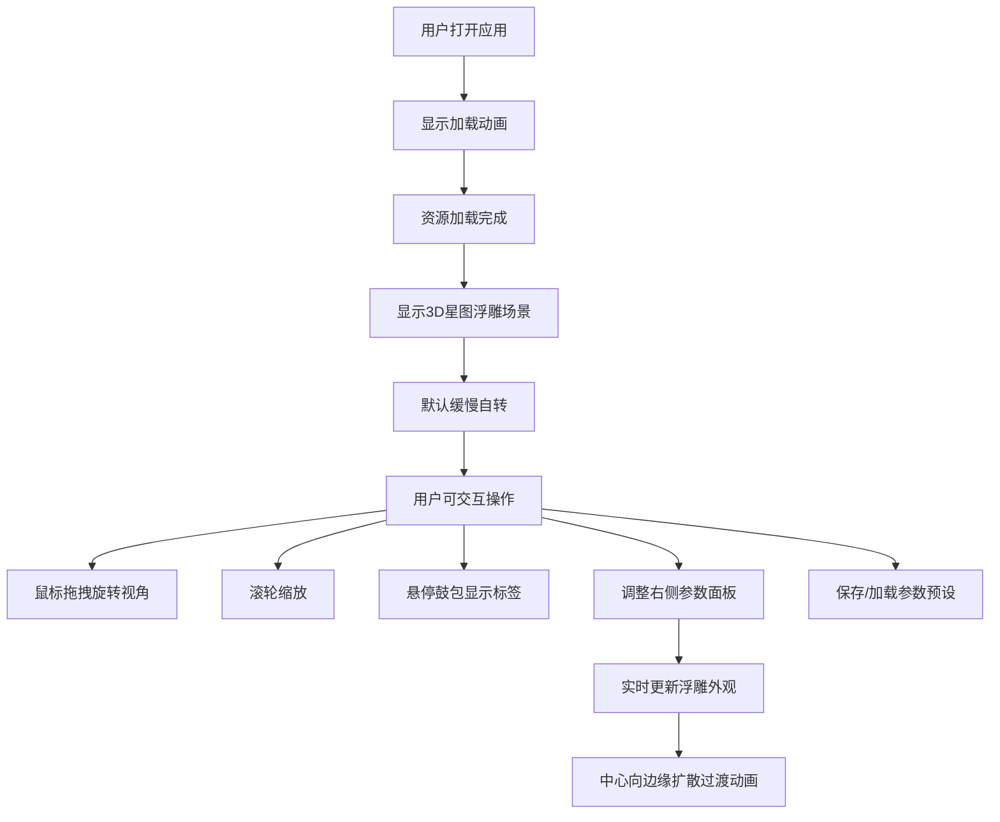

## 1. 产品概述

星尘拓印是一款将银河系星图实时转化为触觉纹理图案的交互式三维可视化工具。用户可选择预设天区模板或上传自定义星图数据，系统将天文数据映射为可感知的三维浮雕纹理表面，兼具科学可视化与艺术美感。

- 目标用户：天文爱好者、数字艺术家、教育工作者
- 核心价值：将抽象的天文数据转化为直观可交互的触觉式视觉体验

## 2. 核心功能

### 2.1 功能模块

1. **主视图区**：Three.js 3D场景渲染，展示星图浮雕表面，支持视角交互
2. **参数控制面板**：右侧可收起的毛玻璃面板，包含7个参数滑块
3. **星图数据模块**：预设天区模板选择与用户自定义JSON数据上传
4. **悬停详情模块**：鼠标悬停显示恒星信息悬浮标签
5. **预设管理模块**：参数配置的保存与加载

### 2.2 页面详情

| 页面名称 | 模块名称 | 功能描述 |
|---------|---------|----------|
| 主应用页 | 加载动画 | 深紫渐变背景+旋转星云SVG，资源加载完毕后平滑过渡 |
| 主应用页 | 3D浮雕场景 | 恒星鼓包+涟漪环+基座平面，Phong光照金属质感，默认自转 |
| 主应用页 | 参数面板 | 7个渐变色滑块控制涟漪波数、基底曲率、鼓包缩放、色温偏移、旋转速度、自转开关、背景星点密度 |
| 主应用页 | 悬停标签 | 跟随鼓包三维位置的悬浮信息标签，含恒星名称与距离 |
| 主应用页 | 预设管理 | 保存/加载JSON格式参数预设文件 |

## 3. 核心流程

## 4. 用户界面设计

### 4.1 设计风格

- **主色调**：深邃太空黑 #000000 → 深紫 #1A0033 径向渐变背景
- **强调色**：紫色系 #6622AA → 粉色系 #FF66AA 渐变滑块轨道
- **高光色**：冷白 #E0F0FF（Phong高光）
- **环境光**：暗紫 #4A0066
- **面板风格**：毛玻璃半透明 rgba(10,0,30,0.6)，边框 #8822AA 1px
- **字体**：现代无衬线字体，白色主文字

### 4.2 页面设计概述

| 页面名称 | 模块名称 | UI元素 |
|---------|---------|--------|
| 主应用页 | 加载动画 | 居中旋转星云SVG，深紫径向渐变背景 |
| 主应用页 | 3D视图区 | 占80%宽度，黑色边框，支持鼠标交互 |
| 主应用页 | 参数面板 | 右侧20%宽度（≥280px），可收起为细条，点击展开有0.4秒cubic-bezier(0.22,1,0.36,1)滑出动画 |
| 主应用页 | 滑块控件 | 渐变轨道，白色圆点发光手柄，显示当前数值 |
| 主应用页 | 悬停标签 | #1A0033 透明度0.9背景，8px圆角，13px白色字体，跟随延迟0.1秒 |

### 4.3 响应性

- Desktop-first设计，主视图区自适应
- 参数面板最小宽度280px保证可用性
- 鼠标交互优先（拖拽、滚轮、悬停）

### 4.4 3D场景指引

- **环境**：纯黑到深紫径向渐变太空背景，微光晕轮廓
- **光照**：Phong光照模型，冷白高光(#E0F0FF)，暗紫环境光(#4A0066)
- **相机**：PerspectiveCamera，支持OrbitControls旋转/缩放
- **动画**：默认余弦自转（30秒周期），参数变化时中心向边缘0.3秒扩散过渡
- **材质**：金属光泽MeshPhongMaterial，0.5px微光晕轮廓
- **性能目标**：30FPS+，参数刷新≤200ms
