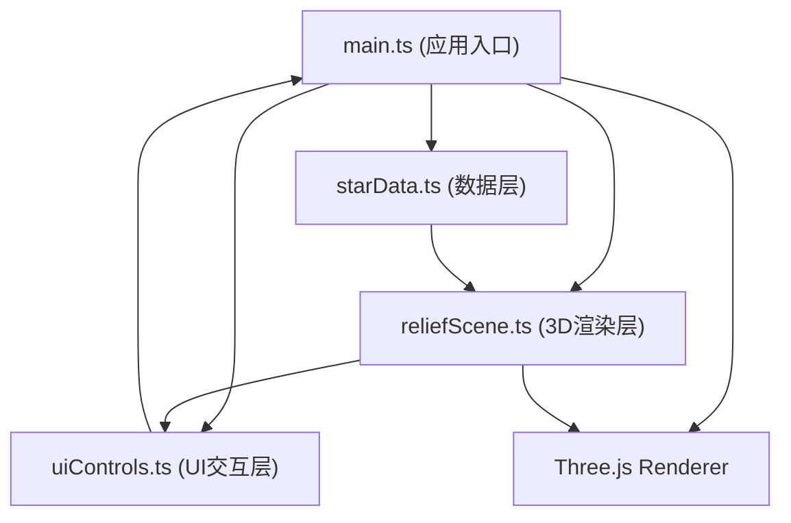

## 1. 架构设计



## 2. 技术说明

- **前端框架**：原生 TypeScript + Three.js（无React/Vue，按用户要求使用CDN风格导入配合Vite构建）
- **构建工具**：Vite 5.x，支持HMR热更新
- **3D引擎**：Three.js 0.160+，使用MeshPhongMaterial实现金属质感
- **交互控制**：Three.js OrbitControls 实现视角操控
- **样式方案**：原生CSS + CSS变量，毛玻璃效果使用backdrop-filter

## 3. 文件结构

| 文件路径 | 职责 |
|---------|------|
| package.json | 项目依赖：three、typescript、vite、@types/three |
| vite.config.js | Vite基础配置，HMR支持 |
| tsconfig.json | TypeScript严格模式，target ES2020 |
| index.html | 入口HTML，加载动画+应用挂载点 |
| src/main.ts | 应用入口：场景/相机/渲染器初始化，帧循环，事件分发 |
| src/starData.ts | 星图数据解析，预设猎户座/仙女座测试数据 |
| src/reliefScene.ts | 核心3D场景：鼓包、涟漪、基座、光照、参数更新、高亮 |
| src/uiControls.ts | 参数面板DOM构建、滑块事件、悬浮标签渲染 |

## 4. 数据模型

### 4.1 恒星数据定义

```typescript
interface Star {
  ra: number;           // 赤经 (弧度 0-2π)
  dec: number;          // 赤纬 (弧度 -π/2 ~ π/2)
  magnitude: number;    // 视星等 (越小越亮，范围约 -1.5 ~ 6)
  spectralType: string; // 光谱类型 O/B/A/F/G/K/M
  name: string;         // 恒星名称
  distance: number;     // 距离 (光年)
}
```

### 4.2 参数配置定义

```typescript
interface ReliefParams {
  rippleCount: number;      // 涟漪波数 2-12
  baseCurvature: number;    // 基底曲率 -0.5 ~ 0.5
  bumpScale: number;        // 鼓包缩放 0.5-2.0
  colorTempShift: number;   // 色温偏移 -0.3 ~ 0.3
  rotationSpeed: number;    // 旋转速度 0-2倍
  autoRotate: boolean;      // 自转开关
  starDensity: number;      // 背景星点密度 0-200
}
```

## 5. 核心实现要点

### 5.1 星图到浮雕的映射

- 赤经(ra) → X轴位置（归一化到 -5 ~ 5）
- 赤纬(dec) → Z轴位置（归一化到 -5 ~ 5）
- 星等(magnitude) → 鼓包高度与半径：越亮(星等越小)越高越大
- 光谱类型 → 颜色渐变：O(蓝白 #A0C0FF) → B → A → F → G → K → M(红橙 #FF8040)

### 5.2 涟漪环实现

- 使用 THREE.TorusGeometry 创建圆环
- 每个鼓包周围生成 rippleCount 个等间距同心圆
- 半径线性递增，透明度随圈数递减

### 5.3 参数过渡动画

- 使用 requestAnimationFrame 驱动的 lerp 插值
- 以场景中心为原点，按距离中心的远近设置延迟
- 总时长 0.3 秒，实现中心向边缘扩散效果

### 5.4 性能优化

- 鼓包使用 InstancedMesh 合批（如数量多时）
- 涟漪材质共享
- 参数更新时仅修改uniform/scale，避免重建几何体
- 渲染器启用 antialias=false 提升帧率
