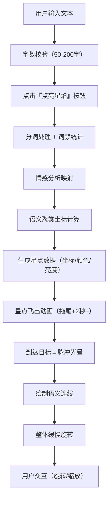

## 1. 产品概述
「星焰书简」是一款基于浏览器的交互式三维可视化工具，将用户输入的散文或诗歌实时转化为动态星空文字云，赋予文字以星辰般的诗意呈现。
- 核心价值：让文字超越平面载体，以沉浸式的3D星空美学展现文本的语义与情感结构
- 目标用户：文学爱好者、设计师、教育工作者、内容创作者

## 2. 核心功能

### 2.1 功能模块
1. **文本输入模块**：磨砂玻璃风格文本框，支持50-200字的散文/诗歌输入，字数实时统计
2. **转化引擎模块**：点击「点亮星焰」按钮后，触发文本→星点的转化动画
3. **三维星空渲染模块**：Three.js驱动的3D场景，支持视角旋转、缩放
4. **语义聚类模块**：基于语义相关性自动聚类为星座状群组
5. **情感色彩映射模块**：词频→亮度、情感→颜色的可视化映射
6. **星座连线模块**：半透明发光连线表现语义关联
7. **动画控制面板**：旋转速度调节（0.5-5度/秒）

### 2.2 页面详情
| 页面名称 | 模块名称 | 功能描述 |
|----------|----------|----------|
| 主页面 | 文本输入区 | 磨砂玻璃文本框、字数统计、转化按钮 |
| 主页面 | 3D星空画布 | Three.js场景、背景深空渐变、星点粒子系统 |
| 主页面 | 控制面板 | 旋转速度滑块、图例说明（情感色对应） |

## 3. 核心流程

用户在文本框中输入50-200字的散文或诗歌，点击「点亮星焰」按钮后：
1. 系统对文本进行分词、词频统计、情感分析
2. 每个字/词转化为独立发光星点，从文本框位置飞出（带拖尾效果，动画≥2秒）
3. 星点按语义相关性在3D空间聚类成星座
4. 到达目标位置时触发脉冲光晕效果
5. 星点间绘制语义连线，整体星座开始缓慢旋转
6. 用户可通过鼠标旋转视角、滚轮缩放

## 4. 用户界面设计

### 4.1 设计风格
- **主色调**：深空蓝 #0B0E2A（背景），星辉白 #F0F4FF（文本）
- **点缀色**：
  - 积极情感：金橙色 #FFD700
  - 中性情感：银白 #C0C0C0
  - 消极情感：幽蓝 #4A90D9
  - 按钮渐变：#FFD700 → #FF8C00
- **输入框**：磨砂玻璃效果（backdrop-filter: blur(8px)），半透明白色边框（rgba(255,255,255,0.2)）
- **按钮**：圆角矩形渐变金色，悬停向上平移2px + 加深阴影
- **字体**：衬线字体（标题，增强文学感）+ 无衬线字体（正文，保证可读性）
- **布局风格**：左侧输入区悬浮于画布之上，右侧及背景为全屏3D星空画布

### 4.2 页面设计概述
| 页面名称 | 模块名称 | UI元素 |
|----------|----------|--------|
| 主页面 | 标题区 | 居中展示「星焰书简」艺术字标题，带微光效果 |
| 主页面 | 输入区 | 磨砂玻璃卡片、文本框、字数计数器、渐变金色按钮 |
| 主页面 | 控制面板 | 悬浮右下角、旋转速度滑块、情感图例标签 |
| 主页面 | 3D画布 | 全屏Three.js渲染、深空渐变背景、微弱星光粒子 |

### 4.3 响应性
- 桌面端优先设计（最低支持1280px宽度）
- 输入区固定宽度420px，悬浮于左侧
- 移动端（<768px）：输入区位于顶部，3D画布占据下方区域

### 4.4 3D场景指引
- **环境**：深空渐变背景（#0B0E2A → #050816），点缀微弱的远景星空粒子
- **光照**：环境光（低强度）+ 星点自发光（主要光源），营造宇宙深邃感
- **相机**：PerspectiveCamera，初始距离适中，支持OrbitControls交互
- **动画**：
  - 飞出动画：贝塞尔曲线轨迹，带拖尾粒子（0.2秒拖尾）
  - 脉冲光晕：到达目标时半径10px扩散，颜色与星点一致
  - 整体旋转：绕Y轴缓慢旋转，速度可调（0.5-5度/秒）
- **性能**：转化动画60FPS，200星点时≥50FPS
