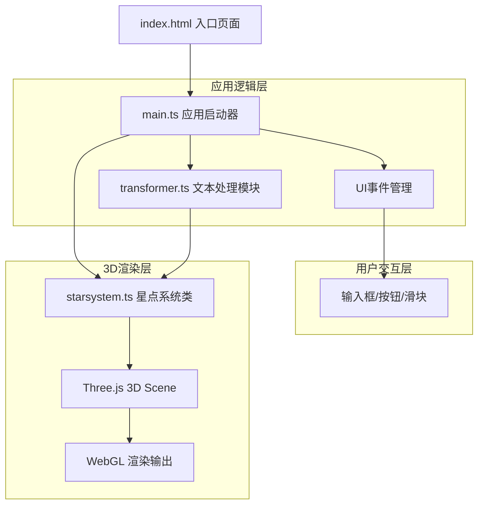

## 1. 架构设计



## 2. 技术描述
- **前端框架**：原生 TypeScript（无React/Vue），用户明确指定
- **3D引擎**：Three.js @0.160+（含 OrbitControls）
- **构建工具**：Vite @5+，支持HMR
- **语言**：TypeScript @5+，严格模式，目标ES2020
- **CSS方案**：原生CSS + CSS变量，backdrop-filter实现磨砂玻璃

## 3. 文件结构

| 文件路径 | 职责说明 |
|----------|----------|
| `/package.json` | 项目依赖：three, typescript, vite, @types/three；启动脚本：npm run dev |
| `/vite.config.js` | 基础Vite配置，启用HMR，端口默认5173 |
| `/tsconfig.json` | strict:true, target:ES2020, module:ESNext, moduleResolution:Bundler |
| `/index.html` | 入口DOM：标题、磨砂玻璃输入卡片（文本框+字数统计+转化按钮）、控制面板（滑块+图例）、Three.js画布容器 |
| `/src/main.ts` | 应用入口：初始化Three.js场景/相机/渲染器，绑定UI事件（输入、点击、滑块），调用transformer处理文本，将数据传入starsystem，主循环requestAnimationFrame |
| `/src/transformer.ts` | 文本处理：中文分词（基于字符+常用词词典）、词频统计、情感分析（基于情感词库映射得分→三档情感）、语义聚类坐标（基于词共现/情感分组生成3D聚类坐标） |
| `/src/starsystem.ts` | StarSystem类：管理星点Sprite/Mesh集合、飞出动画贝塞尔插值+拖尾粒子、脉冲光晕Sprite、连线LineSegments、整体Y轴旋转、OrbitControls接入、性能优化（InstancedMesh/BufferGeometry） |

## 4. 核心数据模型

### 4.1 星点数据定义
```typescript
interface StarPoint {
  id: number;
  text: string;           // 原文字/词
  frequency: number;      // 词频（归一化0-1）
  brightness: number;     // 亮度（基于词频映射 0.3-1.5）
  sentiment: 'positive' | 'neutral' | 'negative';
  color: string;          // 十六进制颜色
  startPosition: THREE.Vector3;  // 飞出起点（文本框屏幕坐标→3D投影）
  targetPosition: THREE.Vector3; // 目标聚类位置
  clusterId: number;      // 所属聚类组
  delay: number;          // 飞出延迟（毫秒，错峰动画）
  duration: number;       // 飞出持续时间（2000-2800ms）
}
```

### 4.2 连线数据
```typescript
interface StarConnection {
  from: number;   // StarPoint id
  to: number;     // StarPoint id
  distance: number; // 语义距离（0-1，影响连线粗细与透明度）
}
```

## 5. 关键算法与实现要点

### 5.1 文本分词策略
- 优先匹配2-4字词组（内置中文常用词/情感词词典，约2000词）
- 未匹配部分按单字拆分
- 输出词数组，去重并统计词频

### 5.2 情感分析映射
- 内置积极词库（如"光、希望、爱、温暖、美丽、快乐"...）与消极词库（如"夜、寒、孤独、忧伤、愁、离别"...）
- 词匹配得分：匹配积极词+1，匹配消极词-1，其余中性
- 映射关系：score>0 → #FFD700（金橙积极）；score=0 → #C0C0C0（银白中性）；score<0 → #4A90D9（幽蓝消极）

### 5.3 语义聚类3D坐标生成
- 按情感sentiment分为3大聚类区域（正面/中性/负面各占空间一个象限扇形）
- 同聚类内词使用球面均匀分布 + 高斯扰动生成聚类内坐标
- 聚类中心间距：正面(20,5,0)、中性(-15,3,10)、负面(0,-8,-18)
- 聚类半径：6-10单位

### 5.4 飞出动画
- 轨迹：startPos → 控制点（start与target中点抬高+随机偏移）→ targetPos，三次贝塞尔插值
- 拖尾：每个星点维护一个10帧的位置历史，使用Points材质渲染尾迹（渐隐透明度，时长约0.2秒）
- 缓动函数：easeOutCubic

### 5.5 脉冲光晕
- 星点到达target时，实例化一个光晕Sprite（径向渐变贴图，中心实边透明）
- 初始scale=0，动画到scale=10px（对应3D空间约1.5单位），持续300ms easeOut，然后销毁

### 5.6 性能优化
- 星点使用 InstancedMesh（若为Mesh）或 Points + BufferGeometry（若为Sprite方案）
- 连线使用 LineSegments + BufferGeometry，距离<阈值才渲染
- 相机视锥剔除（Three.js内置）
- 动画循环避免对象创建，复用Vector3等临时对象

## 6. 性能指标
- 转化动画：≥60FPS（2秒内，使用requestAnimationFrame）
- 稳态渲染：200星点+连线 ≥ 50FPS
- 内存占用：< 200MB
