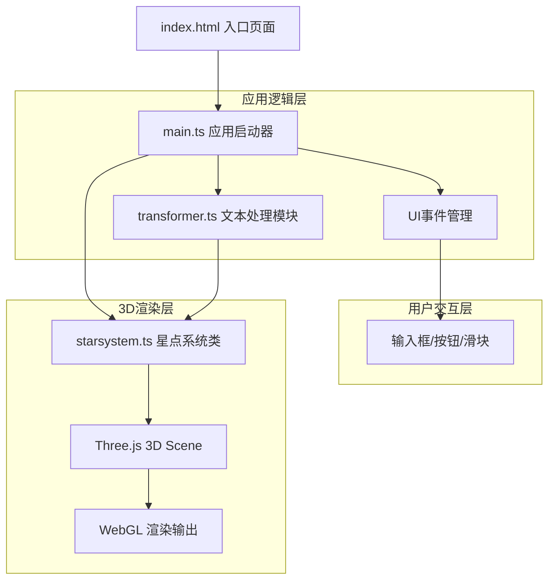
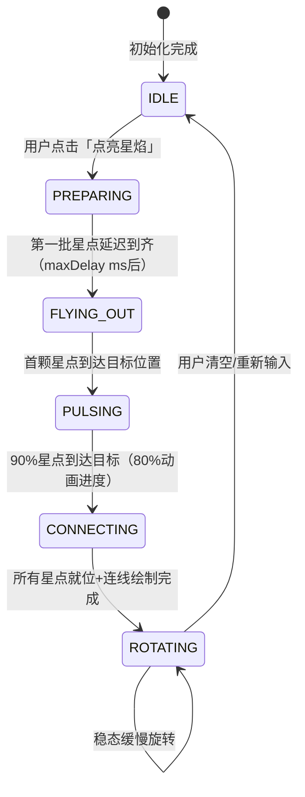

## 1. 架构设计



## 2. 技术描述
- **前端框架**：原生 TypeScript（无React/Vue）
- **3D引擎**：Three.js @0.160+（含 OrbitControls）
- **构建工具**：Vite @5+，支持HMR
- **语言**：TypeScript @5+，严格模式，目标ES2020

## 3. 动画时序设计（核心重写部分）

### 3.1 动画阶段状态机


### 3.2 详细时间线
| 时间点 | 事件 | 说明 |
|--------|------|------|
| T+0ms | 点击按钮 | 文本处理（分词/情感/聚类），生成星点数据 |
| T+0ms | 星点i启动 | delay[i]毫秒后，第i颗星点从文本框位置开始飞出 |
| T+delay[i]ms ~ T+delay[i]+duration[i]ms | 飞出阶段 | 贝塞尔曲线运动 + 0.2秒实时拖尾粒子 |
| T+delay[i]+duration[i]ms | 到达目标 | 触发脉冲光晕（持续300ms：scale 0→1.5→fade） |
| T+max(delay+duration)*80% ms | 连线淡入 | 星点间连线从alpha=0→0.45淡入，持续500ms |
| T+max(delay+duration)*100% ms | 稳态旋转 | 整体开始Y轴缓慢旋转，用户可调速度（0.5-5°/s） |

### 3.3 单颗星点生命周期
```
[诞生] → [飞出+拖尾持续2-2.8s] → [到达脉冲300ms] → [稳态驻留+微闪烁]
             ↓拖尾每帧采样          ↓10px光晕扩散       ↓连线关联
          TrailBuffer(12帧×200)    GlowSprite池         LineSegments
```

## 4. 粒子系统架构

### 4.1 三层渲染结构（性能关键）
```
StarSystem
├─ Layer A: Stars（星点本体）
│   └─ InstancedMesh(200) + SphereGeometry + ShaderMaterial
│      - per-instance: color, brightness, position, scale
│      - shader: 菲涅尔发光 + 脉冲闪烁
│
├─ Layer B: Trails（拖尾粒子）
│   └─ Points(200×12=2400) + BufferGeometry + ShaderMaterial
│      - 环形缓冲区：每颗星12个历史位置槽
│      - per-vertex: age(0-1), color, starId
│      - shader: age→alpha渐隐 + size衰减
│
├─ Layer C: Glows（脉冲光晕）
│   └─ InstancedMesh(50池) + PlaneGeometry + ShaderMaterial
│      - 对象池：复用已消失光晕
│      - per-instance: color, scale, alpha, position
│      - shader: 径向渐变发光贴图
│
└─ Layer D: Connections（语义连线）
    └─ LineSegments + BufferGeometry + ShaderMaterial
       - 动态顶点：随星点位置实时更新
       - per-vertex: color, distanceWeight
       - shader: distance→透明度/粗细
```

### 4.2 对象池策略
- **光晕池**：预分配50个Glow Sprite实例，active状态标记，到达时激活，完成后回收
- **拖尾缓冲**：固定大小Float32Array(2400×3)，循环写入，无需GC

## 5. 核心算法重写

### 5.1 情感分析（加权+否定词翻转）

**否定词库**（权重-1.0翻转窗口内后续词）：不、没、无、非、未、莫、勿、未必、不曾、不再、毫无、绝不、从不

**程度副词库**：
- 强程度（×1.8）：非常、十分、极其、极度、无比、万分、格外
- 弱程度（×0.6）：有点、稍微、略微、稍稍、些许

**情感词权重表**（节选）：
| 词 | 权重 |
|----|------|
| 喜悦、幸福、灿烂、辉煌 | +2.0 |
| 快乐、温暖、美丽、希望 | +1.5 |
| 光、爱、笑、花、梦、星 | +1.0 |
| 悲伤、凄凉、断肠、破碎 | -2.0 |
| 孤独、忧伤、寂寞、惆怅 | -1.5 |
| 寒、夜、愁、泪、苦、残 | -1.0 |

**算法流程**：
```
对分词后的每个词token[i]：
  score = 0
  // 1. 查情感词权重
  if token[i] in sentimentDict:
    score += sentimentDict[token[i]]
  // 2. 否定词窗口（向前2个词内查找否定词）
  for j = max(0, i-2) to i-1:
    if token[j] in NEGATION_WORDS:
      score *= -1
      break
  // 3. 程度副词（向前1个词）
  if i > 0 and token[i-1] in DEGREE_WORDS:
    score *= DEGREE_WORDS[token[i-1]]
  // 4. 上下文矛盾词修正（如"悲伤的喜悦"取后续词主导）
  sentiment[i] = clamp(score, -2, +2)
```

### 5.2 语义聚类坐标（共现矩阵+MDS降维）

**替代随机坐标的方案**：
1. **构建词共现矩阵**：滑动窗口size=5，统计词对共同出现次数
2. **计算语义距离**：`dist(w1,w2) = 1 - PMI(w1,w2)`（点互信息归一化）
3. **情感大类分区**：3个情感sentiment各占3D空间一个半球/象限
4. **同情感内基于距离聚类**：使用力导向布局（Fruchterman-Reingold简化版）
   - 语义距离近的词 → 吸引力强 → 空间距离近
   - 避免重叠：全局排斥力
   - 迭代50次收敛

## 6. 性能优化方案

| 优化点 | 实现方式 | 预期收益 |
|--------|----------|----------|
| 星点本体 | InstancedMesh + ShaderMaterial，单次draw call | 200星→1 draw call，替代200个Mesh |
| 拖尾粒子 | Points + BufferGeometry，环形缓冲区覆盖写入 | 2400粒子→1 draw call，无对象分配 |
| 脉冲光晕 | InstancedMesh对象池(50)，复用实例 | 避免频繁创建销毁Sprite |
| 语义连线 | LineSegments + BufferGeometry，每帧1次position更新 | N连线→1 draw call |
| 主循环零分配 | 预分配Vector3/Color临时变量池 | 消除GC暂停 |
| 矩阵更新 | 仅动画阶段每帧更新matrix，稳态每2帧更新 | 降低CPU占用 |

## 7. 文件结构

| 文件路径 | 职责说明 |
|----------|----------|
| `/package.json` | three, typescript, vite, @types/three |
| `/vite.config.js` | 基础Vite配置，HMR |
| `/tsconfig.json` | strict:true, target:ES2020 |
| `/index.html` | 入口页面+磨砂玻璃UI |
| `/src/main.ts` | Three.js初始化、UI事件、主循环、FPS监控 |
| `/src/transformer.ts` | 加权情感分析(含否定词翻转)、共现矩阵+力导向聚类坐标 |
| `/src/starsystem.ts` | InstancedMesh星点+拖尾Points+光晕池+连线+动画状态机 |

## 8. 核心数据模型

```typescript
interface StarPointData {
  id: number;
  text: string;
  frequency: number;         // 0-1
  sentimentScore: number;    // -2 ~ +2
  sentiment: 'positive'|'neutral'|'negative';
  color: string;
  brightness: number;        // 0.35-1.5
  startPosition: THREE.Vector3;
  targetPosition: THREE.Vector3;
  clusterId: number;
  delay: number;             // ms
  duration: number;          // 2000-2800ms
}

interface StarConnectionData {
  fromId: number;
  toId: number;
  distance: number;          // 0-1，1=最相关
}
```

## 9. 性能指标
- 转化动画：≥60FPS
- 稳态（200星点+连线+拖尾）：≥55FPS
- 内存：< 180MB
