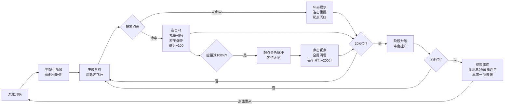

## 1. 产品概述

「弦音裂空」是一款基于 Canvas 的科幻霓虹风格节奏类迷你游戏，玩家通过点击沿贝塞尔曲线轨迹飞向中心靶点的光球音符，在准确时机命中获得分数和连击奖励。

- **核心玩法**：音符从画布边缘生成，沿曲线轨迹飞向中心，玩家需在音符到达靶点时准确点击
- **目标用户**：休闲游戏爱好者、音游玩家
- **市场价值**：提供轻量化、高视觉冲击力的节奏游戏体验，解决传统音游缺乏空间交互感的问题

## 2. 核心特性

### 2.1 功能模块

1. **游戏主界面**：Canvas 游戏画布、音符飞行、粒子特效、中心靶点
2. **状态系统**：连击计数、能量条、得分统计、阶段管理
3. **交互系统**：点击/触摸命中判定、大招释放、重新开始
4. **UI 界面**：连击数字、能量条、得分显示、阶段提示、结束画面

### 2.2 页面详情

| 页面名称 | 模块名称 | 功能描述 |
|-----------|-------------|---------------------|
| 游戏主界面 | 音符系统 | 3组贝塞尔曲线轨迹（快速直线、S形弧线、回旋绕行），每5秒切换，3档飞行速度（2/4/6秒），随连击加速至2倍 |
| 游戏主界面 | 连击系统 | 命中累积连击+1，能量+5%，连击中断变红闪烁0.3秒后重置，连击数字带缩放弹跳动画 |
| 游戏主界面 | 能量系统 | 能量条满100%时靶点变金色脉冲，点击释放全屏清场大招，所有音符爆炸成金色粒子 |
| 游戏主界面 | 难度递增 | 90秒游戏时长，3个阶段每30秒切换，生成速度+20%，判定窗口从0.3秒缩至0.2秒，边缘红色脉冲提示 |
| 游戏主界面 | 计分系统 | 命中+100分，每5连击额外+50分，大招清场每个+200分 |
| 结束画面 | 结算界面 | 显示总分、最高连击数，「再来一次」按钮带复位动画 |

## 3. 核心流程

### 3.1 游戏主流程

## 4. 用户界面设计

### 4.1 设计风格

- **主色调**：深空紫 `#1A0033` 到墨黑 `#000011` 径向渐变背景
- **霓虹配色**：音符采用多彩霓虹色（青、粉、紫、蓝），命中粒子与音符同色
- **发光效果**：所有 UI 元素使用 `text-shadow` / `box-shadow` 发光描边（blur: 4px）
- **中心靶点**：半透明灰色圆环，外径 60px，内径 30px
- **轨迹显示**：淡白色虚线（虚线长度 6px，间距 4px）
- **字体**：使用 Orbitron 科幻字体，数字清晰锐利

### 4.2 动画效果

- **命中粒子**：30 个粒子从命中点向四周扩散，`easeOutQuad` 缓动，0.5 秒消退
- **Miss 文字**：24px 白色文字，`easeOutCubic` 缓动，向上飘移 1 秒消失
- **连击动画**：命中时数字缩放弹跳，中断时红色闪烁 0.3 秒
- **大招效果**：金色粒子烟花爆炸，全屏闪光
- **阶段提示**：屏幕边缘红色脉冲光晕
- **重置动画**：画布闪烁后重新开始

### 4.3 响应式设计

- **移动端适配**：支持触摸事件，点击区域不小于 44px
- **Canvas 自适应**：根据窗口大小调整画布尺寸，保持正方形游戏区域
- **触摸优化**：支持多点触控，防止点击穿透

### 4.4 性能约束

- **帧率**：稳定 60FPS
- **音符上限**：峰值不超过 60 个
- **粒子上限**：峰值不超过 200 个，超出自动回收复用
- **对象池**：音符和粒子采用对象池管理，避免频繁 GC
