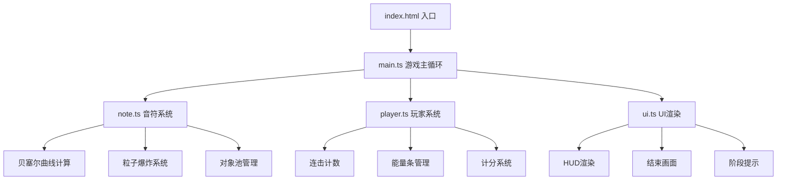

## 1. 架构设计



## 2. 技术栈说明

- **前端框架**：纯 TypeScript + HTML5 Canvas（无 React/Vue 框架，追求性能最大化）
- **构建工具**：Vite 5.x，支持 HMR 热更新
- **语言**：TypeScript 5.x，严格模式，目标 ES2020
- **性能优化**：对象池模式、requestAnimationFrame 主循环、增量渲染

## 3. 文件结构

| 文件路径 | 职责说明 |
|---------|---------|
| `package.json` | 项目依赖：typescript、vite；脚本：npm run dev、start |
| `vite.config.js` | Vite 构建配置，支持 HMR，端口 5173 |
| `tsconfig.json` | TypeScript 严格模式配置，target ES2020 |
| `index.html` | 入口页面，Canvas 容器，全局样式 |
| `src/main.ts` | 游戏主循环，场景初始化，状态管理，帧更新，事件绑定 |
| `src/note.ts` | 音符类，飞行轨迹，命中判定，粒子爆炸，对象池 |
| `src/player.ts` | 玩家类，连击管理，能量条，计分，重置 |
| `src/ui.ts` | UI 渲染类，连击数、能量条、得分、阶段提示、结束画面 |

## 4. 核心数据模型

### 4.1 类型定义

```typescript
// 轨迹类型
type TrajectoryType = 'linear' | 's_curve' | 'spiral';

// 音符状态
type NoteState = 'active' | 'hit' | 'missed' | 'pooled';

// 粒子状态
type ParticleState = 'active' | 'pooled';

// 游戏阶段
type GamePhase = 1 | 2 | 3;

// 游戏状态
type GameState = 'ready' | 'playing' | 'ended';

// 音符接口
interface Note {
  id: number;
  x: number;
  y: number;
  startX: number;
  startY: number;
  controlX1: number;
  controlY1: number;
  controlX2: number;
  controlY2: number;
  endX: number;
  endY: number;
  progress: number;
  duration: number;
  speed: number;
  color: string;
  state: NoteState;
  size: number;
  hitTime: number;
  trajectory: TrajectoryType;
}

// 粒子接口
interface Particle {
  x: number;
  y: number;
  vx: number;
  vy: number;
  color: string;
  life: number;
  maxLife: number;
  size: number;
  state: ParticleState;
}

// 玩家状态
interface PlayerState {
  combo: number;
  maxCombo: number;
  energy: number;
  score: number;
  comboScale: number;
  comboFlash: boolean;
  comboFlashTimer: number;
}
```

### 4.2 游戏常量

```typescript
// 画布尺寸
const CANVAS_SIZE = 800;
const CENTER_X = CANVAS_SIZE / 2;
const CENTER_Y = CANVAS_SIZE / 2;

// 靶点尺寸
const TARGET_OUTER_RADIUS = 60;
const TARGET_INNER_RADIUS = 30;

// 音符配置
const NOTE_COLORS = ['#00FFFF', '#FF00FF', '#8B5CF6', '#3B82F6', '#10B981'];
const NOTE_SPEEDS = [2000, 4000, 6000]; // ms - 快、中、慢
const MAX_NOTES = 60;
const MAX_PARTICLES = 200;
const PARTICLE_PER_HIT = 30;

// 判定窗口
const HIT_WINDOW = [300, 250, 200]; // ms - 随阶段递减

// 游戏时长
const GAME_DURATION = 90000; // 90秒
const PHASE_DURATION = 30000; // 30秒每阶段
const TRAJECTORY_SWITCH_INTERVAL = 5000; // 5秒切换轨迹

// 计分
const SCORE_PER_HIT = 100;
const COMBO_BONUS = 50;
const COMBO_BONUS_INTERVAL = 5;
const ULTIMATE_SCORE_PER_NOTE = 200;

// 能量
const ENERGY_PER_HIT = 5;
const MAX_ENERGY = 100;

// 颜色常量
const COLOR_DEEP_PURPLE = '#1A0033';
const COLOR_BLACK = '#000011';
const COLOR_GOLD = '#FFD700';
const COLOR_RED = '#FF3333';
const COLOR_WHITE = '#FFFFFF';
```

## 5. 核心算法

### 5.1 贝塞尔曲线轨迹计算

```typescript
// 三次贝塞尔曲线点计算
function cubicBezier(
  t: number,
  p0: { x: number; y: number },
  p1: { x: number; y: number },
  p2: { x: number; y: number },
  p3: { x: number; y: number }
): { x: number; y: number } {
  const mt = 1 - t;
  const mt2 = mt * mt;
  const mt3 = mt2 * mt;
  const t2 = t * t;
  const t3 = t2 * t;
  
  return {
    x: mt3 * p0.x + 3 * mt2 * t * p1.x + 3 * mt * t2 * p2.x + t3 * p3.x,
    y: mt3 * p0.y + 3 * mt2 * t * p1.y + 3 * mt * t2 * p2.y + t3 * p3.y
  };
}

// 轨迹生成器 - 3种类型
function generateTrajectory(type: TrajectoryType, centerX: number, centerY: number, canvasSize: number) {
  // 从画布边缘随机起点
  const edge = Math.floor(Math.random() * 4);
  let startX, startY;
  
  switch (edge) {
    case 0: // 上
      startX = Math.random() * canvasSize;
      startY = -30;
      break;
    case 1: // 右
      startX = canvasSize + 30;
      startY = Math.random() * canvasSize;
      break;
    case 2: // 下
      startX = Math.random() * canvasSize;
      startY = canvasSize + 30;
      break;
    default: // 左
      startX = -30;
      startY = Math.random() * canvasSize;
  }
  
  const endX = centerX;
  const endY = centerY;
  
  let controlX1, controlY1, controlX2, controlY2;
  
  switch (type) {
    case 'linear': // 快速直线
      controlX1 = startX + (endX - startX) * 0.33;
      controlY1 = startY + (endY - startY) * 0.33;
      controlX2 = startX + (endX - startX) * 0.66;
      controlY2 = startY + (endY - startY) * 0.66;
      break;
      
    case 's_curve': // S形弧线
      const midX = (startX + endX) / 2;
      const midY = (startY + endY) / 2;
      const perpX = -(endY - startY) * 0.3;
      const perpY = (endX - startX) * 0.3;
      controlX1 = midX - perpX;
      controlY1 = midY - perpY;
      controlX2 = midX + perpX;
      controlY2 = midY + perpY;
      break;
      
    case 'spiral': // 回旋绕行
      const angle = Math.atan2(endY - startY, endX - startX);
      const dist = Math.sqrt((endX - startX) ** 2 + (endY - startY) ** 2);
      controlX1 = startX + Math.cos(angle + Math.PI / 3) * dist * 0.5;
      controlY1 = startY + Math.sin(angle + Math.PI / 3) * dist * 0.5;
      controlX2 = startX + Math.cos(angle - Math.PI / 3) * dist * 0.5;
      controlY2 = startY + Math.sin(angle - Math.PI / 3) * dist * 0.5;
      break;
  }
  
  return { startX, startY, controlX1, controlY1, controlX2, controlY2, endX, endY };
}
```

### 5.2 命中判定算法

```typescript
function checkHit(
  note: Note,
  clickX: number,
  clickY: number,
  centerX: number,
  centerY: number,
  hitWindow: number
): boolean {
  // 计算音符到中心的距离
  const distToCenter = Math.sqrt((note.x - centerX) ** 2 + (note.y - centerY) ** 2);
  
  // 计算点击位置到音符的距离
  const distToClick = Math.sqrt((clickX - note.x) ** 2 + (clickY - note.y) ** 2);
  
  // 点击区域不小于44px
  const clickRadius = Math.max(22, note.size + 10);
  
  // 判定条件：
  // 1. 点击在音符范围内
  // 2. 音符在靶点判定范围内
  // 3. 音符进度在命中窗口内
  const inClickRange = distToClick <= clickRadius;
  const inTargetRange = distToCenter <= TARGET_OUTER_RADIUS;
  const inTimeWindow = note.progress >= (1 - hitWindow / note.duration) && note.progress <= 1;
  
  return inClickRange && inTargetRange && inTimeWindow;
}
```

### 5.3 缓动函数

```typescript
// easeOutQuad - 粒子爆炸
function easeOutQuad(t: number): number {
  return t * (2 - t);
}

// easeOutCubic - Miss文字
function easeOutCubic(t: number): number {
  return 1 - Math.pow(1 - t, 3);
}

// easeInOutQuad - 通用
function easeInOutQuad(t: number): number {
  return t < 0.5 ? 2 * t * t : 1 - Math.pow(-2 * t + 2, 2) / 2;
}
```

### 5.4 对象池实现

```typescript
class ObjectPool<T> {
  private pool: T[] = [];
  private createFn: () => T;
  private resetFn: (obj: T) => void;
  private maxSize: number;
  
  constructor(createFn: () => T, resetFn: (obj: T) => void, maxSize: number) {
    this.createFn = createFn;
    this.resetFn = resetFn;
    this.maxSize = maxSize;
  }
  
  acquire(): T {
    if (this.pool.length > 0) {
      return this.pool.pop()!;
    }
    return this.createFn();
  }
  
  release(obj: T): void {
    if (this.pool.length < this.maxSize) {
      this.resetFn(obj);
      this.pool.push(obj);
    }
  }
  
  get size(): number {
    return this.pool.length;
  }
}
```

## 6. 主循环流程

```typescript
// 游戏主循环
class Game {
  private lastTime = 0;
  private animationId: number | null = null;
  
  start(): void {
    this.lastTime = performance.now();
    this.loop();
  }
  
  private loop(currentTime = performance.now()): void {
    const deltaTime = currentTime - this.lastTime;
    this.lastTime = currentTime;
    
    this.update(deltaTime);
    this.render();
    
    this.animationId = requestAnimationFrame((t) => this.loop(t));
  }
  
  private update(deltaTime: number): void {
    // 1. 更新游戏时间和阶段
    this.updateGamePhase(deltaTime);
    
    // 2. 生成新音符
    this.spawnNotes(deltaTime);
    
    // 3. 更新所有音符位置
    this.updateNotes(deltaTime);
    
    // 4. 更新粒子效果
    this.updateParticles(deltaTime);
    
    // 5. 更新UI动画状态
    this.updateUI(deltaTime);
    
    // 6. 检查游戏结束
    this.checkGameEnd();
  }
  
  private render(): void {
    // 1. 清空画布并绘制背景
    this.drawBackground();
    
    // 2. 绘制音符轨迹
    this.drawTrajectories();
    
    // 3. 绘制中心靶点
    this.drawTarget();
    
    // 4. 绘制音符
    this.drawNotes();
    
    // 5. 绘制粒子
    this.drawParticles();
    
    // 6. 绘制UI层
    this.ui.render(this.ctx);
    
    // 7. 绘制阶段提示光晕
    this.drawPhaseGlow();
    
    // 8. 绘制结束画面（如果游戏结束）
    if (this.state === 'ended') {
      this.drawEndScreen();
    }
  }
  
  stop(): void {
    if (this.animationId) {
      cancelAnimationFrame(this.animationId);
      this.animationId = null;
    }
  }
}
```

## 7. 性能优化策略

1. **对象池模式**：音符和粒子对象复用，避免频繁 GC
2. **离屏 Canvas**：静态背景预渲染，减少每帧绘制开销
3. **增量更新**：只更新可见区域的元素
4. **FPS 监控**：动态调整粒子数量，保持帧率稳定
5. **触摸事件节流**：防止高频触摸事件导致性能问题
6. **WebWorker**：复杂计算（如轨迹生成）移至后台线程（可选优化）
