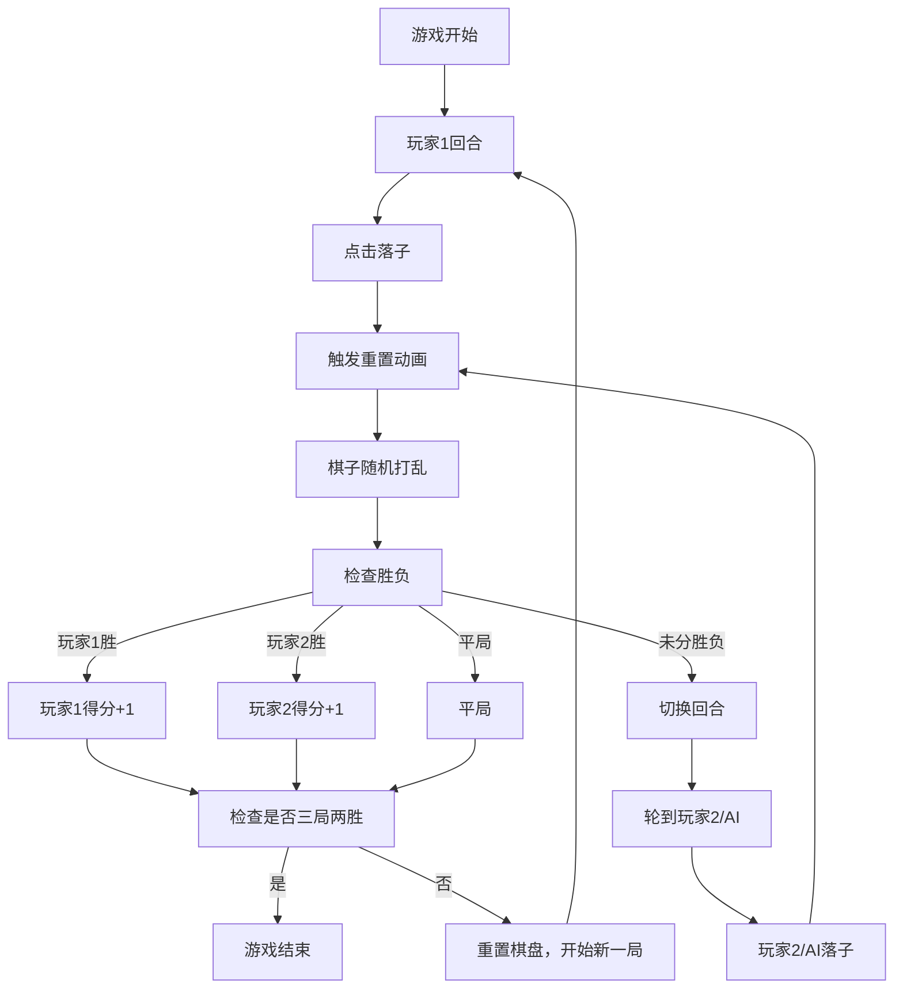

## 1. 产品概述

「熵变棋局」是一款基于 3x3 网格的浏览器逻辑博弈游戏，玩家轮流落子，但每次落子后棋盘状态会随机重置，玩家需要在混乱中依靠策略重建优势，先形成连续同色线的一方获胜。

- 核心玩法：在不确定性中寻找确定性，考验玩家的概率思维和策略规划
- 目标用户：喜欢策略游戏、益智游戏的玩家
- 产品价值：将经典井字棋与随机机制结合，创造全新的博弈体验

## 2. 核心功能

### 2.1 用户角色

| 角色 | 进入方式 | 核心权限 |
|------|----------|----------|
| 玩家1 | 默认角色（冰蓝色） | 先手落子、查看得分、重置游戏 |
| 玩家2 / AI | 双人模式或AI模式（橙红色） | 后手落子、查看得分 |

### 2.2 功能模块

1. **游戏主界面**：3x3 棋盘网格、回合提示、得分记录、重置按钮
2. **棋盘逻辑系统**：落子检测、状态重置、胜负判定
3. **玩家控制系统**：鼠标点击交互、回合切换、AI 走法计算
4. **视觉效果系统**：落子动画、重置粒子爆散、胜利光效
5. **游戏状态管理**：状态机管理、三局两胜制、平局判定

### 2.3 页面详情

| 页面名称 | 模块名称 | 功能描述 |
|----------|----------|----------|
| 游戏主界面 | 标题区域 | 显示「熵变棋局」金色手写风格标题 |
| 游戏主界面 | 信息面板 | 左侧回合提示（带小圆点动画），右侧得分记录（三局两胜） |
| 游戏主界面 | 棋盘区域 | 3x3 发光金线边框网格，半透明深褐格子底色 |
| 游戏主界面 | 控制区域 | 右下角重置按钮（圆角金色，悬停放大） |
| 游戏主界面 | 模式切换 | 双人模式 / AI对战模式切换 |

## 3. 核心流程

玩家进入游戏 → 显示当前回合（玩家1先手）→ 玩家点击空格落子 → 触发棋盘重置动画（0.3秒隐藏+随机打乱）→ 检查胜负 → 切换回合 → 循环直至胜负或平局 → 更新得分 → 可重置开始新一局

## 4. 用户界面设计

### 4.1 设计风格

- **主色调**：墨黑（#0D0D0D）到暗金（#4A3B1A）的径向渐变背景
- **强调色**：金色（#D4AF37）用于边框、文字、按钮；冰蓝（#4FC3F7）玩家1棋子；橙红（#FF7043）玩家2棋子
- **棋子**：直径 30px 实心圆，带弹性缩放落子动画
- **字体**：标题使用金色手写风格字体，正文使用清晰易读的无衬线字体
- **布局**：居中显示，最大宽度 500px，适配视口宽高比
- **视觉风格**：奢华暗金风格，带发光效果，营造神秘高级感

### 4.2 页面设计概览

| 页面名称 | 模块名称 | UI 元素 |
|----------|----------|---------|
| 游戏主界面 | 标题 | 金色手写字体「熵变棋局」，居中顶部 |
| 游戏主界面 | 信息栏 | 左侧回合指示器（彩色圆点+脉动动画），右侧得分板 |
| 游戏主界面 | 棋盘 | 3x3 网格，金色发光边框，半透明深褐格子 |
| 游戏主界面 | 棋子 | 冰蓝/橙红实心圆，弹性缩放落子动画 |
| 游戏主界面 | 重置按钮 | 右下角圆角矩形金色按钮，悬停放大 1.05 倍 |
| 游戏主界面 | 粒子效果 | 重置时棋盘中央爆散 30-50 个彩色粒子 |
| 游戏主界面 | 胜利效果 | 获胜时三线高亮发光 |

### 4.3 响应式设计

- 桌面端优先，最大宽度 500px 居中显示
- 移动端自适应，棋盘根据视口宽度缩放
- 触摸优化，确保点击区域足够大

### 4.4 动画与动效

- **落子动画**：0.2 秒弹性缩放（0 → 1.2 → 1）
- **重置动画**：棋子先隐藏 0.3 秒，同时粒子爆散 0.6 秒
- **回合指示器**：小圆点呼吸脉动动画
- **按钮悬停**：放大 1.05 倍，过渡平滑
- **胜利效果**：获胜线条发光闪烁
