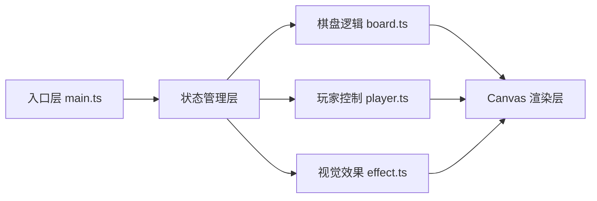

## 1. 架构设计



项目采用模块化架构，基于 TypeScript + Canvas 2D 实现，使用 Vite 作为构建工具。核心逻辑与渲染分离，通过主入口的状态机统一管理游戏流程。

## 2. 技术描述

- **前端技术栈**：TypeScript + Canvas 2D API + Vite
- **构建工具**：Vite 5.x（支持 HMR 热更新）
- **语言版本**：TypeScript 严格模式，目标 ES2020
- **包管理器**：npm
- **无后端**：纯前端游戏，数据保存在内存中

### 核心技术选型理由

- **Canvas 2D**：适合 2D 游戏渲染，性能优异，动画控制灵活
- **TypeScript**：提供类型安全，减少运行时错误
- **Vite**：开发体验好，启动快，支持 HMR

## 3. 文件结构

| 文件路径 | 用途 |
|----------|------|
| `package.json` | 项目依赖与脚本配置 |
| `vite.config.js` | Vite 构建配置 |
| `tsconfig.json` | TypeScript 编译配置（严格模式） |
| `index.html` | 入口页面，包含 Canvas 容器和全局样式 |
| `src/main.ts` | 游戏主入口，初始化场景、状态机、帧循环 |
| `src/board.ts` | 棋盘逻辑，网格数据、落子检测、状态重置、胜负判定 |
| `src/player.ts` | 玩家控制器，鼠标事件、回合切换、AI 走法 |
| `src/effect.ts` | 视觉效果模块，落子动画、粒子爆散、胜利光效 |

## 4. 核心模块设计

### 4.1 棋盘模块 (board.ts)

```typescript
type CellValue = 0 | 1 | 2; // 0: 空, 1: 玩家1, 2: 玩家2
type Board = CellValue[][];

interface BoardState {
  grid: Board;
  isResetting: boolean;
  resetProgress: number;
}
```

核心方法：
- `placePiece(row, col, player)`: 落子
- `resetBoard()`: 随机重置棋盘状态
- `checkWinner()`: 胜负判定
- `isFull()`: 检查棋盘是否已满

### 4.2 玩家模块 (player.ts)

```typescript
type PlayerMode = 'human' | 'ai';

interface PlayerState {
  currentPlayer: 1 | 2;
  mode1: PlayerMode;
  mode2: PlayerMode;
}
```

核心方法：
- `handleClick(row, col)`: 处理点击
- `switchTurn()`: 切换回合
- `getAIMove()`: AI 随机策略

### 4.3 效果模块 (effect.ts)

```typescript
interface Particle {
  x: number;
  y: number;
  vx: number;
  vy: number;
  color: string;
  size: number;
  life: number;
  maxLife: number;
}

interface PieceAnimation {
  row: number;
  col: number;
  scale: number;
  progress: number;
}
```

核心方法：
- `createPlacementAnim(row, col)`: 创建落子动画
- `createResetParticles(x, y)`: 创建重置粒子
- `updateEffects(deltaTime)`: 更新所有效果
- `renderEffects(ctx)`: 渲染效果

### 4.4 主入口 (main.ts)

状态机状态：
- `idle`: 待机
- `playing`: 游戏进行中
- `placing`: 落子动画中
- `resetting`: 重置动画中
- `gameOver`: 游戏结束

## 5. 性能指标

- 帧率：不低于 55 FPS
- 粒子数量：每次重置不超过 50 个
- 动画总时长：落子 + 重置动画不超过 1 秒
- 内存占用：轻量级，无内存泄漏

## 6. 游戏规则实现要点

1. 每次落子后立即触发重置
2. 重置时棋子先隐藏 0.3 秒，再随机分配
3. 重置不改变棋子总数和颜色比例
4. 横、竖、斜连续 3 个同色即获胜
5. 9 格全满无获胜则平局
6. 三局两胜制计分
