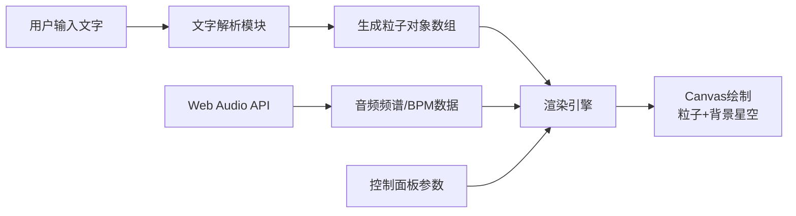

## 1. 产品概述

「词间潮汐」是一款基于Web的交互式文字节奏可视化器，让用户输入文字后，每个字符化身为随音乐律动的粒子，构成有节奏的潮汐文字海。
- 面向前端设计师、创意工作者和文字艺术爱好者
- 提供沉浸式的音画联动体验，将文字转化为动态视觉艺术

## 2. 核心功能

### 2.1 功能模块
1. **主画布区域**：粒子文字展示、背景星空效果、色彩潮汐渐变
2. **控制面板**：文字输入、播放控制、速度调节、粒子大小、音色风格切换

### 2.2 页面详情
| 页面名称 | 模块名称 | 功能描述 |
|---------|---------|---------|
| 主页面 | 文字输入与粒子化 | 支持最多200字符输入，字符即时转为粒子对象 |
| 主页面 | 节奏律动引擎 | 正弦波基础波动 + 音频频谱振幅调制，Y轴起伏 |
| 主页面 | 颜色潮汐渐变 | 水平冷→暖渐变，每10秒色相偏移5度 |
| 主页面 | 控制面板 | 文字框、播放/暂停、速度滑块(0.5x-2.0x)、粒子大小滑块(8-24px)、音色切换(柔和/明亮/暗黑) |
| 主页面 | 音频生成 | Web Audio API生成4小节循环电子氛围音乐，BPM 60-120随机 |

## 3. 核心流程

用户输入文字 → 解析器拆分字符生成粒子数组 → 启动音频引擎 → 渲染器逐帧接收音频频谱数据 → 更新粒子位置/颜色/透明度 → Canvas绘制粒子与背景

## 4. 用户界面设计

### 4.1 设计风格
- **主题**：极简深色，径向渐变从 #0B101E 到 #000000
- **配色**：冷色(#2C3E50 → #3498DB)到暖色(#E74C3C → #F39C12)水平渐变
- **玻璃质感**：半透明磨砂玻璃 `backdrop-filter: blur(12px)`，边框 `rgba(255,255,255,0.1)`
- **交互效果**：悬停0.2px发光外扩，按钮1.5秒脉冲呼吸
- **字体**：优先选择具有设计感的衬线/等宽字体，避免Inter/Roboto/Arial

### 4.2 页面设计概述
| 页面名称 | 模块名称 | UI元素 |
|---------|---------|--------|
| 主页面 | 画布区 | 100%宽 x 75vh，粒子字符+垂直光晕线+星空背景 |
| 主页面 | 控制面板(桌面) | 右侧固定折叠，0.4s ease-in-out滑入，输入框/按钮/滑块 |
| 主页面 | 控制面板(移动) | <768px时移至底部横向图标条 |

### 4.3 响应式
- 桌面优先，移动端自适应
- 字体和粒子间距随视口宽度缩放（1rem ~ 1.8rem）
- <768px：控制面板移至底部折叠为横向图标按钮组

## 5. 性能约束
- 60FPS流畅运行，200粒子时帧率 ≥ 55FPS
- 单帧粒子更新+渲染计算 ≤ 12ms
- 音频分析数据每3帧抽取一次（解耦帧率）
