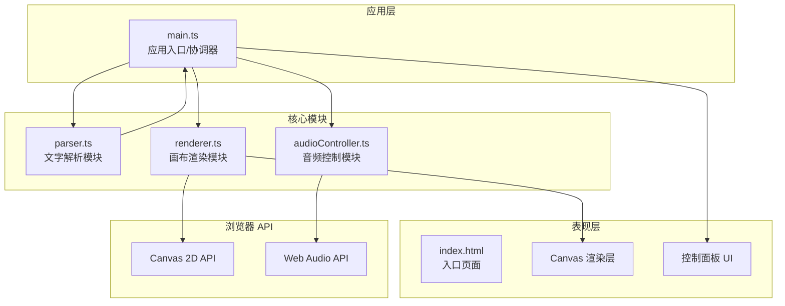

## 1. 架构设计



**数据流向：**
1. 用户在 `index.html` 输入文字 → `main.ts` 监听输入事件
2. `main.ts` 调用 `parser.ts` 解析文字，返回 `Particle[]`
3. `main.ts` 将粒子数组传给 `renderer.ts`
4. `audioController.ts` 通过 Web Audio API 生成音乐并输出频谱/BPM数据
5. `main.ts` 驱动 `requestAnimationFrame` 循环，每帧将音频数据 + 粒子传入 `renderer.ts` 绘制

## 2. 技术描述

- **前端构建**：Vite@5 + TypeScript@5（严格模式，目标ES2020）
- **渲染引擎**：Canvas 2D API（原生，无第三方库）
- **音频引擎**：Web Audio API（OscillatorNode + GainNode + AnalyserNode + DelayNode）
- **样式方案**：原生CSS（backdrop-filter, CSS变量, 响应式媒体查询）
- **无状态管理库**：main.ts 作为协调器使用闭包维护状态

## 3. 文件结构与职责

| 文件路径 | 职责 | 输出数据 | 依赖 |
|---------|------|---------|-----|
| package.json | 项目配置与依赖 | — | — |
| vite.config.js | Vite构建配置（HMR支持） | — | — |
| tsconfig.json | TypeScript严格配置 | — | — |
| index.html | 入口页面，Canvas + 控制面板DOM结构 | — | — |
| src/main.ts | 应用入口，事件监听，数据流协调，动画循环驱动 | — | parser, renderer, audioController |
| src/parser.ts | 文字拆分，计算每个字符初始位置/视觉属性 | `Particle[]` | — |
| src/renderer.ts | 粒子逐帧更新+绘制，背景星空，色彩渐变 | —（绘制到Canvas） | 接收 Particle[] + AudioData |
| src/audioController.ts | 音乐生成，BPM管理，频谱分析输出 | `AudioData` { spectrum, bpm, bassLevel, midHighLevel } | — |

## 4. 核心数据模型

### 4.1 粒子对象 (Particle)
```typescript
interface Particle {
  char: string;           // 单个字符
  baseX: number;          // 初始X坐标（画布相对位置）
  baseY: number;          // 初始Y坐标（画布垂直居中）
  currentX: number;       // 当前X
  currentY: number;       // 当前Y
  fontSize: number;       // 字体大小（px）
  colorIndex: number;     // 0~1，用于水平颜色渐变插值
  phaseOffset: number;    // 正弦波相位偏移（基于字符索引）
  weight: number;         // 字符权重（0.4~1.0，影响透明度）
  scale: number;          // 当前缩放
  opacity: number;        // 当前透明度
}
```

### 4.2 音频数据 (AudioData)
```typescript
interface AudioData {
  spectrum: Uint8Array;   // 频率域数据（每3帧更新一次）
  bpm: number;            // 当前BPM
  bassLevel: number;      // 低频振幅 0~1（控制整体起伏）
  midHighLevel: number;   // 中高频振幅 0~1（控制局部抖动）
  isPlaying: boolean;
}
```

### 4.3 控制面板状态 (ControlState)
```typescript
interface ControlState {
  text: string;           // 当前文字（≤200字符）
  isPlaying: boolean;
  speed: number;          // 0.5 ~ 2.0
  particleSize: number;   // 8 ~ 24 px
  timbreStyle: 'soft' | 'bright' | 'dark';
}
```

## 5. 性能优化策略

- **音频分析降频**：`AnalyserNode.getByteFrequencyData()` 每3帧调用一次，缓存结果
- **Canvas离屏绘制**：星空背景预渲染到离屏Canvas，只在色调偏移时重绘
- **粒子池复用**：文字更新时尽量复用已有粒子对象，减少GC
- **requestAnimationFrame时间戳**：使用传入的timestamp计算deltaTime，确保波动速度与帧率解耦
- **字体缓存**：`ctx.font` 字符串缓存，避免每帧重复拼接

## 6. 模块调用关系

```
main.ts
  ├─► parser.parseText(text, canvasWidth, particleSize) → Particle[]
  ├─► audioController.start() / stop() / setTimbre()
  │     └─► audioController.getAudioData() → AudioData
  └─► renderer.render(ctx, particles, audioData, controlState, timestamp)
        ├─► updateParticles(particles, audioData, controlState, timestamp)
        └─► drawBackground(ctx, timestamp)
        └─► drawParticles(ctx, particles)
```
