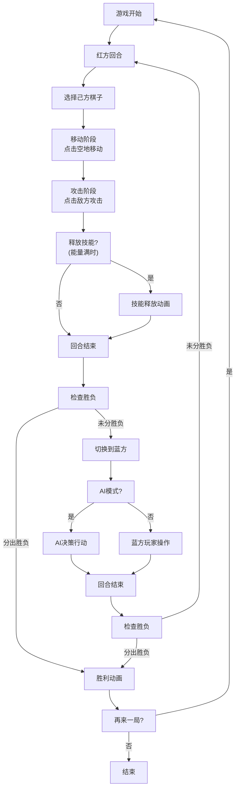

## 1. 产品概述

「暗影棋盘」是一款浏览器端双人回合制策略格斗游戏，玩家在8x8棋盘上操控棋子进行对战，通过策略性走位和技能释放击败对方所有棋子获胜。游戏支持双人同屏对战和AI对战模式，采用暗影主题视觉风格。

- **核心玩法**：回合制拖拽棋子移动与攻击，结合特殊技能与能量系统
- **目标用户**：策略游戏爱好者、休闲玩家
- **产品价值**：轻量化浏览器游戏，无需安装，快速上手，兼具策略深度

## 2. 核心功能

### 2.1 用户角色

| 角色 | 进入方式 | 核心权限 |
|------|---------|----------|
| 红方玩家 | 游戏开始默认先手 | 操作红方5个棋子，移动、攻击、释放技能 |
| 蓝方玩家 | 双人模式下后手 | 操作蓝方5个棋子，移动、攻击、释放技能 |
| AI对手 | AI模式下控制蓝方 | 使用minimax算法决策，自动执行回合 |

### 2.2 功能模块

1. **棋盘系统**：8x8棋盘渲染、棋子布局、位置查询、点击拖拽交互
2. **棋子系统**：三种棋子类型（国王/骑士/弓箭手），生命值、攻击力、移动/攻击范围、能量条、护盾
3. **战斗系统**：普通攻击、特殊技能、伤害计算、粒子特效、死亡动画
4. **回合系统**：轮流操作、移动阶段、攻击阶段、回合切换动画
5. **AI系统**：minimax算法（深度3）、评估函数、200ms响应时间
6. **胜负判定**：全灭判定、胜利动画、再来一局

### 2.3 页面详情

| 页面名称 | 模块名称 | 功能描述 |
|---------|---------|----------|
| 游戏主界面 | 棋盘区域 | 8x8暗色方格棋盘，棋子渲染，拖拽交互，高亮提示 |
| 游戏主界面 | 回合提示区 | 左侧显示当前回合方，旋转光圈动画 |
| 游戏主界面 | 状态面板 | 右侧显示双方剩余棋子数、总生命值 |
| 游戏主界面 | 模式切换 | AI/双人模式切换按钮 |
| 游戏主界面 | 胜利弹窗 | 胜利牌匾动画、金色粒子雨、再来一局按钮 |

## 3. 核心流程

游戏开始 → 红方回合 → 选择棋子 → 移动（可选）→ 攻击/技能 → 回合结束 → 蓝方回合（或AI行动）→ 循环直至一方全灭 → 显示胜利 → 再来一局

## 4. 用户界面设计

### 4.1 设计风格

- **主色调**：深灰 #1A1A2E 与暗红 #E94560 对比，蓝方 #4A90D9
- **棋盘格**：深灰 #2C2C3A 和深蓝 #1A1A3A 交替
- **背景**：深色渐变 #0F0F23 到 #1A1A2E
- **视觉风格**：暗影主题，神秘深邃，发光粒子特效
- **棋子样式**：圆形棋子，中央绘制角色符号（皇冠/马头/弓箭）
- **动效**：粒子爆炸、碎片消散、脉冲光环、旋转光圈、闪光过渡

### 4.2 页面设计概述

| 页面名称 | 模块名称 | UI元素 |
|---------|---------|--------|
| 游戏主界面 | 棋盘 | 8x8方格、交替暗色、棋子圆形渲染、悬停放大光晕 |
| 游戏主界面 | 回合提示 | 左侧竖排、旋转光圈、队伍色高亮 |
| 游戏主界面 | 状态面板 | 右侧竖排、双方棋子数、总生命值条形图 |
| 游戏主界面 | 模式按钮 | 顶部切换按钮、点击切换AI/双人 |
| 游戏主界面 | 能量条 | 棋子底部、灰到队伍色渐变 |
| 游戏主界面 | 胜利弹窗 | 中央放大牌匾、金色粒子雨、再来一局按钮 |

### 4.3 响应式设计

- **桌面端**：棋盘宽度自适应，最小500px，最大800px，正方形
- **移动端**（宽度<600px）：棋盘宽度90%视口，棋子等比缩放
- **触控优化**：拖拽支持触摸事件，点击目标区域适当放大

### 4.4 性能要求

- **帧率**：稳定60FPS
- **AI响应**：≤200ms
- **粒子数**：同时≤100个
