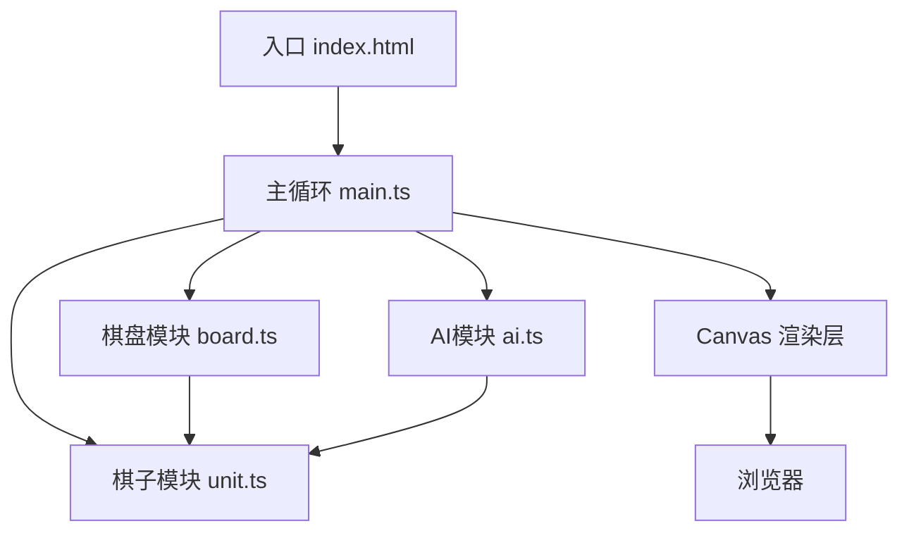

## 1. 架构设计



## 2. 技术描述

- **前端技术栈**：TypeScript + Vite + HTML5 Canvas
- **构建工具**：Vite 5.x（HMR热更新）
- **语言版本**：TypeScript 严格模式，目标 ES2020
- **无后端**：纯前端游戏，所有逻辑在浏览器运行
- **无第三方游戏库**：原生 Canvas 2D API 实现渲染

## 3. 核心模块划分

| 模块 | 文件 | 职责 |
|------|------|------|
| 游戏主循环 | src/main.ts | 游戏状态管理、回合切换、帧更新、胜负判定、全局动画 |
| 棋盘系统 | src/board.ts | 棋盘渲染、棋子布局、点击/拖拽事件处理、位置查询接口 |
| 棋子系统 | src/unit.ts | 棋子类定义、属性、技能、粒子效果生成、伤害计算 |
| AI系统 | src/ai.ts | minimax算法、评估函数、走法生成、决策时间控制 |

## 4. 数据模型

### 4.1 棋子类型定义

```typescript
type Team = 'red' | 'blue';
type UnitType = 'king' | 'knight' | 'archer';
type GamePhase = 'select' | 'move' | 'attack' | 'skill' | 'ended';

interface Position {
  x: number;
  y: number;
}

interface Shield {
  value: number;
  duration: number;
}

interface UnitStats {
  maxHp: number;
  attack: number;
  moveRange: number;
  attackRange: number;
}

interface Particle {
  x: number;
  y: number;
  vx: number;
  vy: number;
  color: string;
  life: number;
  maxLife: number;
  size: number;
}

class Unit {
  id: string;
  type: UnitType;
  team: Team;
  position: Position;
  hp: number;
  maxHp: number;
  attack: number;
  moveRange: number;
  attackRange: number;
  energy: number;
  skillCooldown: number;
  shield: Shield | null;
  hasMoved: boolean;
  hasAttacked: boolean;
  // 动画状态
  isShaking: boolean;
  shakeTime: number;
  isDying: boolean;
  deathTime: number;
  deathParticles: Particle[];
}
```

### 4.2 游戏状态

```typescript
interface GameState {
  units: Unit[];
  currentTeam: Team;
  phase: GamePhase;
  selectedUnit: Unit | null;
  isAIMode: boolean;
  winner: Team | null;
  turnNumber: number;
  particles: Particle[];
  // 动画状态
  flashEffect: { active: boolean; time: number; color: string };
  victoryAnimation: { active: boolean; time: number; winner: Team };
}
```

## 5. 关键算法

### 5.1 Minimax 算法
- 深度限制：3层
- 评估函数：综合棋子价值、生命值、位置优势
- Alpha-Beta 剪枝优化
- 响应时间控制：≤200ms

### 5.2 粒子系统
- 攻击爆炸粒子：10-15个，飞散半径30px，寿命0.4s
- 死亡碎片粒子：20个，寿命0.6s
- 胜利金色粒子雨：从顶部飘落
- 总粒子数限制：≤100

### 5.3 碰撞与范围检测
- 曼哈顿距离 / 切比雪夫距离判断移动和攻击范围
- 弓箭手直线穿透检测
- 骑士冲锋路径检测

## 6. 性能优化策略

- **Canvas分层**：静态棋盘背景预渲染，动态棋子和粒子单独渲染
- **对象池**：粒子对象复用，减少GC
- **requestAnimationFrame**：统一帧更新，保证60FPS
- **AI时间分片**：minimax递归深度控制，超时截断
