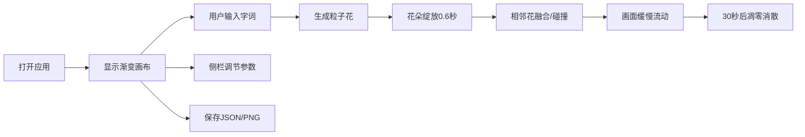

## 1. 产品概述

「词光速写」是一款诗意的创意交互应用，让用户通过文字输入在虚拟画布上生成动态粒子光影诗篇。每一个字词都会化作一朵独特的粒子花，在画布上绽放、融合、最终凋零，形成转瞬即逝的视觉诗篇。

- **主要用途**：创意表达、情绪释放、艺术创作
- **目标用户**：创意工作者、诗歌爱好者、追求视觉美感的普通用户
- **市场价值**：探索文字与视觉艺术的边界，提供独特的数字创作体验

## 2. 核心特性

### 2.1 用户角色

| 角色 | 注册方式 | 核心权限 |
|------|----------|----------|
| 访客用户 | 无需注册 | 使用所有创作功能、保存作品为JSON/PNG |

### 2.2 功能模块

1. **创作画布**：粒子花绽放与融合的主舞台
2. **交互输入**：键盘打字或点击画布生成粒子花
3. **控制侧栏**：调节粒子密度、凋零时长、背景色
4. **作品保存**：一键导出JSON作品数据或PNG截图

### 2.3 页面详情

| 页面名称 | 模块名称 | 功能描述 |
|----------|----------|----------|
| 主创作页 | 画布区域 | 75%宽×85%高的粒子画布，支持点击/打字生成粒子花 |
| 主创作页 | 控制侧栏 | 右侧固定60px宽毛玻璃侧栏，含三个滑块和保存按钮 |
| 主创作页 | 保存功能 | 导出JSON作品数据到后端，或截取当前画布为PNG |

## 3. 核心流程

用户打开应用 → 画布呈现雾灰到暖白的渐变背景 → 用户在画布上点击或打字 → 从输入位置绽放一朵粒子花（颜色、形状由字词情感决定）→ 粒子花与相邻花朵发生融合/碰撞效果 → 所有花朵随时间流动，在设定时长后凋零消散 → 用户可通过侧栏调节参数 → 用户可保存作品为JSON或PNG

## 4. 界面设计

### 4.1 设计风格

- **设计基调**：诗意、流动、有机、转瞬即逝的美感
- **主色调**：雾灰(#E6DFD3)到暖白(#FFF8EC)的渐变背景
- **粒子色**：基于HSL色环，正面情感(0-60°暖色)，负面情感(180-240°冷色)
- **交互色**：金色(#FFD700)用于花朵重叠连线
- **字体**：使用富有诗意的衬线字体展示文字，搭配现代无衬线字体作为UI
- **按钮风格**：半透明毛玻璃质感，悬停时从透明到近白的光晕反馈
- **布局风格**：画布居中，侧栏固定右侧，极简克制的UI元素
- **动效风格**：贝塞尔曲线缓出动画，流畅自然的粒子运动

### 4.2 页面设计概览

| 页面名称 | 模块名称 | UI元素 |
|----------|----------|--------|
| 主创作页 | 画布区域 | 全屏渐变背景、1px柔和阴影边框、粒子花绽放动画、粒子连线脉络、金色重叠脉冲、缓慢流动效果、凋零消散动画 |
| 主创作页 | 控制侧栏 | backdrop-filter: blur(10px)毛玻璃效果、垂直排列三个滑块（粒子密度50-200、凋零时长15-60秒、背景色选择器）、保存按钮（JSON/PNG选项） |
| 主创作页 | 保存按钮 | 悬停光晕动画、点击反馈 |

### 4.3 响应式设计

- **桌面端（默认）**：画布占75%宽×85%高，侧栏固定右侧60px宽
- **移动端（竖屏）**：画布占95%宽，侧栏折叠为底部横条，滑块水平排列
- **触摸优化**：增大点击区域，支持触摸输入生成粒子花

### 4.4 性能指标

- 同时存在30朵花（约3000-4500个粒子）时，帧率不低于45fps
- 使用Canvas 2D进行硬件加速渲染
- 采用requestAnimationFrame进行高效动画循环
- 粒子对象池复用，避免频繁GC
