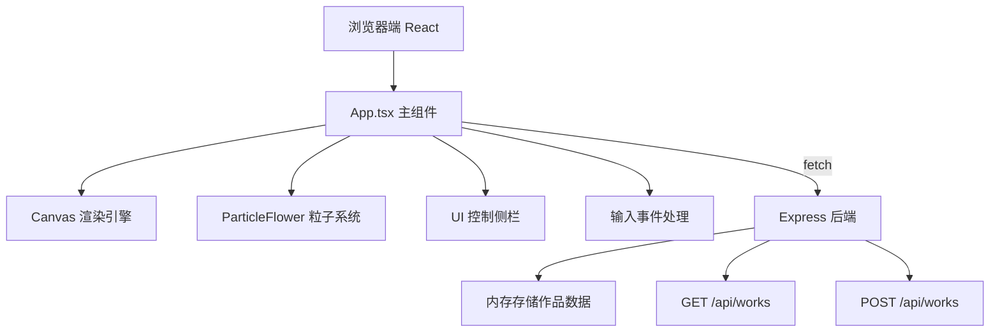
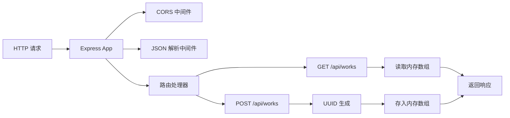

## 1. 架构设计



## 2. 技术栈说明

- **前端框架**：React 18 + TypeScript
- **构建工具**：Vite 5
- **渲染技术**：Canvas 2D API（硬件加速）
- **后端框架**：Express 4 + TypeScript
- **数据存储**：内存数组（开发阶段）
- **唯一标识**：UUID v4
- **跨域处理**：CORS 中间件
- **状态管理**：React Hooks (useState, useRef, useEffect, useCallback)

## 3. 目录结构

```
auto3/
├── src/
│   ├── App.tsx              # 主应用组件
│   ├── ParticleFlower.ts    # 粒子花类模块
│   ├── server.ts            # Express 后端服务
│   └── main.tsx             # React 入口（可选）
├── index.html               # HTML 入口
├── package.json             # 依赖配置
├── vite.config.js           # Vite 构建配置
└── tsconfig.json            # TypeScript 配置
```

## 4. 核心数据类型定义

```typescript
// 粒子接口
interface Particle {
  x: number;
  y: number;
  vx: number;
  vy: number;
  life: number;
  maxLife: number;
  size: number;
  hue: number;
  saturation: number;
  lightness: number;
  alpha: number;
  angle: number;
  distance: number;
  speed: number;
}

// 粒子花接口
interface FlowerData {
  id: string;
  x: number;
  y: number;
  text: string;
  particles: Particle[];
  maxRadius: number;
  currentRadius: number;
  bloomProgress: number;
  bloomDuration: number;
  fadeProgress: number;
  fadeDuration: number;
  hue: number;
  emotion: 'positive' | 'negative' | 'neutral';
  createdAt: number;
  connectedLines: { from: number; to: number }[];
}

// 作品数据接口
interface WorkData {
  id: string;
  flowers: FlowerData[];
  settings: {
    particleDensity: number;
    fadeDuration: number;
    backgroundColor: string;
  };
  createdAt: number;
}

// 画布配置
interface CanvasConfig {
  particleDensity: number;     // 50-200
  fadeDuration: number;        // 15-60秒
  backgroundColor: string;     // 渐变起始色
}
```

## 5. API 定义

### GET /api/works
获取所有保存的作品列表

**响应**：
```typescript
{
  success: boolean;
  data: WorkData[];
}
```

### POST /api/works
保存新作品

**请求体**：
```typescript
{
  flowers: FlowerData[];
  settings: CanvasConfig;
}
```

**响应**：
```typescript
{
  success: boolean;
  data: WorkData;
  message: string;
}
```

## 6. 后端架构



## 7. 核心算法

### 7.1 情感分析算法（简化版）
基于关键词匹配判断字词情感倾向：
- 正面词库：爱、喜欢、快乐、阳光、温暖、火焰、希望、梦想...
- 负面词库：悲伤、痛苦、寒冷、黑暗、孤独、绝望、恐惧...
- 中性：未匹配的词汇

### 7.2 颜色计算
```typescript
function calculateHue(emotion: string, text: string): number {
  const hash = hashCode(text);
  if (emotion === 'positive') {
    return 0 + (hash % 60);  // 暖色区间 0-60
  } else if (emotion === 'negative') {
    return 180 + (hash % 60); // 冷色区间 180-240
  }
  return hash % 360;  // 中性随机
}
```

### 7.3 贝塞尔缓出函数
```typescript
const easeOutCubic = (t: number): number => 1 - Math.pow(1 - t, 3);
```

### 7.4 花朵重叠检测
```typescript
function checkOverlap(flower1: FlowerData, flower2: FlowerData): boolean {
  const dx = flower2.x - flower1.x;
  const dy = flower2.y - flower1.y;
  const distance = Math.sqrt(dx * dx + dy * dy);
  return distance < (flower1.currentRadius + flower2.currentRadius);
}
```

### 7.5 融合粒子衰减
重叠区域粒子每秒减少5%：
```typescript
const decayRate = 0.05; // 5% per second
particle.life -= particle.life * decayRate * deltaTime;
```

## 8. 性能优化策略

1. **粒子对象池**：预分配粒子对象，避免频繁创建销毁
2. **离屏渲染**：背景渐变使用CSS，粒子使用Canvas分层
3. **帧率控制**：使用 `requestAnimationFrame` 配合 `performance.now()`
4. **粒子裁剪**：仅渲染可见区域的粒子
5. **批量绘制**：一次 `beginPath` 绘制多个粒子
6. **DPR 适配**：根据设备像素比调整Canvas分辨率
7. **Web Worker**：可考虑将粒子物理计算移至Worker（进阶优化）

## 9. 动画时序

| 动画 | 时长 | 缓动函数 |
|------|------|----------|
| 粒子花绽放 | 0.6秒 | cubic-bezier(0.34, 1.56, 0.64, 1) |
| 重叠脉冲 | 0.3秒 | ease-in-out |
| 画面流动 | 持续 | linear |
| 凋零消散 | 15-60秒（可配置） | ease-out |
| 按钮悬停光晕 | 0.2秒 | ease-out |
