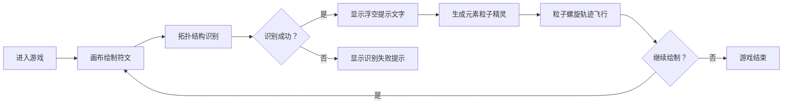

## 1. 产品概述

「符咒工坊」是一款基于浏览器的交互式符文绘制游戏，玩家通过鼠标绘制自定义符文来召唤元素精灵。
- 核心玩法：识别鼠标绘制的符文拓扑结构，召唤对应元素粒子精灵，支持多元素组合召唤高级混合精灵
- 目标用户：喜欢魔法、神秘学和视觉艺术的休闲游戏玩家

## 2. 核心功能

### 2.1 功能模块
1. **符文绘制系统**：Canvas画布上实时绘制鼠标轨迹，支持流畅的线条渲染
2. **符文识别系统**：拓扑分析识别闭合环、直线、波浪、螺旋、交叉环等模式
3. **粒子精灵系统**：生成带拖尾光晕的粒子群，按螺旋/利萨如轨迹飞行
4. **元素组合系统**：火+风=爆燃火焰漩涡，雷+土=晶体电网等组合效果
5. **UI交互系统**：工具栏、历史记录、浮动提示、闪光震动特效

### 2.2 页面详情
| 页面名称 | 模块名称 | 功能描述 |
|-----------|-------------|---------------------|
| 主游戏界面 | 符文画布 | 占屏幕80%宽度，支持鼠标绘制符文，显示粒子精灵和星空背景 |
| 主游戏界面 | 左侧工具栏 | 元素颜色选择（4种固定色）、清除按钮、历史符文召回按钮 |
| 主游戏界面 | 右上符文序列 | 已绘制符文的缩略图序列展示 |
| 主游戏界面 | 浮动提示区 | 识别成功/失败的浮空光晕文字提示 |

## 3. 核心流程

玩家进入游戏 → 在画布上用鼠标绘制符文 → 系统实时识别拓扑结构 → 识别成功显示浮空文字 → 画布中心炸裂元素精灵粒子 → 粒子螺旋飞行环绕 → 可连续绘制多个符文进行组合 → 组合召唤高级混合精灵

## 4. 用户界面设计

### 4.1 设计风格
- **主色调**：深紫黑渐变星空背景（#0B0014 到 #1A0033）
- **元素颜色**：
  - 火元素：橙红渐变 #FF4500 → #FFD700
  - 雷元素：亮紫渐变 #8A2BE2 → #FF00FF
  - 风元素：青绿渐变 #00CED1 → #7FFF00
  - 土元素：赭石渐变 #8B4513 → #DEB887
- **霓虹边框**：默认冰蓝 #00BFFF，随选中元素变化
- **按钮风格**：圆角玻璃质感（毛玻璃模糊10px，半透明背景）
- **字体**：等宽字体，带微弱文字阴影发光效果
- **动效**：悬停微光脉冲缩放（0.3s ease-out）、清除画布渐隐（1秒）、闪光震动特效

### 4.2 页面设计概述
| 页面名称 | 模块名称 | UI元素 |
|-----------|-------------|-------------|
| 主游戏界面 | 符文画布 | 深紫黑渐变星空背景、底部星河粒子漂移、绘制线条、粒子精灵、元素光环 |
| 主游戏界面 | 左侧工具栏 | 玻璃质感面板、4个元素颜色按钮、红色渐变清除按钮、历史记录下拉按钮 |
| 主游戏界面 | 符文序列 | 右上角缩略图展示、缩小符文预览 |
| 主游戏界面 | 浮动提示 | 画布中央下方、带光晕浮空文字、2秒渐隐 |

### 4.3 响应性
- 桌面端优先设计
- 画布自适应窗口大小（80%宽度）
- 工具栏固定左侧，不随滚动移动
