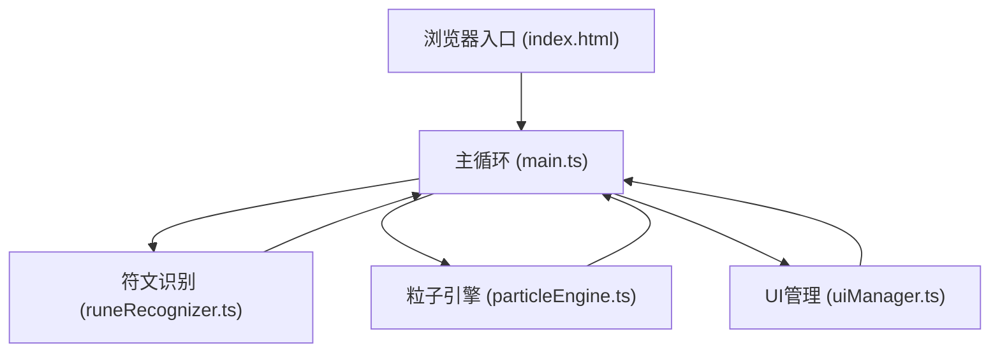

## 1. 架构设计



## 2. 技术描述
- **前端框架**：原生 TypeScript + HTML5 Canvas（无UI框架）
- **构建工具**：Vite 5.x
- **语言标准**：TypeScript 严格模式，目标 ES2020
- **渲染方式**：Canvas 2D API 实时渲染
- **性能目标**：绘制识别响应 < 200ms，500粒子时保持 60FPS

## 3. 模块划分与文件结构

```
project/
├── package.json           # 项目依赖与脚本
├── vite.config.js         # Vite 构建配置
├── tsconfig.json          # TypeScript 配置（严格模式）
├── index.html             # 入口页面
└── src/
    ├── main.ts            # 游戏主循环：画布事件、帧动画、模块协调
    ├── runeRecognizer.ts  # 符文识别：拓扑分析（闭合环/直线/波浪/螺旋/交叉环）
    ├── particleEngine.ts  # 粒子引擎：生成、更新、渲染、轨迹、组合效果
    └── uiManager.ts       # UI管理：工具栏、历史记录、浮动文字、闪光震动
```

## 4. 核心数据结构定义

### 4.1 元素类型
```typescript
type ElementType = 'fire' | 'thunder' | 'wind' | 'earth';
type CombinedElementType = 'fire_wind' | 'thunder_earth' | 'fire_thunder' | 'wind_earth';
```

### 4.2 符文识别结果
```typescript
interface RuneRecognitionResult {
  element: ElementType | null;
  confidence: number;
  pattern: string;
}
```

### 4.3 粒子数据
```typescript
interface Particle {
  x: number;
  y: number;
  vx: number;
  vy: number;
  size: number;
  color1: string;
  color2: string;
  life: number;
  maxLife: number;
  trail: { x: number; y: number }[];
  trajectory: 'spiral' | 'lissajous';
  angle: number;
  angularSpeed: number;
  radius: number;
  focusX: number;
  focusY: number;
  lissajousA?: number;
  lissajousB?: number;
  lissajousDelta?: number;
}
```

### 4.4 符文历史记录
```typescript
interface RuneHistory {
  id: number;
  points: { x: number; y: number }[];
  element: ElementType;
  timestamp: number;
}
```

## 5. 符文识别算法说明

| 符文模式 | 拓扑特征 | 对应元素 |
|---------|---------|---------|
| 闭合环 + 直线 | 检测到闭合路径 + 至少一条外部直线段 | 火 (fire) |
| 锯齿波浪 | 高频方向变化、Y轴振幅大于X轴 | 雷 (thunder) |
| 螺旋 | 旋转方向一致、半径逐渐变化 | 风 (wind) |
| 多个交叉环 | 2个以上闭合路径、存在交叉点 | 土 (earth) |

## 6. 粒子系统参数

| 元素 | 粒子数量 | 基础颜色 | 轨迹类型 |
|-----|---------|---------|---------|
| 单元素 | 150 | 对应渐变色 | 螺旋 (spiral) |
| 双元素组合 | 300 | 融合渐变色 | 利萨如 (lissajous) |
| 最大限制 | 500 | - | - |
