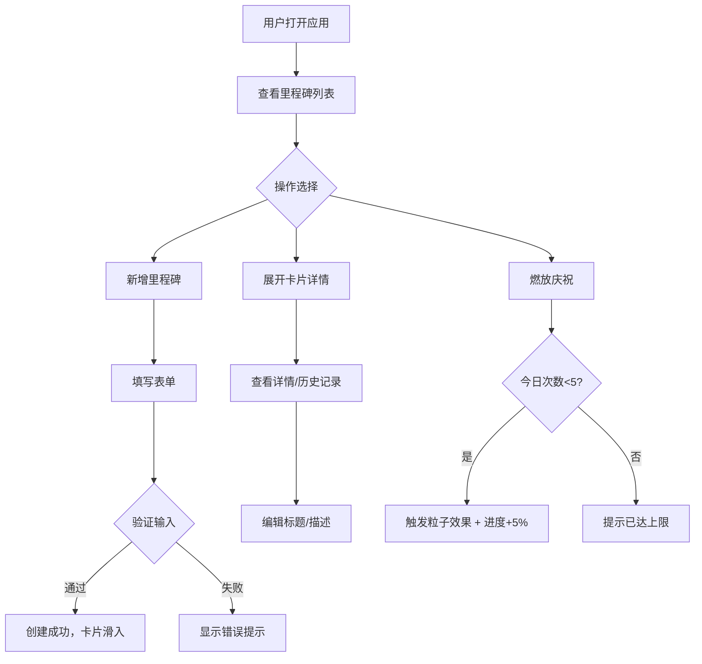

## 1. 产品概述

「动态里程碑」是一个面向项目团队的全栈Web应用，旨在帮助团队在项目推进过程中创建、追踪和庆祝阶段性成果。通过时间线布局的可视化展示和互动庆祝机制，让团队成员在完成每个小目标时获得正向激励，提升项目士气和参与感。

- 目标用户：项目管理者和团队成员，需要一个轻量级工具追踪里程碑进度并团队庆祝
- 核心价值：将枯燥的进度追踪转化为有仪式感的团队体验，通过庆祝机制增强成就感和动力

## 2. 核心功能

### 2.1 用户角色

| 角色 | 注册方式 | 核心权限 |
|------|----------|----------|
| 团队成员 | 无需注册（本地开发模式） | 创建、查看、庆祝、编辑里程碑 |

### 2.2 功能模块

1. **里程碑列表页**：时间线布局的里程碑卡片列表、新增里程碑入口
2. **里程碑详情**：展开视图显示完整信息、历史庆祝记录、编辑功能
3. **庆祝系统**：粒子爆炸效果、进度自动增加、每日限制

### 2.3 页面详情

| 页面名称 | 模块名称 | 功能描述 |
|----------|----------|----------|
| 里程碑列表页 | 时间线列表 | 按截止日期排列的里程碑卡片，带滚动渐入动画 |
| 里程碑列表页 | 新增表单 | 底部按钮弹出表单，填写标题/描述/截止日期并验证 |
| 里程碑卡片 | 进度展示 | 显示标题、目标描述、截止日期、进度百分比条 |
| 里程碑卡片 | 燃放庆祝 | 触发粒子爆炸效果，进度+5%，每日限5次 |
| 里程碑卡片 | 展开详情 | 显示完整描述、创建时间、庆祝历史、编辑功能 |

## 3. 核心流程

1. 用户打开应用，查看以时间线布局排列的里程碑列表
2. 点击底部「新增里程碑」按钮，填写表单创建新里程碑
3. 新卡片以动画出现在列表顶部
4. 点击卡片空白区域展开详细视图，查看历史庆祝记录或编辑信息
5. 点击「燃放庆祝」按钮触发粒子效果，进度自动增加5%
6. 每日每个卡片最多燃放5次，庆祝不可逆

## 4. 用户界面设计

### 4.1 设计风格

- 主题：深色科技感
- 主色：背景 #1a1a2e，卡片 #16213e，强调色 #E94560
- 进度条渐变：从 #0f3460 到 #e94560
- 卡片发光边框：box-shadow 0 0 8px rgba(233,69,96,0.3)
- 按钮样式：圆角按钮，hover 缩放1.05 + 颜色从 #e94560 变为 #c0392b
- 字体：使用 Orbitron 作为展示字体（科技感），Outfit 作为正文字体
- 布局：垂直时间线，卡片居中排列
- 背景：细微网格点阵纹理（CSS radial-gradient）

### 4.2 页面设计概览

| 页面名称 | 模块名称 | UI元素 |
|----------|----------|--------|
| 里程碑列表页 | 时间线列表 | 深色背景+网格点阵，卡片垂直排列，滚动渐入动画（透明度0.4→1，Y轴偏移0-10px） |
| 里程碑列表页 | 新增按钮 | 页面底部固定按钮，点击弹出模态表单 |
| 里程碑卡片 | 基础信息 | 标题（粗体）、描述、截止日期、进度条（渐变填充） |
| 里程碑卡片 | 庆祝按钮 | 卡片右侧，hover缩放，点击后粒子爆炸200-300粒子 |
| 里程碑卡片 | 展开详情 | 高度过渡动画300ms ease-out，显示历史记录列表和编辑按钮 |

### 4.3 响应式

- 桌面优先设计，最大宽度960px居中
- 卡片宽度自适应，最小320px
- 移动端适配：卡片全宽，按钮适当放大便于触摸操作

### 4.4 动画规格

- 新卡片出现：从右侧滑入动画
- 新增卡片出现：从顶部滑入动画
- 卡片展开/收起：高度过渡300ms ease-out
- 粒子效果：200-300粒子，3秒消散，颜色基于卡片主题色和相邻色
- 进度数字跳动：数字递增动画
- 滚动渐入：基于视口位置的透明度和Y轴偏移过渡
