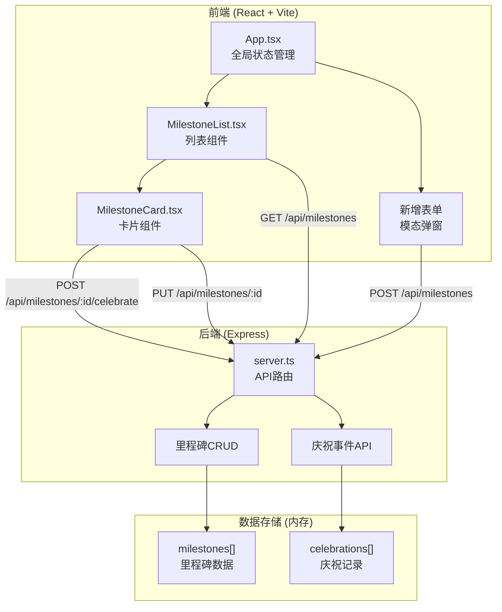
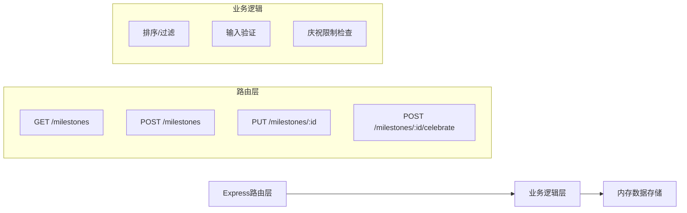
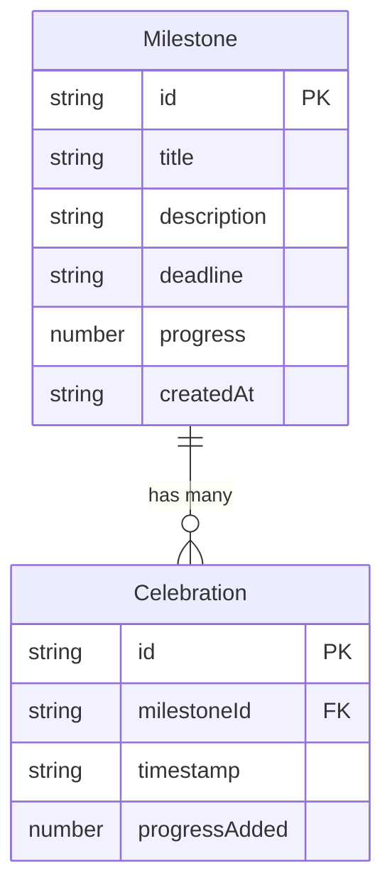

## 1. 架构设计



## 2. 技术说明

- 前端：React 18 + TypeScript + Vite
- 后端：Express 4 + TypeScript（commonjs模块）
- 状态管理：React useState + useEffect（组件内状态）
- 数据存储：服务端内存数组（开发模式）
- 构建工具：Vite，配置代理到后端端口3001
- 样式方案：CSS-in-JS（内联样式 + CSS模块），无Tailwind
- 动画：CSS transitions + Canvas API（粒子效果）
- 唯一ID生成：cuid

## 3. 路由定义

| 路由 | 用途 |
|------|------|
| / | 主页面，展示里程碑列表 |

## 4. API定义

### 4.1 TypeScript类型定义

```typescript
interface Milestone {
  id: string;
  title: string;
  description: string;
  deadline: string;
  progress: number;
  createdAt: string;
  celebrations: Celebration[];
}

interface Celebration {
  id: string;
  milestoneId: string;
  timestamp: string;
  progressAdded: number;
}

interface CreateMilestoneRequest {
  title: string;
  description: string;
  deadline: string;
}

interface UpdateMilestoneRequest {
  title?: string;
  description?: string;
}

interface CelebrateResponse {
  success: boolean;
  milestone: Milestone;
  message?: string;
}
```

### 4.2 API端点

| 方法 | 路径 | 描述 | 请求体 | 响应 |
|------|------|------|--------|------|
| GET | /api/milestones | 获取所有里程碑（按截止日期排序） | - | Milestone[] |
| POST | /api/milestones | 创建新里程碑 | CreateMilestoneRequest | Milestone |
| PUT | /api/milestones/:id | 更新里程碑 | UpdateMilestoneRequest | Milestone |
| POST | /api/milestones/:id/celebrate | 庆祝里程碑（进度+5%） | - | CelebrateResponse |

### 4.3 庆祝限制逻辑

- 每个里程碑每日最多庆祝5次
- 服务端根据celebrations记录中当天日期的条目数判断
- 进度最大值为100%，不可超过
- 庆祝操作不可逆

## 5. 服务端架构图



## 6. 数据模型

### 6.1 数据模型定义



### 6.2 初始化数据

服务启动时预置2-3条示例里程碑数据，方便开发者即时看到界面效果。
