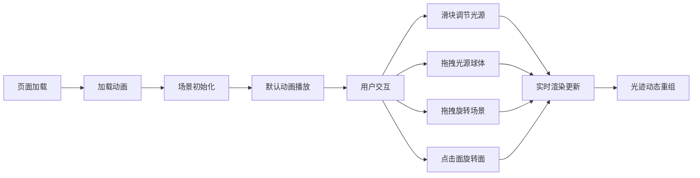

## 1. 产品概述

「光织立方」是一款浏览器交互式三维光影雕塑生成器，用户可通过调节滑块和拖拽控制点，实时观察彩色光线在六面体网格立方体内反射交织形成的动态抽象光影雕塑。

- 核心价值：提供沉浸式光影艺术创作体验，让用户无需专业知识即可创造独特的三维光影雕塑
- 目标用户：数字艺术爱好者、设计师、创意工作者及对光影美学感兴趣的普通用户
- 市场定位：轻量化 WebGL 创意工具，主打即时反馈与视觉美感

## 2. 核心功能

### 2.1 功能模块

1. **三维网格立方体**：6 面独立可旋转的半透明网格立方体，支持鼠标拖拽场景旋转
2. **交互式光源系统**：3 个独立可控光源（红、绿、蓝），支持位置/强度/色相调节
3. **光线反射与光迹**：实时光线反射计算，形成带拖尾效果的动态光迹
4. **交互式面旋转**：点击拖拽立方体面可绕法线独立旋转
5. **背景粒子星云**：静态随机粒子背景，增强空间深邃感

### 2.2 页面详情

| 页面名称 | 模块名称 | 功能描述 |
|-----------|-------------|---------------------|
| 主页面 | 3D 场景 | 展示立方体、光源、光线粒子、背景星云 |
| 主页面 | 左侧控制面板 | 光源参数滑块、颜色选择器、信息展示 |
| 主页面 | 加载动画 | 全屏加载动画，提升首屏体验 |

## 3. 核心流程

用户打开页面 → 加载动画展示 → 场景初始化完成 → 默认立方体自转 + 光源发射光线 → 用户通过滑块调节光源参数 → 用户拖拽光源球体移动位置 → 用户点击立方体面进行旋转 → 实时观察光迹重组效果

## 4. 用户界面设计

### 4.1 设计风格

- **主色调**：纯黑到深蓝径向渐变背景（#0A0A1E → #000011）
- **强调色**：红（#FF3366）、绿（#33FF99）、蓝（#3399FF）光源色
- **辅助色**：浅灰 #CCCCCC（文字）、半透明白色（面板背景）
- **字体**：monospace 等宽字体，字号 14px
- **视觉风格**：赛博冷色调、科技感、毛玻璃效果、发光元素

### 4.2 页面设计概述

| 页面名称 | 模块名称 | UI 元素 |
|-----------|-------------|----------|
| 主页面 | 3D 画布 | 全屏 WebGL 渲染，立方体居中 |
| 主页面 | 左侧控制面板 | 半透明毛玻璃背景（RGBA(255,255,255,0.1)），圆角 12px，模糊 8px |
| 主页面 | 滑块控件 | 细长条圆形拖柄，0.3s ease-out 过渡动画 |
| 主页面 | 颜色选择器 | 圆形色轮样式 |
| 主页面 | 光源拖拽点 | 中心发光，外发光半径 4px |
| 主页面 | 加载动画 | 全屏居中，光效旋转动画 |

### 4.3 响应式设计

- 桌面端（≥768px）：左侧固定控制面板
- 移动端（<768px）：底部抽屉式菜单，0.4s 滑动展开/收起动画
- 支持窗口大小变化实时适配

### 4.4 3D 场景指引

- **环境**：纯黑到深蓝径向渐变背景，营造深邃空间感
- **光源**：3 个点光源（红、绿、蓝），位置可调节，以发光球体可视化
- **相机**：透视相机，初始位置距立方体约 5 单位
- **构图**：立方体居中，光源环绕，光迹填充空间
- **交互**：鼠标拖拽旋转场景、拖拽光源、点击面旋转
- **性能**：60fps 目标，粒子总数 ≤ 3000，光迹生命周期 2 秒

## 5. 性能指标

- 帧率：稳定 60fps
- 光线粒子总数：≤ 3000
- 光迹生命周期：≤ 2 秒
- 交互响应延迟：< 100ms
