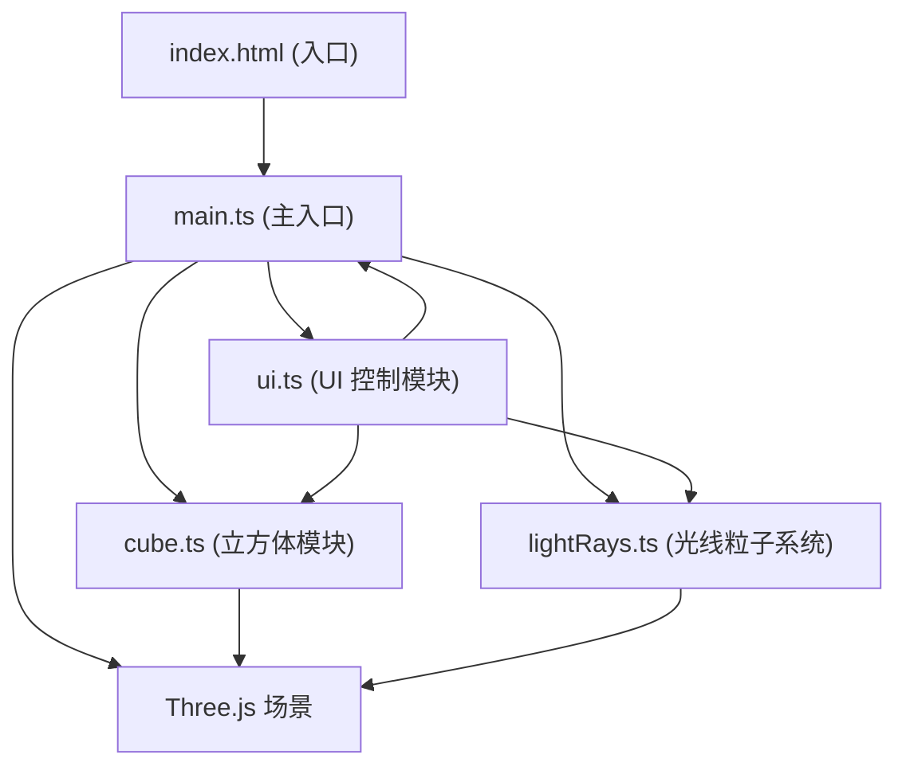

## 1. 架构设计



## 2. 技术描述

- **前端框架**：原生 TypeScript + Three.js
- **构建工具**：Vite（支持 HMR 热更新）
- **3D 引擎**：Three.js
- **类型系统**：TypeScript 严格模式，目标 ES2020
- **样式**：原生 CSS，毛玻璃效果、CSS 变量、CSS 动画

## 3. 文件结构

| 文件路径 | 职责说明 |
|----------|----------|
| `package.json` | 项目依赖和脚本配置 |
| `vite.config.js` | Vite 构建配置 |
| `tsconfig.json` | TypeScript 编译配置（严格模式） |
| `index.html` | 入口 HTML 页面，含加载动画 |
| `src/main.ts` | 主入口：场景初始化、主循环、事件绑定 |
| `src/cube.ts` | 立方体模块：六面体网格、面旋转、法线计算 |
| `src/lightRays.ts` | 光线系统：光线发射、反射计算、光迹粒子 |
| `src/ui.ts` | UI 模块：滑块、颜色选择器、拖拽交互 |

## 4. 核心数据结构

### 4.1 光源数据

```typescript
interface LightSource {
  id: string;
  color: THREE.Color;
  position: THREE.Vector3;
  intensity: number;
  hue: number;
  mesh: THREE.Mesh;
}
```

### 4.2 立方体面数据

```typescript
interface CubeFace {
  normal: THREE.Vector3;
  center: THREE.Vector3;
  rotation: number;
  mesh: THREE.Mesh;
}
```

### 4.3 光迹粒子数据

```typescript
interface LightRayParticle {
  position: THREE.Vector3;
  color: THREE.Color;
  life: number;
  maxLife: number;
  velocity: THREE.Vector3;
}
```

## 5. 关键算法

### 5.1 光线反射算法

使用镜面反射公式计算反射方向：
```
反射方向 = 入射方向 - 2 * (入射方向 · 法线) * 法线
```

### 5.2 光线与平面相交检测

使用射线与平面相交公式判断光线是否击中立方体面。

### 5.3 粒子池管理

使用对象池模式复用光迹粒子，避免频繁创建销毁开销。

## 6. 性能优化策略

1. **粒子池复用**：预分配粒子对象池，循环复用
2. **生命周期管理**：光迹粒子 2 秒后淡出回收
3. **数量限制**：总粒子数 ≤ 3000
4. **几何体复用**：共享几何体和材质
5. **按需更新**：仅在参数变化时重计算
