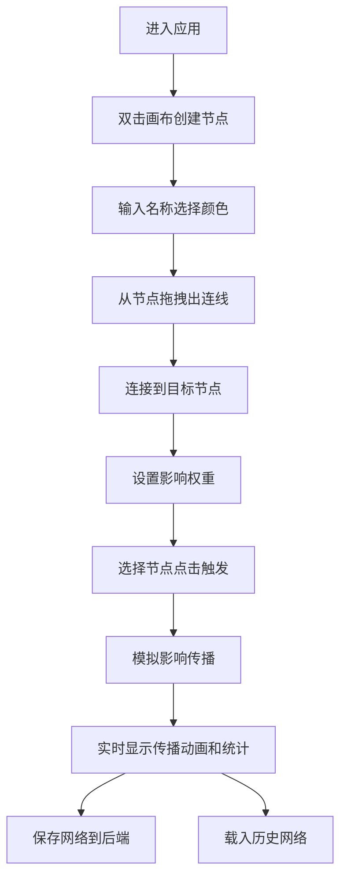

## 1. 产品概述

「因果织网」是一款交互式因果网络可视化与模拟工具，让用户通过拖拽节点、连接因果关系来构建动态因果网络图，并观察初始事件触发后影响在网络中的传播和放大效应。

- **核心价值**：帮助用户直观理解复杂系统中的因果传导机制，可用于教学演示、系统建模、风险分析等场景
- **目标用户**：学生、研究者、系统分析师、决策者
- **产品定位**：轻量级、可视化、交互式的因果网络建模与仿真工具

## 2. 核心功能

### 2.1 功能模块

1. **因果画布**：力导向布局的可视化画布，支持节点创建、拖拽、连线操作
2. **节点管理**：创建/编辑节点名称和颜色，节点代表事件或状态变量
3. **因果连线**：建立节点间的因果关系，设置影响权重（0.1-1.0）
4. **传播模拟**：从指定节点触发，模拟影响在网络中的传播过程（最大6层深度）
5. **数据持久化**：保存和载入因果网络拓扑结构及权重数据
6. **实时统计**：显示激活深度、激活节点总数等模拟数据

### 2.2 页面详情

| 页面名称 | 模块名称 | 功能描述 |
|----------|----------|----------|
| 主应用页面 | 顶部统计栏 | 实时显示激活深度、激活节点总数、传播树图 |
| 主应用页面 | 因果画布 | 75%宽度，力导向布局，节点和连线渲染，交互操作 |
| 主应用页面 | 侧边栏 | 25%宽度，节点列表、触发按钮、保存/载入功能 |
| 主应用页面 | 节点创建弹窗 | 双击画布弹出，输入名称和选择颜色 |
| 主应用页面 | 权重设置滑块 | 连线中点弹出，设置影响权重 |

## 3. 核心流程

### 3.1 用户操作流程

用户进入应用后，可在画布上双击创建节点，拖拽节点调整位置，从节点拖拽出连线建立因果关系。选择节点点击触发按钮后，系统开始模拟影响传播过程，实时显示传播路径和统计数据。用户可保存当前网络到后端，或从列表中载入历史网络。

## 4. 用户界面设计

### 4.1 设计风格

- **设计主题**：深空星空主题，神秘科技感
- **主色调**：深蓝紫色渐变背景（#1A1A2E 到 #16213E）
- **强调色**：亮黄色脉冲（激活初始节点）、亮橙色（#FF8C00，激活传播）
- **预设色板**：8种节点颜色供选择
- **字体**：现代无衬线字体，标题使用具有科技感的显示字体
- **视觉效果**：毛玻璃侧边栏、发光节点、脉冲动画、粒子反馈

### 4.2 页面设计概述

| 页面名称 | 模块名称 | UI元素 |
|----------|----------|--------|
| 主应用 | 顶部统计栏 | 半透明背景，实时数据展示，脉冲动画 |
| 主应用 | 因果画布 | 75%宽度，星空背景，力导向布局，圆形节点，贝塞尔曲线连线 |
| 主应用 | 侧边栏 | 25%宽度，毛玻璃效果（backdrop-filter: blur(10px)），节点列表，操作按钮 |
| 主应用 | 弹窗/滑块 | 深色半透明背景，平滑过渡动画 |

### 4.3 响应式设计

- **大屏适配**（≥1440px）：优化间距和尺寸，充分利用屏幕空间
- **标准屏**（1280px-1440px）：默认布局，侧边栏25%宽度
- **小屏适配**（<1280px）：侧边栏自动收起为悬浮按钮，点击展开

### 4.4 动画与交互

- **节点交互**：选中时外发光扩散到80px，拖拽时弹性回弹（0.3秒 cubic-bezier）
- **连线交互**：默认半透明（0.4），激活时脉冲虚线动画（dash 1.5s linear infinite）
- **连接反馈**：粒子飞溅效果
- **激活动画**：亮黄色环形脉冲，颜色向亮橙色渐变，3秒后恢复
- **平滑过渡**：所有交互操作都有平滑过渡效果

## 5. 性能要求

- 支持50个节点和100条连线同时存在
- 力导向布局帧率不低于30fps
- 动画流畅，无明显卡顿
