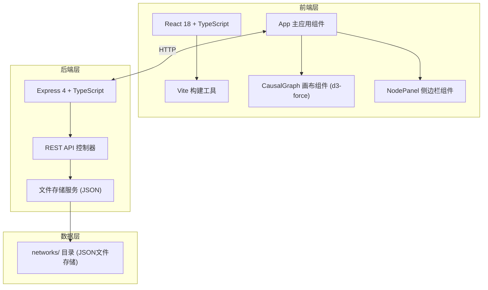
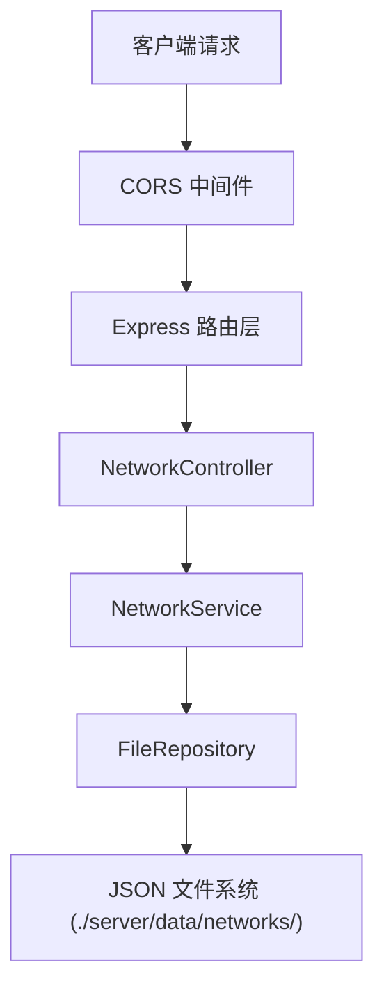
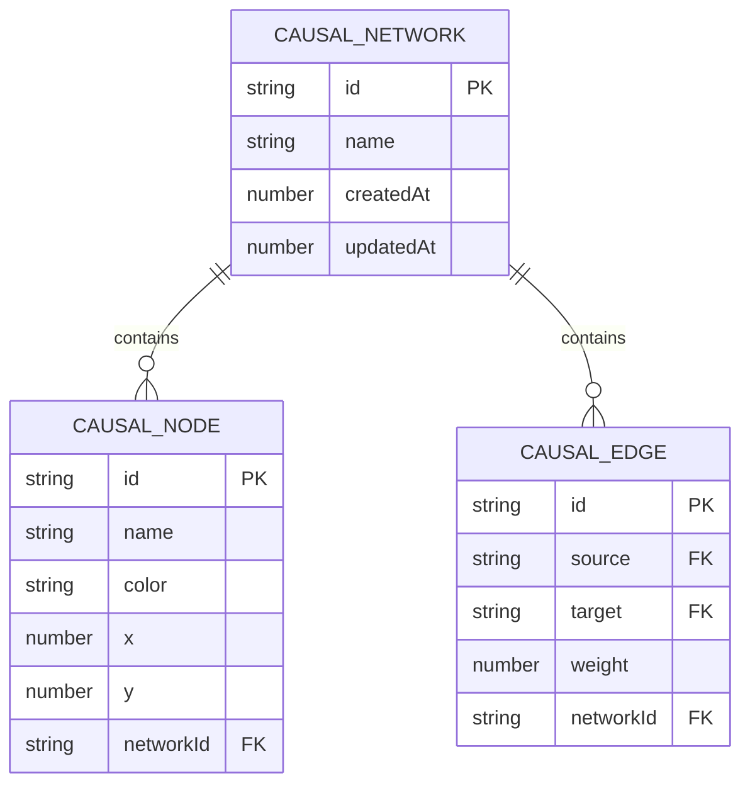

## 1. 架构设计



## 2. 技术描述

- **前端**：React 18 + TypeScript + Vite
  - UI组件：原生CSS + CSS动画
  - 力导向布局：d3-force
  - 状态管理：React useState/useRef（轻量级场景）
  - HTTP客户端：fetch API
  
- **后端**：Express 4 + TypeScript
  - CORS中间件
  - JSON文件持久化存储
  - RESTful API设计
  
- **构建工具**：Vite 5 + @vitejs/plugin-react
  - 支持React HMR
  - TypeScript严格模式
  - 目标ES2020

## 3. 路由定义

| 路由 | 用途 |
|------|------|
| / | 应用主页面 |
| GET /api/networks | 获取所有保存的网络列表 |
| GET /api/networks/:id | 获取指定网络详情 |
| POST /api/networks | 保存新的网络 |
| PUT /api/networks/:id | 更新指定网络 |
| DELETE /api/networks/:id | 删除指定网络 |

## 4. API 定义

### 4.1 类型定义

```typescript
// 节点类型
interface CausalNode {
  id: string;
  name: string;
  color: string;
  x: number;
  y: number;
  vx?: number;
  vy?: number;
}

// 连线类型
interface CausalEdge {
  id: string;
  source: string;
  target: string;
  weight: number; // 0.1 - 1.0
}

// 网络类型
interface CausalNetwork {
  id: string;
  name: string;
  createdAt: number;
  updatedAt: number;
  nodes: CausalNode[];
  edges: CausalEdge[];
}

// 激活状态
interface ActivationState {
  nodeId: string;
  depth: number;
  activatedAt: number;
  isInitial: boolean;
}

// 传播统计
interface PropagationStats {
  maxDepth: number;
  totalActivated: number;
  activatedEdges: string[];
}
```

### 4.2 请求/响应模式

**GET /api/networks**
- 响应: `{ networks: Array<{id: string, name: string, createdAt: number, updatedAt: number}> }`

**GET /api/networks/:id**
- 响应: `CausalNetwork`

**POST /api/networks**
- 请求体: `{ name: string, nodes: CausalNode[], edges: CausalEdge[] }`
- 响应: `{ id: string, ...network }`

**PUT /api/networks/:id**
- 请求体: `{ name: string, nodes: CausalNode[], edges: CausalEdge[] }`
- 响应: `CausalNetwork`

**DELETE /api/networks/:id**
- 响应: `{ success: true }`

## 5. 服务器架构图



### 模块职责

- **NetworkController**：处理HTTP请求，参数校验，响应格式化
- **NetworkService**：业务逻辑，ID生成（cuid），时间戳管理
- **FileRepository**：文件读写操作，JSON序列化/反序列化

## 6. 数据模型

### 6.1 实体关系图



### 6.2 文件存储结构

```
server/
├── data/
│   └── networks/
│       ├── <network-id-1>.json
│       ├── <network-id-2>.json
│       └── ...
```

每个网络JSON文件格式:
```json
{
  "id": "cuid-generated-id",
  "name": "网络名称",
  "createdAt": 1234567890,
  "updatedAt": 1234567890,
  "nodes": [
    {
      "id": "node-cuid-1",
      "name": "节点1",
      "color": "#FF6B6B",
      "x": 100,
      "y": 200
    }
  ],
  "edges": [
    {
      "id": "edge-cuid-1",
      "source": "node-cuid-1",
      "target": "node-cuid-2",
      "weight": 0.5
    }
  ]
}
```

## 7. 项目文件结构

```
/
├── package.json
├── vite.config.js
├── tsconfig.json
├── index.html
├── src/
│   └── client/
│       ├── app.tsx          # 主应用组件
│       ├── CausalGraph.tsx  # 核心画布组件
│       ├── NodePanel.tsx    # 侧边栏组件
│       └── types.ts         # 类型定义
├── server/
│   ├── server.ts            # Express服务器
│   ├── controllers/
│   │   └── networkController.ts
│   ├── services/
│   │   └── networkService.ts
│   ├── repositories/
│   │   └── fileRepository.ts
│   └── data/
│       └── networks/        # 存储目录
└── .trae/
    └── documents/
        ├── PRD_因果织网.md
        └── Tech_Architecture_因果织网.md
```
