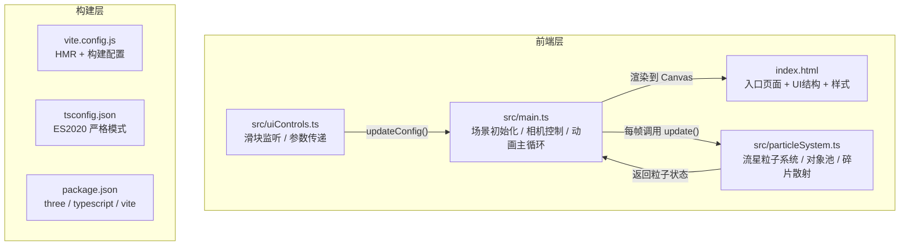

## 1. 架构设计



**数据流向**：UI 滑块事件 → uiControls.ts 解析参数 → main.ts.updateConfig() 更新配置 → particleSystem.ts 每帧读取配置生成/更新粒子 → main.ts 动画循环渲染

## 2. 技术说明

- **前端框架**：TypeScript + Three.js（原生，非 React 封装）
- **构建工具**：Vite + HMR
- **3D 引擎**：Three.js（使用 BufferGeometry + Points + 自定义 Shader 实现高性能粒子渲染）
- **相机控制**：Three.js OrbitControls
- **无后端**：纯前端应用

## 3. 路由定义

| 路由 | 用途 |
|------|------|
| / | 单页应用，包含三维视口和控制面板 |

## 4. 核心模块设计

### 4.1 文件结构与职责

```
/
├── package.json          # 依赖管理，启动脚本 npm run dev
├── vite.config.js        # Vite 构建配置，HMR 支持
├── tsconfig.json         # TypeScript 严格模式，目标 ES2020
├── index.html            # 入口页面，深空背景，控制面板UI，加载动画
└── src/
    ├── main.ts           # 场景初始化，相机控制，动画主循环，接收UI参数
    ├── particleSystem.ts  # 流星粒子系统，对象池，碎片散射
    └── uiControls.ts     # UI交互逻辑，监听滑块和按钮事件
```

### 4.2 粒子系统架构（对象池）

```mermaid
flowchart LR
    "对象池" -->|"获取"| "活跃流星"
    "活跃流星" -->|"生命周期结束"| "轨迹末端"
    "轨迹末端" -->|"散射生成"| "碎片粒子"
    "碎片粒子" -->|"2秒后消散"| "对象池回收"
    "对象池" -->|"获取"| "碎片粒子"
```

**对象池设计**：
- 预分配固定大小的流星对象数组（池容量：200）
- 预分配固定大小的碎片对象数组（池容量：6000，最大 50颗/秒 × 30碎片 × 4秒缓冲）
- 每个对象含：position, velocity, color, life, maxLife, active 标记
- 获取时从池中取首个 inactive 对象，释放时标记 inactive
- 避免每帧 new/GC 造成内存抖动

### 4.3 渲染策略

- **流星轨迹**：使用 Line 几何体或自定义 Trail 几何体，每颗流星记录最近 N 个位置点，使用 AdditiveBlending 实现发光效果，颜色沿轨迹从 #FFFFFF → #FF8C00 → #8B0000 渐变
- **碎片粒子**：使用 Points + BufferGeometry 批量渲染，每帧更新 position 和 opacity 属性
- **性能优化**：合并所有碎片为单个 Points 对象，使用 BufferAttribute 动态更新，避免逐粒子创建 Mesh

### 4.4 接口定义

```typescript
// particleSystem.ts 导出接口
interface MeteorConfig {
  density: number;      // 1-50 颗/秒
  direction: number;    // 0-360 度
  speed: number;        // 5-30 单位/秒
}

class ParticleSystem {
  constructor(scene: THREE.Scene);
  update(delta: number): void;
  updateConfig(config: Partial<MeteorConfig>): void;
  triggerBurst(): void;  // 爆发效果
  dispose(): void;
}

// main.ts 导出接口
interface AppConfig extends MeteorConfig {}

class App {
  updateConfig(config: Partial<AppConfig>): void;
}

// uiControls.ts
function initControls(app: App): void;
```

### 4.5 性能约束实现

| 约束 | 实现方式 |
|------|----------|
| 45+ FPS @ 50颗/秒 | 对象池 + 批量 BufferGeometry + Points 合并渲染 |
| 避免内存抖动 | 预分配对象池，生命周期内复用对象 |
| 轨迹渲染性能 | 每颗流星限制轨迹点数量（最多20点），过期点回收 |
| 碎片渲染性能 | 所有碎片合并为单个 Points 对象，单次 draw call |
