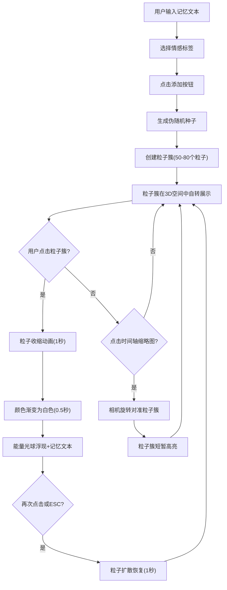

## 1. 产品概述

「水晶记忆」是一款浏览器交互式三维粒子记忆相册，让用户以星尘粒子形式存储和回溯生活中的重要瞬间。用户输入简短记忆文本并选择情感标签，系统在三维空间中生成对应的星尘粒子簇，点击粒子簇可触发召回动画回溯记忆。

## 2. 核心功能

### 2.1 用户角色
| 角色 | 注册方式 | 核心权限 |
|------|----------|----------|
| 普通用户 | 无需注册 | 添加记忆、浏览粒子簇、召回记忆、时间轴导航 |

### 2.2 功能模块
1. **三维粒子场景**：基于Three.js的三维空间，展示所有记忆粒子簇，支持自由旋转视角
2. **记忆添加**：输入文本+情感标签，生成粒子簇
3. **记忆召回**：点击粒子簇触发收缩动画，显示记忆文本和能量光球
4. **时间轴面板**：右侧垂直时间轴，按添加时间排列缩略预览
5. **快捷操作**：R键重置视角、C键清除高亮、ESC退出召回模式

### 2.3 页面详情
| 页面名称 | 模块名称 | 功能描述 |
|----------|----------|----------|
| 主场景 | 三维粒子空间 | 全屏三维场景，展示所有星尘粒子簇，支持OrbitControls旋转 |
| 主场景 | 输入面板 | 左下角浮动面板，包含文本输入框、情感标签选择器、添加按钮 |
| 主场景 | 时间轴面板 | 右侧垂直面板，按时间排列粒子簇缩略预览，可点击导航 |
| 主场景 | 召回视图 | 点击粒子簇后触发的收缩动画+能量光球+记忆文本浮层 |

## 3. 核心流程

1. 用户在输入框输入记忆文本（1-50汉字），选择情感标签（喜悦/忧伤/怀念/平静/期待），点击添加按钮
2. 系统根据文本字符编码生成伪随机种子，在三维空间中生成50-80个粒子簇，粒子颜色由情感标签决定
3. 粒子簇呈球壳状分布，以0.005弧度/秒绕Y轴自转
4. 用户点击粒子簇触发召回：粒子收缩至中心→颜色渐变白色→能量光球浮现→记忆文本显示
5. 再次点击光球或按ESC，粒子簇恢复原状
6. 用户可通过时间轴缩略图快速导航至对应粒子簇

## 4. 用户界面设计

### 4.1 设计风格
- 主色调：深蓝#0B0B2A到深紫#1B1B4A渐变（太空主题）
- 情感色彩：喜悦暖橙→亮黄、忧伤冰蓝→淡紫、怀念复古棕→琥珀、平静薄荷→天蓝、期待粉紫→金紫
- 按钮风格：圆角胶囊型，情感渐变填充，悬停光晕效果
- 字体：系统默认无衬线字体，标题48px，正文14px
- 布局：全屏3D场景+浮动面板叠加

### 4.2 页面设计概览
| 页面名称 | 模块名称 | UI元素 |
|----------|----------|--------|
| 主场景 | 三维粒子空间 | 深色太空渐变背景，粒子簇星尘效果，OrbitControls交互 |
| 主场景 | 输入面板 | 半透明毛玻璃面板，圆角12px，输入框+5个情感圆形按钮+添加按钮 |
| 主场景 | 时间轴面板 | 右侧200px宽，毛玻璃背景，圆形缩略图40px直径，垂直滚动 |
| 主场景 | 召回视图 | 收缩粒子动画，半透明能量光球，Canvas纹理文字浮层 |

### 4.3 响应式
- 桌面端优先，3D场景占85%以上屏幕面积
- 输入面板和时间轴面板固定定位叠加在3D场景上

### 4.4 3D场景指引
- 环境：深色太空主题，无环境光贴图
- 光照：环境光+点光源辅助
- 相机：透视相机，初始位置(0,5,20)，OrbitControls阻尼0.05
- 粒子：使用Three.js Points，自定义着色器或PointsMaterial
- 动画：requestAnimationFrame驱动，粒子自转+召回收缩/扩散
- 性能：粒子总数≤2000时保持60FPS，召回动画帧时间≤16ms
