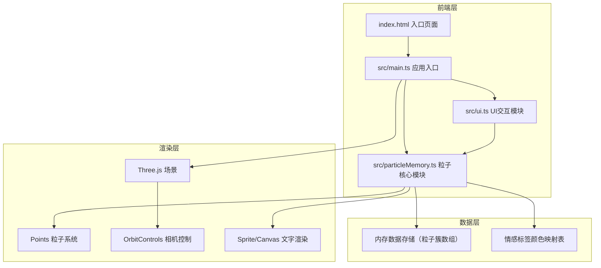

## 1. 架构设计



## 2. 技术说明
- 前端：TypeScript + Three.js + Vite
- 构建工具：Vite（支持HMR）
- 3D渲染：Three.js（Points粒子系统、Sprite文字、OrbitControls）
- 包管理：npm
- 无后端：纯前端应用，数据存储在内存中

## 3. 路由定义
| 路由 | 用途 |
|------|------|
| / | 主页面，包含三维粒子场景和所有交互UI |

## 4. 数据模型

### 4.1 核心数据结构

```typescript
type EmotionTag = "喜悦" | "忧伤" | "怀念" | "平静" | "期待"

interface MemoryData {
  id: string
  text: string
  emotion: EmotionTag
  timestamp: number
}

interface ParticleCluster {
  id: string
  memory: MemoryData
  center: THREE.Vector3
  particles: ParticleData[]
  points: THREE.Points
  rotationSpeed: number
  isRecalled: boolean
  isAnimating: boolean
  originalPositions: Float32Array
  originalColors: Float32Array
}

interface ParticleData {
  position: THREE.Vector3
  color: THREE.Color
  size: number
  rotationSpeed: number
}
```

### 4.2 情感颜色映射
| 情感 | 起始颜色 | 结束颜色 |
|------|----------|----------|
| 喜悦 | #FF8C00 暖橙 | #FFD700 亮黄 |
| 忧伤 | #00BFFF 冰蓝 | #DDA0DD 淡紫 |
| 怀念 | #8B4513 复古棕 | #FFBF00 琥珀 |
| 平静 | #98FF98 薄荷 | #87CEEB 天蓝 |
| 期待 | #FF69B4 粉紫 | #DDA0DD 金紫 |

## 5. 文件结构
```
├── package.json
├── vite.config.js
├── tsconfig.json
├── index.html
└── src/
    ├── main.ts
    ├── particleMemory.ts
    └── ui.ts
```
