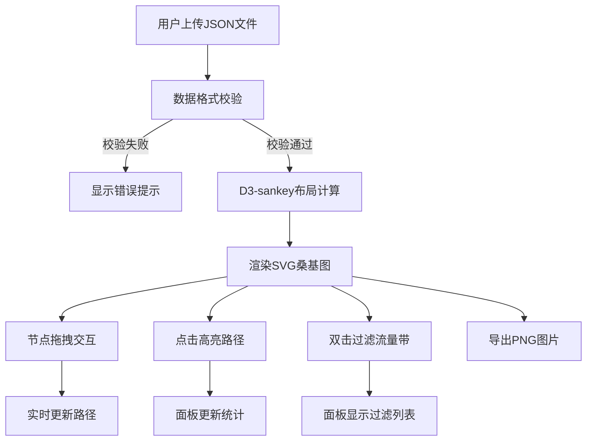

## 1. 产品概述

桑基图交互可视化平台是一个面向数据分析师和业务决策者的全栈Web应用，解决手动绘制复杂能量流或资金流图耗时且无法联动的痛点。用户上传JSON数据文件后，系统自动生成可交互的桑基图，支持拖拽调整、点击高亮、数据过滤和PNG导出。

- 核心价值：将复杂的流量关系数据转化为直观、可交互的可视化图表，提升数据分析效率
- 目标用户：数据分析师、财务人员、供应链管理者、能源监控人员

## 2. 核心功能

### 2.1 功能模块
1. **数据上传模块**：拖拽/点击上传JSON文件，数据校验与错误提示
2. **桑基图渲染模块**：D3.js布局渲染，节点拖拽，流量带实时更新
3. **交互控制模块**：点击高亮路径，双击过滤流量带，缩放平移
4. **统计面板模块**：选中节点详情，全图摘要，过滤列表
5. **导出模块**：PNG图片生成与下载

### 2.2 页面详情
| 页面名称 | 模块名称 | 功能描述 |
|-----------|-------------|---------------------|
| 主页面 | 上传区域 | 拖拽或点击上传JSON文件，实时校验数据格式 |
| 主页面 | 桑基图画布 | D3.js渲染可交互桑基图，支持拖拽、缩放、高亮 |
| 主页面 | 右侧统计面板 | 显示选中节点详情、全图摘要、过滤列表 |
| 主页面 | 工具栏 | 导出PNG按钮、重置视图按钮 |

## 3. 核心流程

用户上传JSON数据文件 → 系统解析并校验数据格式 → 校验通过后使用D3.js布局算法计算节点和流量带位置 → 渲染桑基图到SVG画布 → 用户可拖拽节点调整布局、点击元素高亮路径、双击过滤流量带 → 右侧面板实时更新统计数据 → 用户可导出当前视图为PNG图片。

## 4. 用户界面设计

### 4.1 设计风格
- **主色调**：深色主题，背景#1A1A2E，节点#16213E，流量带从#0F3460渐变到#E94560
- **视觉风格**：毛玻璃效果侧边栏，渐变流量带，平滑过渡动画
- **字体**：选用现代无衬线字体，标题使用具有科技感的字体
- **动效**：节点拖拽0.3秒平滑过渡，流量带悬停放大1.2倍，高亮透明度动画

### 4.2 页面设计概述
| 页面名称 | 模块名称 | UI元素 |
|-----------|-------------|-------------|
| 主页面 | 上传区域 | 半透明拖拽框，虚线边框，hover时边框高亮 |
| 主页面 | 桑基图画布 | 深色背景，渐变流量带，矩形节点，缩放控制 |
| 主页面 | 统计面板 | 毛玻璃背景，固定宽度300px，数据卡片，列表项可点击 |
| 主页面 | 工具栏 | 悬浮按钮组，图标+文字，hover效果 |

### 4.3 响应式设计
- **桌面端（≥768px）**：左侧画布区域自适应，右侧固定300px侧边栏
- **移动端（<768px）**：侧边栏折叠为顶部下拉面板，画布占满全屏
- **触摸优化**：支持触摸拖拽节点，双指缩放

## 5. 性能指标
- 节点数≤50、连接数≤200时，拖拽帧率≥55fps
- 数据解析和首次渲染时间<2秒
- PNG导出时间<1秒
- 高亮切换动画流畅度≥60fps
