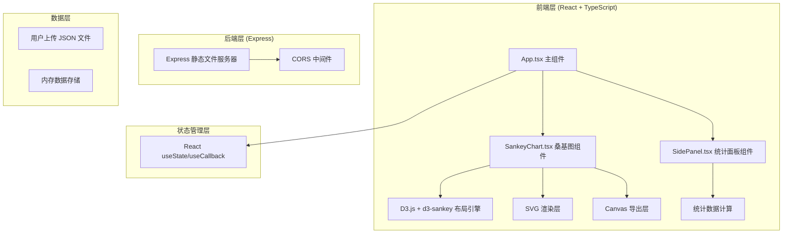
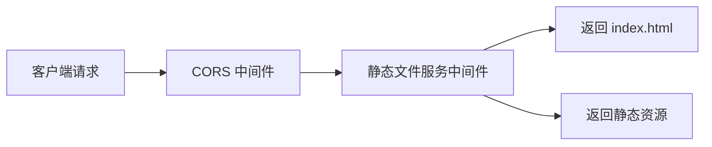

## 1. 架构设计



## 2. 技术描述

- **前端框架**：React@18 + TypeScript@5
- **构建工具**：Vite@5 + @vitejs/plugin-react@4
- **可视化库**：d3@7 + d3-sankey@0.12
- **后端服务**：Express@4 + cors@2
- **工具库**：uuid@9
- **开发模式**：Vite HMR 热更新 + Express 静态服务

## 3. 项目文件结构

| 文件路径 | 作用说明 |
|---------|----------|
| `package.json` | 项目依赖配置，启动脚本 |
| `vite.config.js` | Vite 构建配置，React HMR |
| `tsconfig.json` | TypeScript 严格模式配置 |
| `index.html` | 入口页面，全局样式 |
| `src/main.tsx` | React 应用入口 |
| `src/App.tsx` | 主组件，状态管理 |
| `src/components/SankeyChart.tsx` | 桑基图渲染交互组件 |
| `src/components/SidePanel.tsx` | 右侧统计面板组件 |
| `server/index.ts` | Express 后端服务器 |

## 4. 数据类型定义

```typescript
// 节点数据类型
interface SankeyNode {
  id: string;
  label: string;
  x?: number;
  y?: number;
  x0?: number;
  x1?: number;
  y0?: number;
  y1?: number;
  value?: number;
  sourceLinks?: SankeyLink[];
  targetLinks?: SankeyLink[];
}

// 流量带数据类型
interface SankeyLink {
  source: string | SankeyNode;
  target: string | SankeyNode;
  value: number;
  width?: number;
  y0?: number;
  y1?: number;
  index?: number;
}

// 桑基图完整数据
interface SankeyData {
  nodes: SankeyNode[];
  links: SankeyLink[];
}

// 选中状态
interface SelectionState {
  type: 'node' | 'link' | null;
  data: SankeyNode | SankeyLink | null;
}

// 过滤状态
interface FilterState {
  filteredLinks: number[];
  filteredNodeIds: string[];
}
```

## 5. 核心 API 定义

### 5.1 组件 Props

```typescript
// SankeyChart 组件 Props
interface SankeyChartProps {
  data: SankeyData | null;
  selection: SelectionState;
  onSelectionChange: (selection: SelectionState) => void;
  onFilterChange: (filter: FilterState) => void;
  filteredLinks: number[];
  onExportPNG: () => void;
}

// SidePanel 组件 Props
interface SidePanelProps {
  data: SankeyData | null;
  selection: SelectionState;
  filterState: FilterState;
  onNodeClick: (nodeId: string) => void;
  onRestoreLink: (linkIndex: number) => void;
  onRestoreAll: () => void;
}
```

### 5.2 后端服务

| 路由 | 方法 | 用途 |
|-------|------|------|
| `/` | GET | 静态文件服务入口 |
| `/assets/*` | GET | 静态资源访问 |

## 6. 关键技术实现点

### 6.1 桑基图布局计算
- 使用 `d3-sankey` 的 `sankey()` 布局计算节点和流量带位置
- 节点宽度固定 20px，高度按流量值比例缩放
- 支持拖拽后手动更新节点位置并重新计算路径

### 6.2 交互实现
- **节点拖拽**：使用 `d3.drag()` 实现，拖拽时实时更新 `x0, x1, y0, y1`
- **点击高亮**：通过修改 SVG 元素 `opacity` 属性实现，相关路径保持 1.0，其他降至 0.2
- **双击过滤**：将流量带索引加入过滤数组，重新渲染时排除
- **缩放平移**：使用 `d3.zoom()` 实现画布缩放和平移

### 6.3 视觉效果
- **渐变流量带**：为每条流量带创建独立的 `linearGradient`，从源节点色过渡到目标节点色
- **毛玻璃面板**：使用 `backdrop-filter: blur(10px)` 实现
- **平滑动画**：CSS transition `transition: all 0.3s ease`

### 6.4 PNG 导出
- 使用 `XMLSerializer` 将 SVG 序列化为字符串
- 创建 `Image` 对象加载 SVG 数据
- 绘制到 `Canvas` 并导出为 PNG 格式下载

### 6.5 性能优化
- 使用 React `useMemo` 缓存布局计算结果
- 使用 `requestAnimationFrame` 确保拖拽流畅
- 限制重绘范围，仅更新变化的元素
- 使用 CSS `transform` 而非 `top/left` 进行定位

## 7. 服务端架构



### 7.1 服务器配置
- 端口：5173（Vite 开发服务器）
- 静态目录：`dist/`（生产构建输出）
- CORS：允许所有来源（开发环境）
