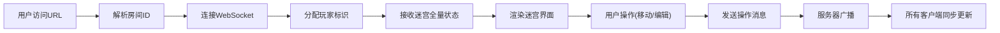

## 1. 产品概述
「协作迷宫」是一个实时协作的Web应用，让团队成员能够在浏览器中共同编辑和探索共享迷宫地图。通过WebSocket实现毫秒级同步，支持最多8人同时在线协作。

- 主要用途：团队协作游戏、远程团建活动、教育场景中的互动教学
- 解决问题：传统单机迷宫游戏缺乏社交互动，远程团队缺乏轻松的协作工具
- 目标用户：远程团队、教育工作者、游戏爱好者
- 市场价值：填补实时协作迷宫类应用的空白，提供有趣且实用的团队互动体验

## 2. 核心功能

### 2.1 用户角色
| 角色 | 注册方式 | 核心权限 |
|------|----------|----------|
| 普通用户 | URL访问自动加入 | 移动玩家、编辑障碍物、放置提示、保存迷宫 |

### 2.2 功能模块
1. **迷宫主界面**：20x20迷宫网格渲染、玩家图标显示、障碍物编辑
2. **实时协作系统**：WebSocket连接管理、消息广播、房间管理
3. **玩家管理**：随机颜色分配、自定义名称、在线玩家列表
4. **提示系统**：临时提示标签放置、打字机效果显示、自动消失
5. **历史回放**：操作记录存储、回放控制、进度滑块
6. **保存分享**：迷宫数据导出JSON、生成分享链接、链接导入

### 2.3 页面详情
| 页面名称 | 模块名称 | 功能描述 |
|-----------|-------------|---------------------|
| 迷宫主页面 | 迷宫网格 | 20x20格子渲染，点击切换障碍物，拖拽移动玩家 |
| 迷宫主页面 | 操作面板 | 在线玩家列表、回放控制条、保存按钮、房间ID显示 |
| 迷宫主页面 | 提示系统 | 点击格子放置提示标签，打字机效果逐字显示 |
| 迷宫主页面 | 回放控制 | 滑块控制回放进度，播放/暂停按钮控制动画 |

## 3. 核心流程

### 3.1 用户加入流程
用户通过URL访问 → 解析房间ID → 连接WebSocket → 分配随机颜色和名称 → 接收当前迷宫状态 → 渲染迷宫和玩家

### 3.2 协作编辑流程
用户点击格子/拖拽玩家 → 本地更新状态 → 发送WebSocket消息 → 服务器广播至同房间其他用户 → 所有客户端同步更新

### 3.3 历史回放流程
用户点击回放按钮 → 从操作历史第0帧开始 → 按0.3秒间隔逐帧应用操作 → 更新迷宫显示 → 可通过滑块跳转到任意帧

## 4. 用户界面设计

### 4.1 设计风格
- **主色调**：深灰蓝背景 #1A1A2E，深棕障碍物 #4E342E（带#5D4037高光）
- **玩家图标**：彩色圆形（直径20px），带白色脉动光圈动画（周期1.5秒）
- **字体**：显示字体使用 Press Start 2P（卡通像素风格），正文字体使用 VT323
- **按钮风格**：圆角卡通按钮，悬停有轻微放大效果和发光边框
- **布局风格**：左侧全屏迷宫网格，右侧固定宽度操作面板（平板模式折叠为悬浮按钮）
- **图标风格**：使用 lucide-react 图标库，配合卡通风格

### 4.2 页面设计概述
| 页面名称 | 模块名称 | UI元素 |
|-----------|-------------|-------------|
| 迷宫主页面 | 迷宫网格 | 20x20网格，白色半透明细线，障碍物立体块状，玩家彩色圆形带脉动光圈 |
| 迷宫主页面 | 操作面板 | 暗色半透明背景，玻璃拟态效果，玩家列表彩色圆圈+名称，回放滑块+播放按钮 |
| 迷宫主页面 | 提示标签 | 半透明气泡，backdrop-filter: blur(4px)，打字机效果逐字显示 |
| 迷宫主页面 | 响应式 | 平板模式下侧面板折叠为悬浮按钮，点击展开 |

### 4.3 动画效果
- **玩家脉动光圈**：白色光晕从透明到半透明循环，周期1.5秒
- **提示打字机效果**：文字逐字出现，每字间隔50ms
- **回放动画**：操作过渡平滑，每步间隔0.3秒
- **按钮悬停**：轻微放大（scale 1.05），发光边框效果

### 4.4 响应式
- **桌面端**（≥1024px）：左侧迷宫网格，右侧280px操作面板
- **平板端**（768px-1024px）：迷宫全屏，操作面板折叠为右下角悬浮按钮，点击弹出模态面板
- **触控优化**：增大点击区域，支持触摸拖拽移动玩家

## 5. 性能指标
- 支持最多8人同时协作
- FPS保持在30以上（含动画）
- WebSocket消息延迟低于500ms
- 历史操作记录最多100步
