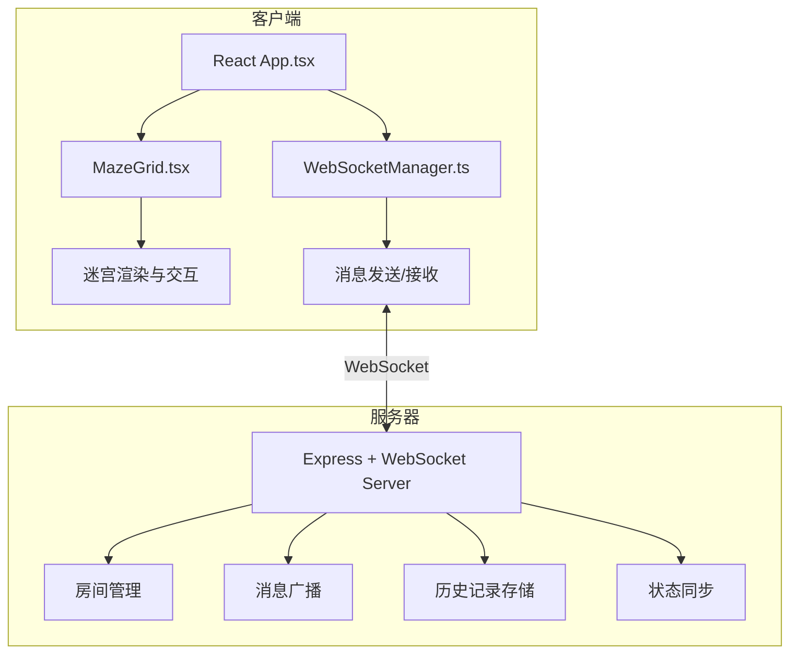
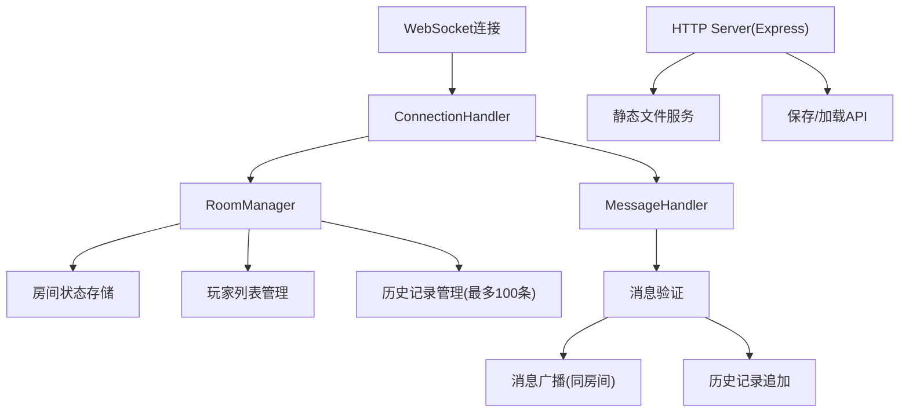

## 1. 架构设计



## 2. 技术描述

### 2.1 技术栈
- **前端**：React@18 + TypeScript + Vite@5
- **后端**：Express@4 + ws@8（WebSocket库）
- **状态管理**：React useState/useReducer（轻量级，无需额外状态管理库）
- **样式**：原生CSS + CSS变量（不使用Tailwind，根据用户需求自定义暗色卡通风主题）
- **通信协议**：WebSocket（ws库）
- **工具库**：uuid（生成唯一ID）、cors（跨域处理）

### 2.2 项目初始化
- 使用 `npm init vite-init@latest` 初始化 React + TypeScript 项目
- 后端使用 Express + ws 构建 WebSocket 服务器
- 前后端共享 TypeScript 类型定义

## 3. 数据模型

### 3.1 核心类型定义

```typescript
// 格子状态
export type CellType = 'empty' | 'obstacle';

// 玩家信息
export interface Player {
  id: string;
  name: string;
  color: string;
  x: number;
  y: number;
}

// 提示标签
export interface Hint {
  id: string;
  x: number;
  y: number;
  text: string;
  createdAt: number;
  duration: number;
}

// 操作记录
export type ActionType = 'move' | 'toggle_obstacle' | 'add_hint';

export interface Action {
  id: string;
  type: ActionType;
  playerId: string;
  timestamp: number;
  payload: {
    x?: number;
    y?: number;
    newX?: number;
    newY?: number;
    text?: string;
  };
}

// 迷宫状态
export interface MazeState {
  width: number;
  height: number;
  grid: CellType[][];
  players: Player[];
  hints: Hint[];
  history: Action[];
}

// WebSocket消息类型
export type MessageType = 
  | 'join' 
  | 'leave' 
  | 'state_sync' 
  | 'player_move' 
  | 'toggle_obstacle' 
  | 'add_hint'
  | 'history_sync';

export interface WebSocketMessage {
  type: MessageType;
  roomId: string;
  data?: any;
}
```

### 3.2 数据流向
1. 客户端发送操作消息 → 服务器验证 → 加入历史记录 → 广播至同房间所有客户端
2. 新客户端连接 → 服务器发送全量迷宫状态 + 历史记录 → 客户端初始化渲染
3. 回放功能：客户端本地按时间间隔应用历史操作，不影响服务器状态

## 4. 路由定义

| 路由 | 用途 |
|-------|---------|
| `/` | 默认页面，自动生成随机房间ID并重定向 |
| `/room?id=XXX` | 指定房间ID的迷宫页面 |
| `/room?data=BASE64` | 通过分享链接载入迷宫数据 |

## 5. API 定义

### 5.1 HTTP API
| 方法 | 路径 | 用途 | 请求参数 | 响应 |
|------|------|------|----------|------|
| GET | `/api/room/:id` | 获取房间信息 | roomId | `{ roomId, playerCount }` |
| POST | `/api/save` | 保存迷宫数据 | `{ roomId, state }` | `{ shareUrl, data }` |
| GET | `/api/load/:data` | 加载分享的迷宫 | base64编码的迷宫数据 | `MazeState` |

### 5.2 WebSocket 消息格式

**客户端发送消息：**
```typescript
// 加入房间
{ type: 'join', roomId: 'xxx', data: { playerName: '玩家1' } }

// 移动玩家
{ type: 'player_move', roomId: 'xxx', data: { playerId: 'xxx', newX: 5, newY: 5 } }

// 切换障碍物
{ type: 'toggle_obstacle', roomId: 'xxx', data: { x: 3, y: 4 } }

// 添加提示
{ type: 'add_hint', roomId: 'xxx', data: { x: 5, y: 5, text: '这里放炸弹' } }
```

**服务器发送消息：**
```typescript
// 状态同步（新用户加入时）
{ type: 'state_sync', roomId: 'xxx', data: MazeState }

// 玩家移动广播
{ type: 'player_move', roomId: 'xxx', data: { playerId, newX, newY } }

// 障碍物变更广播
{ type: 'toggle_obstacle', roomId: 'xxx', data: { x, y, cellType } }

// 提示添加广播
{ type: 'add_hint', roomId: 'xxx', data: Hint }

// 历史同步
{ type: 'history_sync', roomId: 'xxx', data: Action[] }

// 玩家加入/离开通知
{ type: 'join' | 'leave', roomId: 'xxx', data: Player }
```

## 6. 服务器架构



### 6.1 服务器模块
- **ConnectionHandler**：处理WebSocket连接建立和断开，玩家加入/离开
- **RoomManager**：管理多个房间，每个房间独立存储迷宫状态、玩家列表、操作历史
- **MessageHandler**：解析客户端消息，验证合法性，更新状态并广播
- **HistoryManager**：维护每房间最多100条操作历史，支持新用户同步

### 6.2 性能优化
- 使用 Set 存储同房间客户端，广播时 O(n) 遍历
- 历史记录使用环形数组，超过100条时自动覆盖最旧记录
- 状态同步仅在新用户加入时发送全量状态，后续操作只发送增量消息
- 消息节流：同一玩家100ms内最多发送5条消息，防止恶意刷屏

## 7. 项目文件结构

```
auto57/
├── package.json
├── vite.config.js
├── tsconfig.json
├── index.html
├── src/
│   ├── server.ts              # Express + WebSocket 服务器
│   ├── shared/
│   │   └── types.ts           # 共享类型定义
│   └── client/
│       ├── main.tsx           # 入口文件
│       ├── App.tsx            # 主组件
│       ├── MazeGrid.tsx       # 迷宫网格组件
│       ├── WebSocketManager.ts # WebSocket管理模块
│       ├── components/
│       │   ├── PlayerIcon.tsx  # 玩家图标组件
│       │   ├── HintBubble.tsx  # 提示气泡组件
│       │   ├── ControlPanel.tsx # 操作面板组件
│       │   └── PlaybackControl.tsx # 回放控制组件
│       └── styles/
│           ├── global.css      # 全局样式
│           └── animations.css  # 动画定义
```
