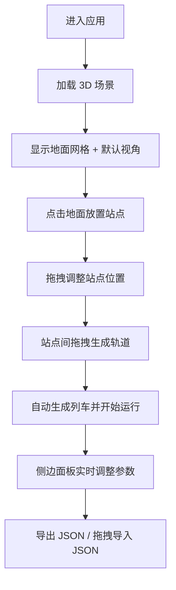

## 1. 产品概述
3D 地铁线路规划可视化工具是一款基于 Web 的交互式应用，旨在解决传统平面地铁图缺乏空间层次感和动态运营模拟能力的问题。用户可在 3D 场景中自由规划站点、连接线路，并实时模拟列车运行效果。
- 主要用途：城市地铁线路规划、教学演示、轨道交通方案可视化
- 目标用户：城市规划师、交通工程师、教育工作者、轨道交通爱好者
- 产品价值：通过 3D 空间可视化和动态模拟，提供沉浸式的线路规划体验

## 2. 核心功能

### 2.1 功能模块
1. **3D 场景主界面**：站点放置、轨道连接、列车运行模拟、视角控制
2. **站点管理面板**：站点列表、尺寸/颜色调整、删除操作
3. **线路管理面板**：线路列表、编号/名称编辑、颜色修改、站点顺序展示
4. **列车模拟控制面板**：全局速度调节、启停控制
5. **数据导入导出**：JSON 格式方案保存与恢复

### 2.2 页面详情
| 页面名称 | 模块名称 | 功能描述 |
|-----------|-------------|---------------------|
| 主界面 | 3D 场景画布 | 全屏 Three.js 渲染场景，支持鼠标交互放置/拖拽站点、连接轨道 |
| 主界面 | 侧边控制面板 | 右侧 300px 毛玻璃面板，包含站点、线路、速度参数调节 |
| 主界面 | 汉堡菜单（移动端） | 窗口 < 900px 时收起侧边栏到右上角菜单 |
| 主界面 | 导入导出工具栏 | JSON 文件拖拽上传、导出下载按钮 |

## 3. 核心流程
用户进入应用后，首先看到默认 45° 俯视角的 3D 场景和地面网格。通过点击地面放置站点，拖拽站点调整位置，站点间拖拽连接形成轨道线路。系统自动在每条线路上生成列车并开始模拟运行。用户可通过侧边面板调整各项参数，所有修改实时生效。规划完成后可导出 JSON 文件保存方案，后续可拖拽导入恢复。

## 4. 用户界面设计
### 4.1 设计风格
- **主色调**：深灰背景 #1a1a2e，地面网格 #3a3a5e，科幻暗色调
- **站点**：立方体带渐变发光效果（核心亮白→边缘淡出），半透明地面投影辅助定位
- **轨道**：半透明管状带微弱光晕，8 种预设颜色随机分配
- **列车**：发光球体 + 20-30 个拖尾粒子，经过站点时脉冲光效果（0.3x→0.5x→0.3x 半径，2秒）
- **侧边面板**：毛玻璃效果（backdrop-filter: blur），半透明背景，平滑圆角边框
- **控件**：悬停放大动画（scale 1.05），点击颜色加深反馈
- **字体**：Orbitron（科幻标题）+ Noto Sans SC（中文正文）
- **按钮风格**：圆角 8px，边框细线条发光，悬停边框亮度提升

### 4.2 页面设计概览
| 页面名称 | 模块名称 | UI 元素 |
|-----------|-------------|-------------|
| 主界面 | 3D 场景 | 全屏 canvas，深色渐变背景，地面网格，发光站点/轨道/列车 |
| 主界面 | 侧边面板 | 毛玻璃卡片，分区折叠面板，滑块+颜色选择器+按钮组 |
| 主界面 | 加载屏 | 全屏深色背景 + 居中科幻风加载动画 |
| 主界面 | 响应式菜单 | 窗口 < 900px 显示右上角汉堡按钮，点击展开抽屉式面板 |

### 4.3 响应式设计
- 桌面端优先设计，窗口宽度 ≥ 900px 显示右侧固定侧边栏
- 窗口宽度 < 900px：侧边栏自动收起，右上角显示汉堡菜单按钮，点击后从右侧滑出抽屉式面板（覆盖 80% 宽度）
- 触控优化：移动端支持双指缩放、单指拖拽旋转视角

### 4.4 3D 场景设计指引
- **环境/氛围**：深空科幻风，深色渐变背景，雾效增强空间感（FogExp2）
- **光照配置**：AmbientLight（0.4）+ DirectionalLight（0.8，带阴影）+ 点光源模拟站点发光
- **相机设置**：PerspectiveCamera（fov 60），默认 45° 俯视角，OrbitControls 控制
- **镜头运动**：R 键 1 秒动画过渡重置视角，所有旋转平移操作平滑插值
- **交互与动画**：站点悬停高亮，放置时地面投影，列车匀速移动+站点停顿2秒+脉冲光，粒子拖尾
- **后处理效果**：UnrealBloomPass 实现发光光晕效果
- **性能预算**：帧率 ≥ 45fps，最多 10 站点 + 5 线路无卡顿，初始加载 ≤ 2 秒
