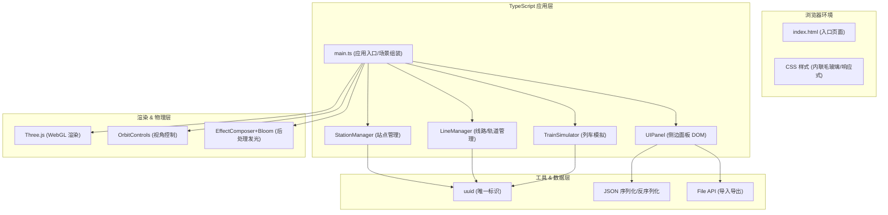

## 1. 架构设计



## 2. 技术选型说明
- **前端框架**: 原生 TypeScript（无 React/Vue，纯 DOM 操作 + Three.js 渲染，保证 45fps+ 性能）
- **3D 引擎**: three@^0.160.0 + @types/three
- **构建工具**: vite@^5.0.0（HMR 热更新，ESBuild 极速编译）
- **语言**: TypeScript@^5.3.0（严格模式 strict: true，target ES2020）
- **工具库**: uuid@^9.0.0（站点/线路/列车唯一 ID 生成）
- **后处理**: three/examples/jsm/postprocessing/* （UnrealBloomPass 发光效果）
- **无后端**: 纯前端应用，数据通过 JSON 文件本地导入导出持久化

## 3. 文件组织结构
```
auto58/
├── index.html                      # 入口页面（含加载动画、字体引入）
├── package.json                    # 依赖配置
├── vite.config.js                  # Vite 构建配置
├── tsconfig.json                   # TypeScript 严格模式配置
└── src/
    ├── main.ts                     # 应用入口：初始化场景/相机/渲染器/循环
    ├── StationManager.ts           # 站点管理：增删改查 + 拖拽交互
    ├── LineManager.ts              # 线路管理：轨道生成 + 颜色分配
    ├── TrainSimulator.ts           # 列车模拟：运动曲线 + 停靠 + 粒子拖尾
    ├── UIPanel.ts                  # UI 面板：DOM 渲染 + 事件绑定
    └── types.ts                    # 共享 TypeScript 类型定义（补充）
```

## 4. 核心模块职责与接口定义

### 4.1 StationManager
```typescript
interface StationData {
  id: string;
  position: { x: number; y: number; z: number };
  size: number;      // 默认 0.8
  color: string;     // 默认 #ffffff
  name: string;      // 默认 "站点N"
}
class StationManager {
  constructor(scene: THREE.Scene, groundPlane: THREE.Mesh);
  addStation(position: THREE.Vector3, opts?: Partial<StationData>): StationData;
  removeStation(id: string): void;
  moveStation(id: string, position: THREE.Vector3): void;
  updateStationSize(id: string, size: number): void;
  updateStationColor(id: string, color: string): void;
  getStationById(id: string): StationData | undefined;
  getAllStations(): StationData[];
  onStationClick?: (id: string) => void;    // 回调：点击站点
  onStationDrag?: (id: string, pos: THREE.Vector3) => void; // 回调：拖拽站点
  raycastStations(raycaster: THREE.Raycaster): THREE.Intersection[];
  dispose(): void;
}
```

### 4.2 LineManager
```typescript
interface LineData {
  id: string;
  name: string;        // e.g. "1号线 - 蓝线"
  color: string;       // 8 预设色之一
  stationIds: string[]; // 有序站点 ID 列表
  opacity: number;     // 0.2 - 1.0
}
const PRESET_COLORS = [
  '#3498db', '#e74c3c', '#2ecc71', '#f39c12',
  '#9b59b6', '#1abc9c', '#e91e63', '#ff9800'
];
class LineManager {
  constructor(scene: THREE.Scene, stationManager: StationManager);
  addLine(stationIds: string[]): LineData;
  removeLine(id: string): void;
  updateLineName(id: string, name: string): void;
  updateLineColor(id: string, color: string): void;
  updateLineOpacity(id: string, opacity: number): void;
  regenerateTrack(lineId: string): void;    // 站点位置变化后重生成轨道
  getLineById(id: string): LineData | undefined;
  getAllLines(): LineData[];
  onLineCreated?: (line: LineData) => void;
  dispose(): void;
}
```

### 4.3 TrainSimulator
```typescript
interface TrainData {
  id: string;
  lineId: string;
  progress: number;  // 0 - 1，在线路上的进度
  speed: number;     // 基础速度（单位/秒）
  isPaused: boolean;
  stopTimer: number; // 站点停靠剩余时间
}
class TrainSimulator {
  constructor(
    scene: THREE.Scene,
    lineManager: LineManager,
    stationManager: StationManager
  );
  startSimulation(): void;
  stopSimulation(): void;
  setGlobalSpeedMultiplier(multiplier: number): void;  // 0.5x - 3x
  update(deltaTime: number): void;    // 每帧调用：更新列车位置/粒子
  createTrainForLine(lineId: string): void;
  removeTrainForLine(lineId: string): void;
  isRunning(): boolean;
  dispose(): void;
}
```

### 4.4 UIPanel
```typescript
interface UIPanelCallbacks {
  onAddStation: () => void;
  onRemoveStation: (id: string) => void;
  onUpdateStationSize: (id: string, size: number) => void;
  onUpdateStationColor: (id: string, color: string) => void;
  onUpdateLineName: (id: string, name: string) => void;
  onUpdateLineColor: (id: string, color: string) => void;
  onUpdateLineOpacity: (id: string, opacity: number) => void;
  onRemoveLine: (id: string) => void;
  onSpeedChange: (speed: number) => void;
  onExport: () => void;
  onImport: (file: File) => void;
  onResetView: () => void;
}
class UIPanel {
  constructor(container: HTMLElement, callbacks: UIPanelCallbacks);
  renderStationList(stations: StationData[]): void;
  renderLineList(lines: LineData[]): void;
  setCurrentSpeed(speed: number): void;
  showNotification(message: string): void;
  dispose(): void;
}
```

### 4.5 数据导入导出格式 (JSON Schema)
```typescript
interface MetroProjectData {
  version: '1.0';
  exportedAt: number;        // timestamp
  stations: StationData[];
  lines: LineData[];
  trains: { lineId: string; progress: number }[];
  settings: {
    globalSpeedMultiplier: number;
  };
}
```

## 5. 场景交互流程定义
| 交互 | 触发条件 | 处理模块 | 行为 |
|------|----------|----------|------|
| 放置站点 | 左键点击地面网格 | StationManager + main | 在点击点生成发光立方体+地面投影 |
| 拖拽移动站点 | 左键按下站点并拖动 | StationManager | 射线投射更新位置，轨道联动刷新 |
| 删除站点 | 右键点击站点 | StationManager | 删除站点及关联线路段 |
| 连接轨道 | 从一个站点拖拽到另一个 | LineManager | 生成 CatmullRom 曲线管道+分配颜色 |
| 视角旋转 | 左键拖拽空白处 | OrbitControls | 围绕中心旋转 |
| 视角平移 | 右键拖拽空白处 | OrbitControls | 平移相机目标 |
| 视角缩放 | 鼠标滚轮 | OrbitControls | 改变相机距离 |
| 重置视角 | 键盘 R 键 | main | 1 秒动画过渡到默认 45° 俯视 |
| 导入文件 | 拖拽 JSON 到窗口 | UIPanel + main | 解析并恢复完整场景状态 |
| 导出文件 | 点击导出按钮 | UIPanel | 触发 JSON 文件下载 |

## 6. 性能优化策略
1. **几何体复用**：所有站点共用 BoxGeometry 实例，仅材质颜色不同
2. **粒子池化**：列车拖尾粒子使用对象池，避免频繁 GC
3. **射线检测优化**：仅在鼠标事件时执行 raycast，每帧最多 1 次
4. **矩阵自动更新**：静止对象设置 `matrixAutoUpdate = false`
5. **后处理阈值**：Bloom 仅对发光材质生效，降低采样率
6. **帧率监控**：`performance.now()` 计算 delta，保证 45fps+
7. **懒初始化**：列车/轨道数据延迟到线路创建时生成
