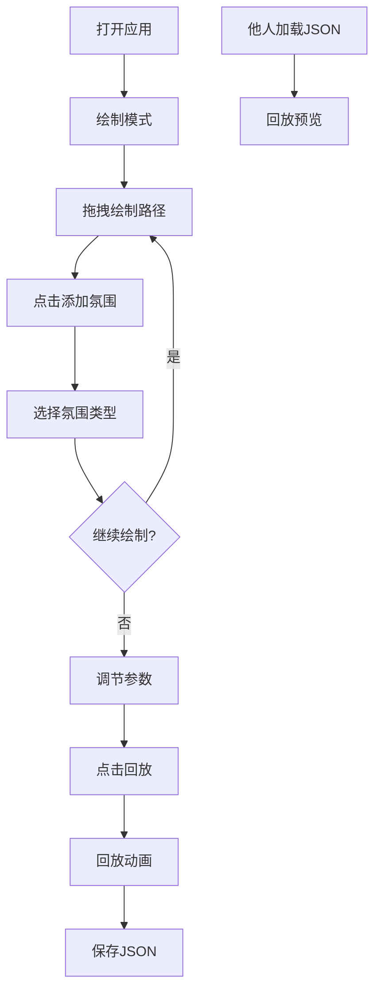

## 1. 产品概述

「尘音寻迹」是一款浏览器端交互式迷路途经回放应用，解决数字空间中离线路径导航难以保留行走时的感官记忆和情感氛围的问题。用户通过鼠标或触控在虚拟地图上绘制步行路径，为路径各段赋予氛围参数，生成带粒子特效的自动回放动画，并可保存为JSON文件分享给他人加载查看。

- 核心价值：将抽象的路径数据转化为富有情感氛围的视觉记忆，让路径分享不再只是坐标点的罗列
- 目标用户：徒步爱好者、城市漫游者、游戏玩家、创意工作者

## 2. 核心功能

### 2.1 功能模块

1. **路径绘制模块**：虚拟地图画布、鼠标/触控绘制、发光尾迹效果
2. **氛围系统模块**：四种预设氛围（森林/海洋/暮色/火山）、路径段氛围绑定、颜色实时映射
3. **回放动画模块**：路径逐段亮起、氛围粒子发射与飘散、生命周期管理
4. **参数调节模块**：粒子密度滑块、回放速度滑块、实时生效
5. **保存与加载模块**：JSON文件导出、本地文件加载、路径信息展示

### 2.2 页面详情

| 页面名称 | 模块名称 | 功能描述 |
|---------|---------|---------|
| 主页面 | 顶部导航栏 | LOGO标题、绘制/回放模式切换按钮 |
| 主页面 | 中央画布区 | 虚拟地图、路径绘制、粒子动画渲染 |
| 主页面 | 左侧控制面板 | 粒子密度滑块、回放速度滑块、保存路径按钮 |
| 主页面 | 右侧氛围面板 | 添加氛围按钮、四种氛围选择器 |
| 主页面 | 底部加载区 | 加载路径按钮、路径名称显示、作者输入框 |

## 3. 核心流程

用户打开应用 → 默认进入绘制模式 → 在画布上拖拽绘制路径 → 点击「添加氛围」选择氛围类型 → 可继续绘制多段路径并赋予不同氛围 → 调节粒子密度和回放速度 → 点击「回放」查看动画效果 → 点击「保存路径」下载JSON文件 → 他人收到JSON后点击「加载路径」上传文件 → 自动进入回放预览模式

## 4. 用户界面设计

### 4.1 设计风格

- **主题**：深色主题，主背景深灰蓝（#1A2332），画布区域柔白（#F5F0E8）高对比
- **配色**：主色#4A90D9（蓝色），辅助色#6BCB77（森林绿）、#FF8C42（暮色橙）、#FF6B6B（火山红），强调色#A8D8EA（浅蓝LOGO色）
- **按钮风格**：圆角8px，半透明毛玻璃效果，悬停透明度提升，按压缩放动画
- **滑块风格**：轨道高4px，滑块圆形直径16px，主色#4A90D9
- **字体**：标题使用独特衬线/艺术字体，正文使用现代无衬线字体，营造诗意漫游氛围
- **视觉特效**：发光尾迹、粒子飘散、渐变按钮、毛玻璃面板、淡入动画

### 4.2 页面设计概述

| 页面名称 | 模块名称 | UI元素 |
|---------|---------|-------|
| 主页面 | 顶部导航栏 | LOGO「尘音寻迹」24px #A8D8EA，0.5s淡入动画；绘制/回放切换按钮，圆角6px，悬停半透明白，选中蓝色背景 |
| 主页面 | 中央画布 | 占视口85%宽、90%高，柔白背景#F5F0E8，路径发光蓝#4A90D9线宽3px，0.3s平滑尾迹 |
| 主页面 | 左侧面板 | 毛玻璃效果#FFFFFF08，圆角8px；粒子密度滑块（30-150默认80）；回放速度滑块（0.5x-3x默认1x）；保存路径渐变按钮 |
| 主页面 | 右侧面板 | 毛玻璃效果；「添加氛围」按钮；四种氛围卡片带颜色预览和图标 |
| 主页面 | 底部区域 | 加载路径按钮；路径名称显示；作者输入框 |

### 4.3 响应式

- 桌面端优先设计，左右双面板布局
- 视口宽度<768px时：左侧面板折叠为底部工具栏，画布自动调整宽高比
- 触控设备优化：支持触摸绘制，按钮点击区域适当放大

### 4.4 动画与交互

- 页面加载：LOGO淡入（0.5s），面板滑入（0.4s带延迟）
- 路径绘制：发光尾迹延迟跟随（0.3s）
- 模式切换：平滑过渡（0.3s）
- 按钮交互：悬停背景变化（0.2s），按压缩放0.95（0.2s）
- 回放动画：路径逐段亮起（2倍速默认），粒子发散飘散（5s生命周期），结束渐隐（1s）
- 粒子效果：随路径长度比例发射数量，向四周飘散，淡出消失

## 5. 性能要求

- 粒子数量最多150个时，回放帧率不低于30fps
- 路径点超过500个时，绘制流畅不卡顿
- JSON文件大小控制在500KB以内
- 使用Canvas 2D渲染，requestAnimationFrame循环
- 粒子池化管理，避免频繁GC
