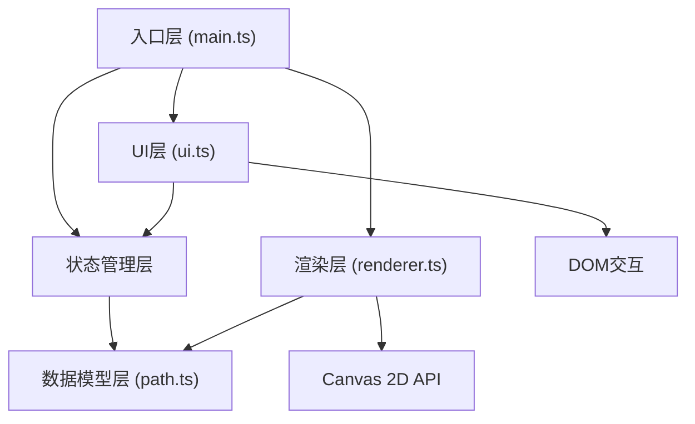

## 1. 架构设计

本项目为纯前端浏览器应用，采用模块化TypeScript架构，基于Canvas 2D进行渲染。



## 2. 技术选型说明

- **前端框架**：原生TypeScript + Vite
  - 理由：项目为Canvas渲染为主的轻量交互应用，无需重量级框架，原生TS + Vite可获得最佳性能和最小打包体积
- **构建工具**：Vite 5.x
  - 理由：极速HMR、开箱即用TypeScript支持、开发体验优秀
- **语言**：TypeScript 5.x 严格模式
  - 理由：类型安全提升可维护性，严格模式确保代码质量
- **渲染**：HTML5 Canvas 2D
  - 理由：路径绘制、粒子系统需要高性能2D渲染，Canvas API比DOM操作性能高一个数量级
- **样式**：原生CSS
  - 理由：UI组件少，原生CSS足够，减少依赖
- **数据存储**：JSON文件下载/上传
  - 理由：无需后端服务，纯前端方案，用户数据自主可控

## 3. 文件结构

```
auto6/
├── package.json
├── vite.config.js
├── tsconfig.json
├── index.html
└── src/
    ├── main.ts          # 应用入口，状态管理，渲染循环
    ├── path.ts          # 路径数据模型，序列化/反序列化
    ├── renderer.ts      # Canvas渲染核心，粒子系统
    └── ui.ts            # UI组件，DOM事件绑定
```

### 3.1 模块职责

| 模块 | 职责 | 核心类/函数 |
|-----|------|-----------|
| main.ts | 应用初始化、模式切换、渲染循环调度、全局状态 | App类、start() |
| path.ts | 路径点数据、氛围段定义、序列化/反序列化、校验 | PathPoint、AtmosphereSegment、PathMemory |
| renderer.ts | Canvas绘制、发光路径、粒子系统、氛围图标 | CanvasRenderer、ParticleSystem、Particle |
| ui.ts | 控制面板、滑块、按钮、加载/保存逻辑、事件绑定 | UIController |

## 4. 数据模型定义

### 4.1 核心类型

```typescript
// 路径点
interface PathPoint {
  x: number;          // 画布相对坐标 0-1
  y: number;          // 画布相对坐标 0-1
  timestamp: number;  // 相对时间戳(ms)，从路径起点开始
}

// 氛围类型
type AtmosphereType = 'forest' | 'ocean' | 'dusk' | 'volcano';

// 氛围配置
interface AtmosphereConfig {
  type: AtmosphereType;
  name: string;
  color: string;      // 主颜色
  icon: string;       // 图标标识
}

// 氛围段 - 将路径按索引分段，每段对应一种氛围
interface AtmosphereSegment {
  startIndex: number; // 路径点起始索引
  endIndex: number;   // 路径点结束索引
  atmosphere: AtmosphereType;
}

// 路径记忆文件结构
interface PathMemoryData {
  version: string;
  name: string;
  author: string;
  createdAt: string;
  points: PathPoint[];
  segments: AtmosphereSegment[];
  particleDensity: number;   // 30-150
  playbackSpeed: number;     // 0.5-3
}
```

### 4.2 氛围预设

| 氛围类型 | 名称 | 颜色 | 粒子效果 | 图标 |
|---------|------|------|---------|------|
| forest | 森林 | #6BCB77 | 绿色小圆圈 + 音符 | 鸟鸣音符 |
| ocean | 海洋 | #4A90D9 | 蓝色波浪符号 | 波浪 |
| dusk | 暮色 | #FF8C42 | 橙色星光点 | 星光 |
| volcano | 火山 | #FF6B6B | 红色熔岩粒子 | 熔岩 |

## 5. 渲染系统设计

### 5.1 路径绘制
- 使用二次贝塞尔曲线平滑路径
- 发光效果：多层阴影 + 渐隐尾迹
- 尾迹延迟：通过维护一个绘制点队列实现0.3s延迟效果
- 氛围颜色：根据当前段的氛围类型映射路径颜色

### 5.2 粒子系统
- 对象池模式管理粒子，避免频繁GC
- 粒子发射：路径段亮起时按长度比例发射
- 粒子运动：随机方向初速度 + 缓慢飘散 + 重力/浮力
- 生命周期：5秒，透明度随时间线性衰减
- 最大粒子数：150，超出时复用最早死亡的粒子

### 5.3 氛围图标
- 使用贝塞尔曲线绘制音符符号
- 不同氛围对应不同粒子形状和运动模式
- 粒子大小随机，增强自然感

## 6. 性能优化策略

1. **路径点简化**：记录时使用距离阈值去重，避免过密点
2. **粒子池化**：预分配粒子对象数组，循环复用
3. **离屏渲染**：静态元素缓存到离屏Canvas
4. **requestAnimationFrame**：使用系统刷新率同步
5. **相对坐标存储**：路径点使用0-1相对坐标，适配不同画布尺寸
6. **增量绘制**：回放时只重绘变化区域（如需要）

## 7. 状态管理

应用状态集中在main.ts中管理：
- `mode`: 'draw' | 'playback' - 当前模式
- `isDrawing`: boolean - 是否正在绘制
- `pathMemory`: PathMemory - 当前路径数据
- `playbackProgress`: number - 回放进度 0-1
- `particleDensity`: number - 粒子密度
- `playbackSpeed`: number - 回放速度

状态变更通过简单的事件通知机制通知UI和渲染层更新。
