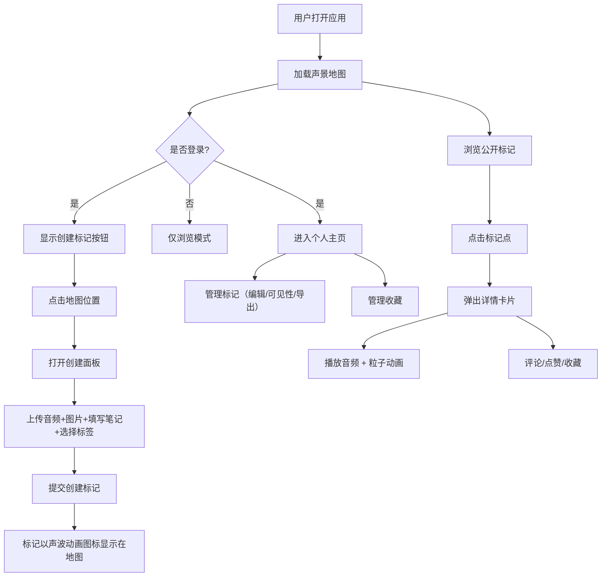
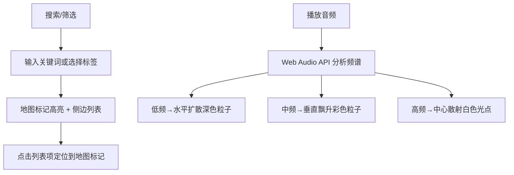

## 1. 产品概述

城市声景地图（Soundscape Map）——帮助城市音频爱好者将散步时听到的独特环境声音与具体地点、时间、心情可视化关联，并分享给社区的全栈Web应用。用户在地图上标记位置，录制或上传声音，添加文字笔记、情绪标签和现场图片，形成可交互探索的声景社区。

## 2. 核心功能

### 2.1 用户角色

| 角色 | 注册方式 | 核心权限 |
|------|----------|----------|
| 访客 | 无需注册 | 浏览公开声景点、播放音频、搜索筛选 |
| 注册用户 | 用户名注册 | 创建/编辑标记、评论、点赞、收藏、管理旅行日志 |

### 2.2 功能模块

1. **声景地图主页**：全屏地图展示、标记点声波动画、搜索与筛选、标记详情弹窗
2. **标记创建/编辑面板**：上传音频、填写笔记、选择情绪标签、上传图片、位置微调
3. **社区探索**：浏览公开声景点、按标签/距离筛选、评论点赞
4. **个人旅行日志**：我的标记列表、收藏列表、可见性管理、批量导出JSON
5. **声谱粒子动画**：实时音频频谱分析驱动的Canvas粒子可视化

### 2.3 页面详情

| 页面名称 | 模块名称 | 功能描述 |
|----------|----------|----------|
| 声景地图主页 | 地图视图 | Mapbox GL JS全屏地图，zoom=12初始城市级别，标记点声波动画图标 |
| 声景地图主页 | 搜索筛选栏 | 搜索框（模糊匹配标题/位置）、情绪标签筛选、距离/时间排序 |
| 声景地图主页 | 标记详情卡片 | 320px宽弹窗，图片+柔光遮罩、播放按钮、粒子动画、笔记、标签、评论点赞 |
| 标记创建面板 | 上传区域 | 音频文件上传（WAV/MP3，≤15秒）、图片上传（JPG/PNG，≤2MB） |
| 标记创建面板 | 表单区域 | 文字笔记（≤200字）、情绪标签单选（10个预设标签） |
| 个人主页 | 我的标记 | 时间倒序列表，分页10条/页，缩略图+标题+日期+播放数+点赞数 |
| 个人主页 | 收藏夹 | 收藏的他人标记列表，分页显示，支持个人备注（≤50字） |
| 个人主页 | 管理功能 | 可见性切换（公开/私有）、全选/反选、批量导出JSON |

## 3. 核心流程

## 4. 用户界面设计

### 4.1 设计风格

- **主基色**：柔和大地色系
- **背景色**：暖灰 #F5E6C8
- **导航栏**：深棕 #3E2723 背景 + 白色文字
- **按钮**：麦色 #D4A373 背景 + 深棕文字，悬停 #E0B97E
- **详情卡片**：米白 #FFF8E7 背景 + 深棕 #3E2723 文字
- **地图容器**：圆角16px，投影 rgba(0,0,0,0.1) 0px 4px 12px
- **情绪标签色**：宁静=#6ECB63、喧闹=#FF6B6B、忧郁=#5C6BC0、欢快=#FFD54F、神秘=#AB47BC、温暖=#FF8A65、清新=#26A69A、怀旧=#8D6E63、浪漫=#EC407A、震撼=#FF7043
- **过渡动画**：缓入缓出 cubic-bezier(0.4, 0, 0.2, 1)
- **标记新增动画**：从标记点向外扩散圆形波纹，半径0→60px，0.8s完成
- **声波标记动画**：正弦波幅度20px，周期1.2s持续循环

### 4.2 页面设计概览

| 页面名称 | 模块名称 | UI元素 |
|----------|----------|--------|
| 声景地图主页 | 导航栏 | 深棕背景、Logo、搜索框、筛选下拉、用户头像 |
| 声景地图主页 | 地图区域 | 全屏Mapbox地图、圆角卡片嵌入、声波动画标记 |
| 声景地图主页 | 详情弹窗 | 米白卡片320px、图片+柔光遮罩、播放按钮、Canvas粒子、标签圆点 |
| 声景地图主页 | 侧边列表 | 搜索结果列表、最多20条、图标+标题+距离 |
| 个人主页 | 标记列表 | 缩略图+信息行、分页控件、可见性开关、导出按钮 |
| 个人主页 | 收藏列表 | 收藏项+备注、分页、取消收藏 |

### 4.3 响应式适配

- 桌面优先设计
- <768px：详情卡片改为底部浮层（距底20px，宽95%），筛选列表折叠为悬浮按钮
- 最小宽度320px

### 4.4 性能指标

- 声景点列表首次加载 ≤2秒（≤100条数据）
- 粒子动画帧率 ≥30fps
- 音频播放启动延迟 ≤500ms
