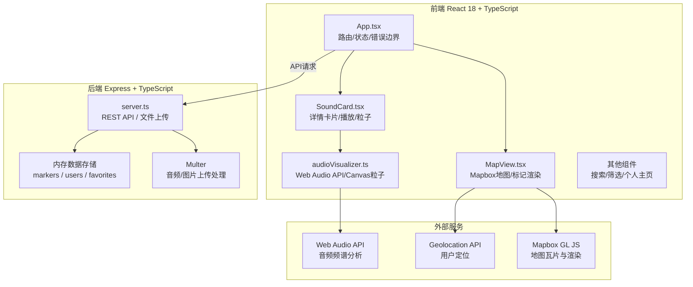
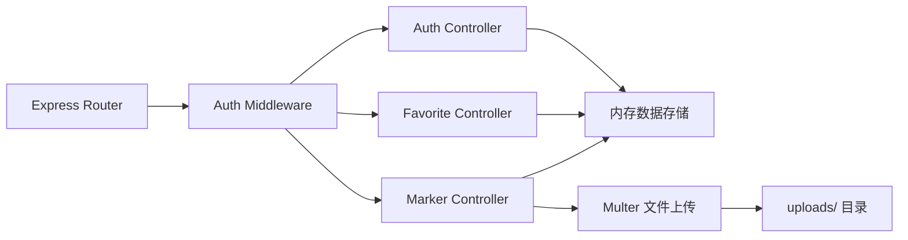
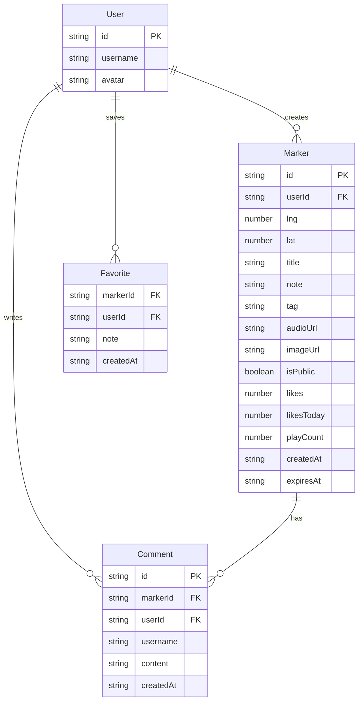

## 1. 架构设计



## 2. 技术说明

- **前端**：React@18 + TypeScript + Vite
- **初始化工具**：vite-init (react-express-ts模板)
- **样式方案**：CSS Modules + Tailwind CSS
- **状态管理**：Zustand
- **地图**：Mapbox GL JS
- **后端**：Express@4 + TypeScript + Multer
- **数据库**：内存存储（JSON文件持久化到 uploads/data.json）
- **音频处理**：Web Audio API (AnalyserNode, fftSize=256)

## 3. 路由定义

| 路由 | 用途 |
|------|------|
| `/` | 声景地图主页（全屏地图+搜索+筛选+详情卡片） |
| `/profile` | 个人旅行日志（我的标记+收藏+管理） |

## 4. API 定义

### 4.1 TypeScript 类型定义

```typescript
interface Marker {
  id: string;
  userId: string;
  lng: number;
  lat: number;
  title: string;
  note: string;
  tag: EmotionTag;
  audioUrl: string;
  imageUrl: string;
  isPublic: boolean;
  likes: number;
  likesToday: number;
  comments: Comment[];
  playCount: number;
  createdAt: string;
  expiresAt: string;
}

type EmotionTag = 
  | '宁静' | '喧闹' | '忧郁' | '欢快' | '神秘'
  | '温暖' | '清新' | '怀旧' | '浪漫' | '震撼';

interface Comment {
  id: string;
  userId: string;
  username: string;
  content: string;
  createdAt: string;
}

interface Favorite {
  markerId: string;
  userId: string;
  note: string;
  createdAt: string;
}

interface User {
  id: string;
  username: string;
  avatar: string;
}
```

### 4.2 API 端点

| 方法 | 路径 | 描述 | 请求 | 响应 |
|------|------|------|------|------|
| GET | `/api/markers` | 查询公开标记 | query: search, tag, sort, page | `{ markers: Marker[], total: number }` |
| POST | `/api/markers` | 创建标记 | multipart/form-data: audio, image, lng, lat, note, tag, isPublic | `{ marker: Marker }` |
| PUT | `/api/markers/:id` | 更新标记 | body: note, tag, image, isPublic, lng, lat | `{ marker: Marker }` |
| GET | `/api/markers/:id` | 获取单个标记 | - | `{ marker: Marker }` |
| POST | `/api/markers/:id/like` | 点赞 | - | `{ likes: number, likesToday: number }` |
| POST | `/api/markers/:id/comment` | 评论 | body: content, userId | `{ comment: Comment }` |
| GET | `/api/users/:id/markers` | 获取用户标记 | query: page | `{ markers: Marker[], total: number }` |
| POST | `/api/favorites/:id` | 收藏标记 | body: note | `{ favorite: Favorite }` |
| GET | `/api/favorites` | 获取收藏列表 | query: page, userId | `{ favorites: (Favorite & Marker)[], total: number }` |
| POST | `/api/auth/login` | 登录 | body: username | `{ user: User }` |
| POST | `/api/auth/register` | 注册 | body: username | `{ user: User }` |

## 5. 服务端架构图



## 6. 数据模型

### 6.1 数据模型定义



### 6.2 粒子动画映射规则

| 频段 | 频率范围 | 粒子行为 | 粒子颜色 | 粒子直径 |
|------|----------|----------|----------|----------|
| 低频 | 0-200Hz | 水平方向扩散 | #1A1A2E（深色） | 4px |
| 中频 | 200-2000Hz | 垂直方向飘升 | 情绪标签色相+30°偏移 | 3px |
| 高频 | 2000-22000Hz | 从中心向四周散射 | 白色 | 1px, 透明度0.6-1.0 |

- 画布大小：320x180px
- 粒子总数上限：150个
- 动画帧率：≥30fps
- fftSize：256

## 7. 文件结构

```
├── package.json
├── index.html
├── vite.config.js
├── tsconfig.json
├── server.ts
├── uploads/                    # 音频和图片上传目录
├── src/
│   ├── App.tsx                 # 主组件
│   ├── main.tsx                # 入口
│   ├── index.css               # 全局样式
│   ├── components/
│   │   ├── MapView.tsx         # 地图视图
│   │   ├── SoundCard.tsx       # 标记详情卡片
│   │   ├── CreateMarker.tsx    # 创建标记面板
│   │   ├── SearchBar.tsx       # 搜索筛选栏
│   │   ├── SideList.tsx        # 侧边列表
│   │   ├── ProfilePage.tsx     # 个人主页
│   │   └── Navbar.tsx          # 导航栏
│   ├── utils/
│   │   └── audioVisualizer.ts  # 音频可视化工具
│   ├── store/
│   │   └── useStore.ts         # Zustand状态管理
│   └── types/
│       └── index.ts            # TypeScript类型定义
```
