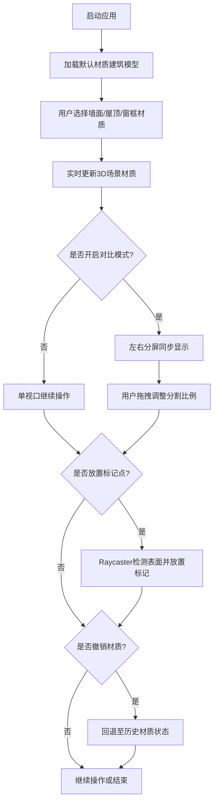

## 1. 产品概述

MaterialMix是一款面向建筑设计领域的3D建筑外观材质对比与交互评审应用，旨在解决业主与设计师协作评审时静态效果图难以直观对比多种材质效果的痛点。通过沉浸式3D场景，用户可实时切换墙面、屋顶、窗框材质，多角度漫游观察，并支持双屏对比模式直观呈现方案差异。

- 目标用户：建筑设计师、业主方评审人员、室内外设计团队
- 核心价值：将静态2D效果图升级为可交互的3D材质评审工具，大幅提升协作效率与决策准确性

## 2. 核心功能

### 2.1 用户角色

| 角色 | 注册方式 | 核心权限 |
|------|----------|----------|
| 普通用户 | 无需注册，本地使用 | 浏览3D场景、切换材质、对比方案、放置标记 |

### 2.2 功能模块

1. **3D场景视口**：建筑模型展示、天空盒背景、相机漫游控制
2. **材质选择面板**：墙面/屋顶/窗框三组材质选择、材质预览、撤销操作
3. **双屏对比模式**：左右分屏同步显示、可调节分割比例、默认方案对照
4. **标记与漫游**：WASD键盘平移、鼠标Orbit控制、表面标记点放置与连线

### 2.3 页面详情

| 页面名称 | 模块名称 | 功能描述 |
|----------|----------|----------|
| 主界面 | 3D视口 | 渲染建筑3D模型，支持鼠标拖拽旋转、滚轮缩放、右键平移、WASD平移，左键放置标记点 |
| 主界面 | 材质面板 | 左侧280px面板，分墙面/屋顶/窗框三组卡片，每组4种材质预设，底部撤销按钮 |
| 主界面 | 对比按钮 | 视口右上角圆形按钮，点击切换单/双视口对比模式 |
| 主界面 | 双屏对比 | 左右分屏同步摄像机，左侧当前材质、右侧默认材质，可拖拽调整分割比例 |

## 3. 核心流程

用户启动应用后，默认展示带有浅灰色基础材质的3D建筑模型。用户通过左侧面板选择不同部位的材质方案，场景实时更新渲染效果。点击对比按钮可切换双屏模式，直观对比当前方案与默认方案的差异。用户可在场景中自由漫游观察，并在需要重点关注的位置放置标记点。若对材质选择不满意，可点击撤销按钮回退至上一状态。

## 4. 用户界面设计

### 4.1 设计风格

- **主色调**：深灰工业风 (#2C2C2C面板背景 / #3A3A3A卡片背景)，搭配橙色强调色 (#FF7043)
- **组别配色**：墙面组蓝色(#4FC3F7)渐变条、屋顶组绿色(#81C784)渐变条、窗框组橙色(#FFB74D)渐变条
- **按钮风格**：圆角矩形(8px)，选中项左侧4px主色边框，背景色#455A64
- **字体**：现代无衬线字体，链接Google Fonts通用字体
- **布局风格**：左右分栏桌面布局，移动端自动切换为上下折叠布局
- **过渡动画**：所有交互0.2秒ease-out过渡，选中项1.5秒呼吸光晕动画

### 4.2 页面设计概览

| 页面名称 | 模块名称 | UI元素 |
|----------|----------|--------|
| 主界面 | 材质面板 | 280px深色侧边栏、三组卡片式材质组(圆角12px)、每组顶部2px彩色渐变条、材质按钮(48px高含32x32预览色块)、撤销按钮(橙色) |
| 主界面 | 3D视口 | 天空盒渐变背景(#87CEEB→#E0F7FA)、右上角44px圆形对比按钮(#FF7043配双箭头)、可拖拽分割线(2px浅灰实线) |
| 主界面 | 双屏模式 | 右侧视口2px虚线浅灰边框、左上角"默认方案"标签、分割比例范围3:7~7:3 |
| 主界面 | 标记系统 | 8px红色圆点标记、半透明虚线连接标记点 |

### 4.3 响应式设计

- 桌面端（≥768px）：左右结构，左侧280px固定面板，右侧自适应3D视口
- 移动端（<768px）：上下结构，顶部折叠横条面板，点击后向下展开200px可滚动区域，下方为3D视口

### 4.4 3D场景指引

- **环境/天空盒**：渐变天空背景，顶部天蓝色(#87CEEB)到底部浅青色(#E0F7FA)
- **光照设置**：AmbientLight环境光+DirectionalLight平行光模拟日光，带柔和阴影
- **相机设置**：默认背面45度俯视角度，PerspectiveCamera，支持OrbitControls旋转/缩放/平移
- **构图与焦点**：建筑居中放置，地面平面承托，留出足够观察空间
- **交互与动画**：材质切换无动画即时响应、相机漫游平滑阻尼、标记点淡入效果
- **后处理效果**：保持简洁，无额外后处理以确保性能
- **资源与性能预算**：纯程序化几何体，无外部模型资源，目标帧率≥30FPS（对比模式≥25FPS）
