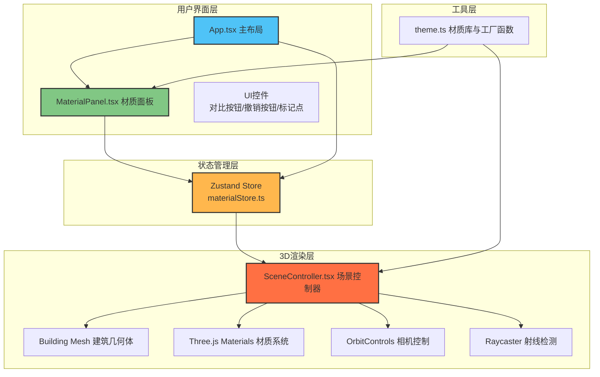

## 1. 架构设计



## 2. 技术说明

- **前端框架**：React@18 + TypeScript@5 + Vite@5
- **3D渲染**：Three.js + @react-three/fiber + @react-three/drei
- **状态管理**：Zustand（轻量级状态管理，管理材质选择、历史记录、标记点、对比模式）
- **构建工具**：Vite + @vitejs/plugin-react
- **样式方案**：纯CSS（内联样式+style标签），无额外UI库依赖，满足工业风深色主题需求
- **类型定义**：@types/three 提供Three.js类型支持

## 3. 项目结构与文件职责

| 文件路径 | 职责说明 | 依赖关系 |
|----------|----------|----------|
| `package.json` | 项目依赖与脚本配置 | - |
| `vite.config.js` | Vite构建配置，启用React插件 | - |
| `tsconfig.json` | TypeScript严格模式配置，模块解析bundler | - |
| `index.html` | HTML入口，挂载根节点，加载通用字体 | - |
| `src/main.tsx` | React入口，渲染App组件，初始化帧率监控 | 依赖App.tsx |
| `src/App.tsx` | 主布局组件，左侧材质面板+中央3D视口，管理全局状态与响应式布局 | 依赖MaterialPanel、SceneController、materialStore |
| `src/SceneController.tsx` | 3D场景控制器，加载建筑预设几何体、管理mesh阵列、应用材质更新、处理相机漫游、Raycaster标记检测 | 依赖theme.ts、materialStore |
| `src/MaterialPanel.tsx` | 材质选择面板，分三组材质卡片，处理用户选择与撤销操作 | 依赖theme.ts、materialStore |
| `src/store/materialStore.ts` | Zustand状态管理，存储当前材质、历史记录（最多10条）、标记点、对比模式状态 | 无UI依赖 |
| `src/utils/theme.ts` | 材质常量库（墙面4种/屋顶4种/窗框4种）、createMaterial工厂函数创建MeshStandardMaterial | 无内部依赖 |

### 数据流向说明

```
用户交互 → MaterialPanel → Zustand Store (materialStore) → SceneController → Three.js渲染更新
   ↑                                                           ↓
   └──── 撤销操作 ←────── 历史记录栈 ──────────────────────── 材质状态
```

## 4. 核心数据模型

### 4.1 材质定义

```typescript
interface MaterialPreset {
  name: string;
  type: 'wall' | 'roof' | 'window';
  color: string;
  roughness: number;
  metalness: number;
  transparent?: boolean;
  opacity?: number;
}

interface MaterialSelection {
  wall: MaterialPreset;
  roof: MaterialPreset;
  window: MaterialPreset;
}
```

### 4.2 Zustand Store状态

```typescript
interface MaterialStore {
  currentMaterials: MaterialSelection;
  history: MaterialSelection[];
  markers: { position: [number, number, number] }[];
  isCompareMode: boolean;
  splitRatio: number;
  selectMaterial: (type: 'wall' | 'roof' | 'window', preset: MaterialPreset) => void;
  undo: () => void;
  addMarker: (position: [number, number, number]) => void;
  clearMarkers: () => void;
  toggleCompareMode: () => void;
  setSplitRatio: (ratio: number) => void;
}
```

## 5. 性能优化策略

1. **材质复用**：相同参数的MeshStandardMaterial实例复用，避免重复创建
2. **几何体缓存**：建筑几何体仅创建一次，材质切换时仅替换material属性
3. **渲染节流**：帧率监控确保稳定30FPS，对比模式最低25FPS
4. **标记点优化**：最多5个标记点，使用BufferGeometry减少draw call
5. **响应式优化**：移动端使用CSS媒体查询切换布局，不影响3D渲染性能
