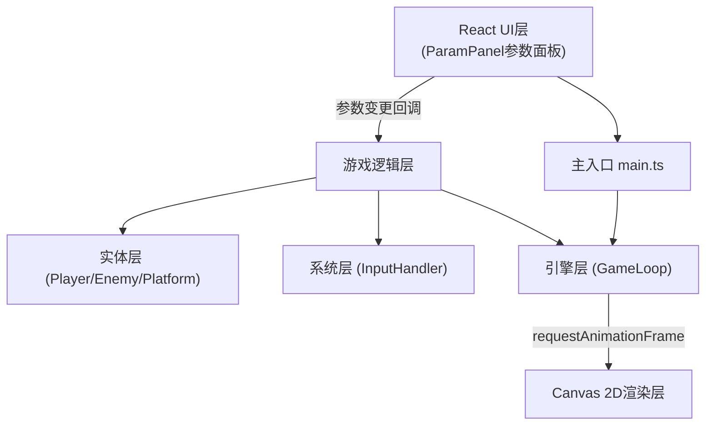

## 1. 架构设计

JumpStrike采用分层模块化架构，使用React管理UI层，Canvas 2D作为游戏渲染层，通过Vite提供快速开发构建体验。



### 模块调用关系与数据流向
1. **main.ts** → 创建Game实例 → 启动GameLoop → 挂载React UI
2. **GameLoop** → 每帧调用update(dt) → InputHandler读取输入 → Player.update(dt) → 碰撞检测 → render(ctx)
3. **ParamPanel** → 参数变更 → 更新Player实例的params属性 → Player后续update使用新参数
4. **Player** → 返回攻击命中列表 → Enemy.takeDamage() → 更新敌人状态

## 2. 技术描述

- **前端框架**：React 18 + TypeScript 5 + Vite 5
- **构建工具**：Vite（配置@vitejs/plugin-react）
- **渲染引擎**：Canvas 2D原生API，自定义脏矩形检测优化
- **状态管理**：React useState/useRef管理UI状态，游戏状态由Game类集中管理
- **样式方案**：内联样式 + CSS变量，无外部UI库依赖
- **后端**：无，纯前端应用
- **数据库**：无，配置导出为浏览器端JSON下载

### 核心技术选型理由
- **Vite**：极快的HMR热更新，适合游戏迭代调试
- **Canvas 2D**：相比DOM更适合高频游戏渲染，支持脏矩形优化
- **TypeScript严格模式**：确保游戏参数类型安全，减少物理计算错误

## 3. 目录结构

```
auto125/
├── package.json
├── index.html
├── vite.config.js
├── tsconfig.json
└── src/
    ├── main.ts                 # 应用入口
    ├── App.tsx                 # React根组件
    ├── engine/
    │   ├── GameLoop.ts         # 游戏主循环
    │   └── Game.ts             # 游戏状态容器
    ├── entities/
    │   ├── Player.ts           # 玩家角色
    │   ├── Enemy.ts            # 敌人AI
    │   └── Platform.ts         # 平台碰撞体
    ├── systems/
    │   ├── InputHandler.ts     # 键盘输入系统
    │   ├── CollisionSystem.ts  # 碰撞检测系统
    │   └── Recorder.ts         # 动作录制回放系统
    └── components/
        └── ParamPanel.tsx      # 参数调节面板组件
```

## 4. 核心数据模型

### 4.1 类型定义

```typescript
// 游戏参数
interface GameParams {
  jumpHeight: number;      // 跳跃高度 200-600
  gravity: number;         // 重力加速度 500-1500
  lightDamage: number;     // 轻击伤害 5-30
  heavyDamage: number;     // 重击伤害 10-50
  dashCooldown: number;    // 冲刺斩冷却 0.3-2.0s
}

// 攻击类型
type AttackType = 'light' | 'heavy' | 'dash';

// 攻击判定框
interface Hitbox {
  x: number;
  y: number;
  width: number;
  height: number;
  damage: number;
  knockback: number;
  active: boolean;
}

// 角色状态
interface PlayerState {
  x: number;
  y: number;
  vx: number;
  vy: number;
  facing: 1 | -1;
  onGround: boolean;
  jumpsRemaining: number;  // 剩余跳跃次数（二段跳）
  health: number;
  isAttacking: boolean;
  attackPhase: 'startup' | 'active' | 'recovery' | 'none';
  attackType: AttackType | null;
  attackTimer: number;
  dashCooldownTimer: number;
}

// 敌人状态
interface EnemyState {
  x: number;
  y: number;
  vx: number;
  health: number;
  maxHealth: number;
  patrolLeft: number;
  patrolRight: number;
  hitFlashTimer: number;
  deathScale: number;
  alive: boolean;
}

// 录制帧
interface RecordedFrame {
  timestamp: number;
  playerX: number;
  playerY: number;
  inputs: Record<string, boolean>;
  attackEvents: { type: AttackType; x: number; y: number }[];
  hits: { x: number; y: number }[];
}
```

### 4.2 动作时序参数
| 攻击类型 | 前摇时间 | 攻击判定 | 后摇硬直 | 冷却时间 | 击退距离 |
|---------|---------|---------|---------|---------|---------|
| 轻击(J) | 120ms | 持续40ms | 80ms | - | 0 |
| 重击(K) | 250ms | 持续60ms | 200ms | - | 50px |
| 冲刺斩(L) | 200ms | 突进全程 | 150ms | 800ms(可调节) | - |

## 5. 渲染优化策略

### 5.1 脏矩形检测
- 维护每帧变更的矩形区域列表（角色移动区、攻击特效区、敌人更新区）
- 仅重绘dirty rectangles，减少Canvas像素操作
- 静态背景（天空渐变、地面）使用离屏Canvas预渲染缓存

### 5.2 性能指标
- 目标帧率：60FPS（每帧≤16ms）
- 渲染时间预算：≤8ms（留出物理和逻辑计算时间）
- 内存占用：录制5秒约300帧数据，预估≤2MB

## 6. 构建与部署

- **开发启动**：`npm run dev` → Vite开发服务器，默认端口5173
- **生产构建**：`npm run build` → 输出至dist目录
- **类型检查**：`tsc --noEmit`
- **无外部后端依赖**，所有功能纯浏览器端运行
