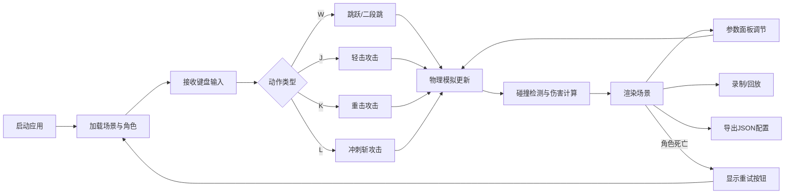

## 1. 产品概述

JumpStrike是一款面向独立游戏开发者的2D横版角色二段跳与空中连击动作沙盒工具，帮助开发者快速设计、调试和对比不同的跳跃攻击机制。通过实时参数调节和动作回放功能，大幅缩短战斗手感调整的迭代周期。

- 核心价值：为游戏开发者提供可实时调试的战斗动作沙盒，降低二段跳与空中连击系统的设计门槛
- 目标用户：独立游戏开发者、动作游戏设计师、游戏编程爱好者

## 2. 核心功能

### 2.1 功能模块
1. **游戏主场景**：2D横版物理模拟场景，含平台、角色、敌人
2. **角色控制系统**：WASD移动，二段跳，三种空中攻击（轻击J、重击K、冲刺斩L）
3. **实时参数面板**：右侧浮动控制面板，实时调节跳跃、重力、攻击等参数
4. **动作回放系统**：录制并回放最近5秒的输入与动作，显示轨迹与命中标记
5. **配置导出系统**：将当前参数导出为JSON配置文件供游戏使用

### 2.2 页面详情
| 页面名称 | 模块名称 | 功能描述 |
|-----------|-------------|---------------------|
| 主应用 | Canvas游戏视口 | 2000×600像素横版场景，实时渲染角色、敌人、平台与攻击特效 |
| 主应用 | ParamPanel参数面板 | 右侧浮动卡片，包含跳跃高度、重力、攻击伤害、冷却时间滑块控件 |
| 主应用 | 回放与导出区 | 面板底部的录制回放按钮和导出配置按钮 |
| 主应用 | 重试界面 | 角色死亡时中央显示红色重试按钮，点击重置场景 |

## 3. 核心流程

用户打开应用后，角色出现在场景左侧地面。通过WASD控制移动与跳跃，空中再次按W触发二段跳。跳跃中按J/K/L触发不同攻击动作，敌人被击中后弹飞并扣血。用户可随时通过右侧面板调节参数，观察手感变化。点击录制后可回放最近5秒操作，满意后导出JSON配置。

## 4. 用户界面设计

### 4.1 设计风格
- **主色调**：天空蓝渐变背景（#87CEEB → #E0F6FF），深灰色面板（#2d2d2d），蓝色强调色（#4A90D9）
- **按钮风格**：圆角卡片样式，悬停亮度提升10%+白色描边，点击缩放至95%
- **字体**：像素风游戏字体配合现代无衬线字体，数字使用等宽字体
- **布局**：Canvas居中主视口 + 右侧固定280px宽参数面板
- **视觉风格**：像素风游戏美术，Canvas渲染使用像素化滤镜保持锐利边缘

### 4.2 页面设计概述
| 页面名称 | 模块名称 | UI元素 |
|-----------|-------------|-------------|
| 主应用 | 游戏视口 | 天空蓝渐变背景、棕色地面平台、浅灰色浮动平台、蓝色像素角色、红色圆形敌人、白色攻击判定可视化 |
| 主应用 | ParamPanel | 深灰圆角卡片、#444滑块轨道、#4A90D9填充色、滑块悬停弹性动画、参数数值实时显示 |
| 主应用 | 回放导出区 | 蓝底白字按钮、悬停高亮、点击缩放反馈 |
| 主应用 | 重试界面 | 红色背景#d9534f、白色文字、圆角8px、居中浮现动画 |

### 4.3 响应式
- 桌面端优先，Canvas自适应视口大小，保持16:9比例
- 参数面板固定宽度280px，垂直方向可滚动
- Canvas使用脏矩形检测优化重绘性能

### 4.4 Canvas渲染规范
- 角色：32×48像素像素风小人，蓝色主调，持剑几何图形（矩形身体、直线四肢、三角形剑刃）
- 敌人：半径20像素红色圆形，被击中闪烁效果
- 平台：棕色地面（#8B4513）+ 浅灰色浮动平台（#D3D3D3），像素化纹理
- 特效：半透明蓝色回放轨迹线，红色命中标记圆圈
