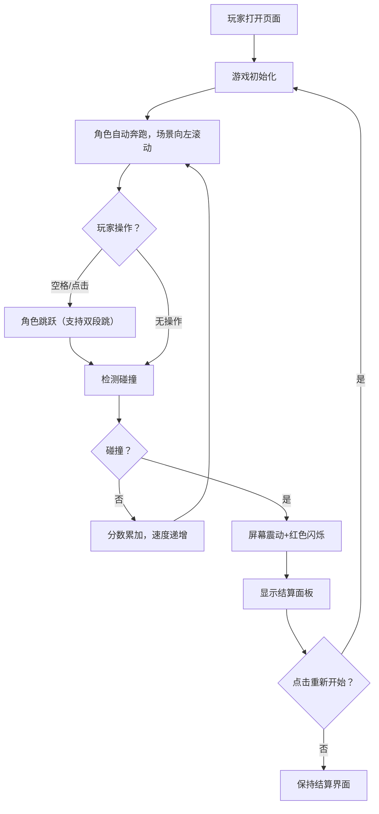

## 1. 产品概述

赛博朋克风格的Canvas无限跑酷游戏，玩家控制角色在霓虹城市中奔跑跳跃，躲避障碍物挑战最高分。
- 目标用户：休闲游戏玩家，喜欢赛博朋克美学的用户
- 产品价值：提供简单易上手、视觉效果精美的无尽跑酷体验

## 2. 核心功能

### 2.1 用户角色
| 角色 | 注册方式 | 核心权限 |
|------|---------|---------|
| 玩家 | 无需注册 | 游玩游戏、查看分数、刷新最高分 |

### 2.2 功能模块
1. **游戏主界面**：Canvas渲染区域、实时分数显示、最高分显示
2. **游戏结束面板**：本次得分、历史最高分、励志短语、重新开始按钮

### 2.3 页面详情
| 页面名称 | 模块名称 | 功能描述 |
|---------|---------|---------|
| 游戏主界面 | Canvas游戏区 | 渲染角色、场景、障碍物、粒子特效，60FPS游戏循环 |
| 游戏主界面 | 分数显示 | 实时显示当前距离分数和历史最高分，毛玻璃半透明面板 |
| 游戏主界面 | 输入处理 | 键盘空格键/鼠标点击/触摸屏幕触发跳跃（支持双段跳） |
| 游戏结束面板 | 结算界面 | 显示本次得分、历史最高分、随机励志短语、重新开始按钮 |

## 3. 核心流程

玩家打开页面 → 游戏自动开始（角色奔跑、场景滚动）→ 按空格/点击跳跃躲避障碍物 → 碰到障碍物或掉入坑洞游戏结束 → 显示结算面板 → 点击重新开始重置游戏

## 4. 用户界面设计

### 4.1 设计风格
- **主色调**：深紫色（#1a0a2e）背景，青色（#00fff7）霓虹描边，洋红色（#ff00ff）辅助色
- **按钮风格**：毛玻璃半透明（backdrop-filter: blur），霓虹边框发光效果，像素风字体
- **字体**：像素风字体（Press Start 2P 或等效等宽像素字体）
- **布局风格**：全屏Canvas，UI元素悬浮于Canvas之上

### 4.2 页面设计概览
| 页面名称 | 模块名称 | UI元素 |
|---------|---------|--------|
| 游戏主界面 | Canvas游戏区 | 深紫渐变背景、青色网格地面、霓虹建筑剪影、像素角色、霓虹障碍物、粒子拖尾、屏幕震动/闪烁效果 |
| 游戏主界面 | 分数面板 | 毛玻璃半透明背景、像素风字体、青色/洋红霓虹文字、左上角悬浮 |
| 游戏结束面板 | 结算界面 | 毛玻璃大面板居中、像素风标题、本次分数、历史最高分、随机励志短语、霓虹发光重新开始按钮 |

### 4.3 响应式
- 桌面端优先，移动端自适应
- Canvas按窗口尺寸等比缩放，保持游戏画面比例
- 触摸事件与键盘事件双支持
