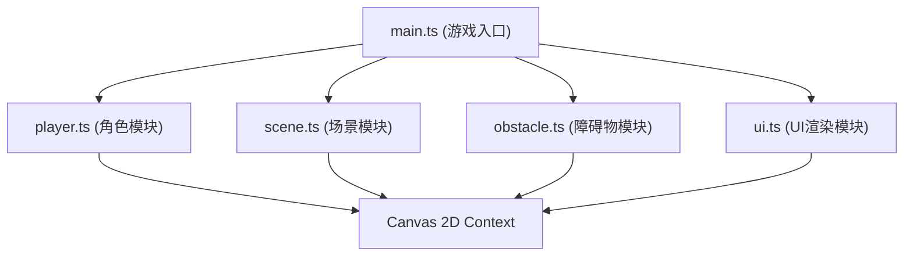

## 1. 架构设计



## 2. 技术说明
- **前端**：TypeScript + Vite + Canvas 2D API
- **构建工具**：Vite
- **包管理**：npm
- **无后端**，最高分通过 localStorage 本地存储

## 3. 文件结构

| 文件路径 | 用途 |
|---------|------|
| /package.json | 项目依赖配置（typescript, vite） |
| /index.html | 入口页面，全屏Canvas容器 |
| /tsconfig.json | TypeScript配置（严格模式，ESNext） |
| /vite.config.js | Vite构建配置 |
| /src/main.ts | 游戏主入口：初始化Canvas、游戏循环、事件绑定、模块协调 |
| /src/player.ts | 角色类：位置、速度、跳跃状态、双段跳逻辑、渲染 |
| /src/scene.ts | 场景管理：背景、建筑剪影、地面网格线、滚动逻辑 |
| /src/obstacle.ts | 障碍物管理：随机生成、碰撞检测、频率调整 |
| /src/ui.ts | UI渲染：分数、最高分、游戏结束面板、励志短语、按钮事件 |

## 4. 核心数据结构

### Player（角色）
```typescript
interface Player {
  x: number;
  y: number;
  vy: number;
  width: number;
  height: number;
  isJumping: boolean;
  jumpCount: number;
  maxJumps: number;
  gravity: number;
  jumpPower: number;
  trail: { x: number; y: number; alpha: number }[];
}
```

### Obstacle（障碍物）
```typescript
interface Obstacle {
  x: number;
  y: number;
  width: number;
  height: number;
  type: 'box' | 'rail' | 'pit' | 'flying';
  color: string;
}
```

### GameState（游戏状态）
```typescript
interface GameState {
  isRunning: boolean;
  isGameOver: boolean;
  score: number;
  highScore: number;
  scrollSpeed: number;
  baseSpeed: number;
  maxSpeed: number;
  screenShake: number;
  screenFlash: number;
}
```

## 5. 模块职责

- **main.ts**：游戏主循环（requestAnimationFrame），状态管理，事件分发，模块协调
- **player.ts**：角色物理更新（重力、跳跃），残影粒子，碰撞盒渲染
- **scene.ts**：地面网格线滚动，多层建筑视差滚动，背景渐变
- **obstacle.ts**：障碍物按难度概率生成，AABB碰撞检测，类型多样性
- **ui.ts**：分数实时绘制，游戏结束面板，毛玻璃效果，像素风文字，励志短语随机
