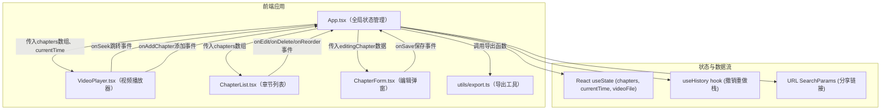

## 1. 架构设计



## 2. 技术说明

- **前端框架**：React@18 + TypeScript@5
- **构建工具**：Vite@5 + @vitejs/plugin-react
- **状态管理**：React useState + useReducer + 自定义useHistory hook
- **图标**：lucide-react
- **样式方案**：纯CSS（CSS Modules或内联样式，按用户指定的自定义样式）
- **初始化工具**：vite-init

## 3. 类型定义与数据模型

```typescript
interface Chapter {
  id: string;           // UUID
  title: string;        // 章节标题，≤30字符
  time: number;         // 开始时间（秒）
  color: string;        // 章节颜色（16进制HEX）
}

interface HistoryState {
  past: Chapter[][];    // 撤销栈
  present: Chapter[];   // 当前状态
  future: Chapter[][];  // 重做栈
}
```

预设颜色数组（10种）：
```typescript
const PRESET_COLORS = [
  '#6c63ff', '#ff6b6b', '#51cf66', '#ffd43b', '#22b8cf',
  '#cc5de8', '#ff922b', '#339af0', '#f06595', '#748ffc'
];
```

## 4. 模块文件结构与职责

| 文件路径 | 职责 | 调用关系 |
|----------|------|----------|
| `package.json` | 项目依赖与启动脚本 | npm run dev 启动 Vite |
| `vite.config.js` | Vite构建配置，启用React插件 | 被 vite 命令调用 |
| `tsconfig.json` | TypeScript严格模式配置 | 被 tsc 与 IDE 调用 |
| `index.html` | 入口页面，挂载根节点、引入Google Fonts | 被 Vite 作为入口加载 |
| `src/App.tsx` | 主应用组件，全局状态管理，视频/列表数据同步，撤销重做，URL分享 | 引入 VideoPlayer, ChapterList, ChapterForm, export utils |
| `src/VideoPlayer.tsx` | 封装HTML5 video，自定义时间轴渲染章节圆点，倍速/音量/全屏控制 | 向App发送 onTimeUpdate, onSeek, onAddChapter |
| `src/ChapterList.tsx` | 章节列表面板，卡片渲染，点击跳转，拖拽排序，编辑/删除 | 向App发送 onJump, onEdit, onDelete, onReorder |
| `src/ChapterForm.tsx` | 添加/编辑章节弹窗，标题输入+颜色选择 | 向App发送 onSave(title, color) |
| `src/utils/export.ts` | 章节数组→VTT文本/JSON文本转换，文件下载 | 被App的导出按钮调用 |

## 5. 核心数据流

1. **用户上传视频** → App设置videoFile状态 → VideoPlayer加载并播放
2. **播放中时间更新** → VideoPlayer的timeupdate事件 → App更新currentTime → VideoPlayer/ChapterList高亮当前章节
3. **添加章节** → 用户点击时间轴添加按钮 → App打开ChapterForm → 用户输入保存 → App更新chapters数组 → VideoPlayer/ChapterList重新渲染
4. **编辑/删除章节** → ChapterList触发事件 → App更新chapters数组（同时推入历史栈）
5. **拖拽排序** → ChapterList HTML5 Drag API → App按新顺序更新chapters
6. **撤销/重做** → 键盘快捷键 → useHistory hook切换past/present/future → App更新chapters
7. **导出** → 用户点击导出菜单 → export.ts生成文本 → Blob触发浏览器下载
8. **分享链接** → App将chapters数组JSON编码为URL查询参数 → 复制到剪贴板 → 新用户打开时解析URL参数恢复chapters

## 6. 性能优化策略

- 章节圆点使用CSS transform定位，避免重排
- ChapterList条目使用React.memo避免不必要重渲染
- 拖拽排序使用requestAnimationFrame节流DOM更新
- 时间轴progress使用CSS变量，通过transform更新而非重绘整个条
