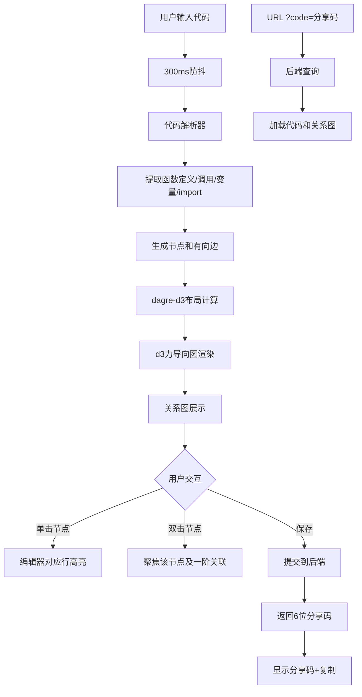

## 1. 产品概述

CodeCanvas 是一款在线代码片段可视化与分享应用，让开发者输入代码后实时生成语法高亮标注块，并通过动态关系图直观展示函数调用关系、变量依赖和模块引用结构，支持一键分享。

- 核心目的：帮助开发者理解代码结构、可视化依赖关系、便捷分享代码片段
- 目标用户：前端/后端开发者、代码学习者、技术团队

## 2. 核心功能

### 2.1 用户角色
| 角色 | 注册方式 | 核心权限 |
|------|----------|----------|
| 匿名用户 | 无需注册 | 编辑代码、查看关系图、保存与分享 |
| 访客用户 | 通过分享链接访问 | 查看已保存代码与关系图 |

### 2.2 功能模块
1. **编辑器页面**：代码输入编辑面板 + 关系图展示面板（主页面）
2. **分享访问页面**：通过分享码加载代码和关系图的只读视图

### 2.3 页面详情
| 页面名称 | 模块名称 | 功能描述 |
|----------|----------|----------|
| 编辑器页面 | 代码编辑面板 | textarea集成prismjs实时语法高亮，300ms防抖，高度自适应最小320px |
| 编辑器页面 | 关系图面板 | dagre-d3布局+力导向图渲染，节点按函数/变量/模块分色，边带箭头，悬停高亮关联 |
| 编辑器页面 | 顶部导航栏 | 语言选择、保存按钮（波纹动画）、分享码显示与复制 |
| 编辑器页面 | 可拖拽分隔条 | 左右分栏4:6，可拖拽调节，最小左栏300px右栏400px |
| 编辑器页面 | 分享弹窗 | 6位分享码、复制链接按钮带成功反馈动画、半透明背景淡入 |
| 分享访问页面 | URL参数加载 | ?code=分享码自动加载代码和关系图 |

## 3. 核心流程

用户在编辑面板输入代码 → 300ms防抖后自动解析 → 提取函数定义/调用、变量声明、import/require → 生成节点和有向边 → dagre-d3布局 → 力导向图渲染关系图。

点击节点 → 编辑器对应行滚动至视口中央并高亮淡黄色3秒 → 双击节点 → 只显示该节点及一阶关联（其他半透明）。

保存按钮 → 提交代码和图数据到后端 → 后端返回6位分享码 → 页面顶部右侧显示分享码 → 复制到剪贴板。

## 4. 用户界面设计

### 4.1 设计风格
- 主色调：深色主题 #1e1e2e
- 编辑区背景：#1a1a2e，字体 Fira Code 14px
- 关系图背景：#16213e
- 节点颜色：函数#00a8ff、变量#ff6b6b、模块#9b59b6
- 边颜色：半透明淡蓝 #00a8ff50，粗1.5px
- 保存按钮主色#00a8ff，点击渐变#0077b6
- 所有过渡动画：ease-in-out 0.3s
- 按钮风格：圆角8px，轻微内阴影

### 4.2 页面设计概览
| 页面名称 | 模块名称 | UI元素 |
|----------|----------|--------|
| 编辑器页面 | 顶部导航栏 | 深色背景、Logo左侧、语言选择下拉、保存按钮右侧(波纹动画)、分享码输入框 |
| 编辑器页面 | 编辑面板 | Fira Code字体、行号、prismjs高亮叠加层、背景#1a1a2e |
| 编辑器页面 | 分隔条 | 4px宽、hover高亮#4A90D9、cursor col-resize |
| 编辑器页面 | 关系图面板 | SVG画布、圆形节点(12-32px按入度)、带箭头边、悬停高亮 |
| 编辑器页面 | 分享弹窗 | 居中卡片、半透明遮罩淡入、6位分享码、复制按钮+成功反馈 |

### 4.3 响应式适配
- 桌面优先，视口宽度≥768px：左右两栏布局(4:6)，可拖拽分隔条
- 视口宽度<768px：上下布局，编辑区50vh固定高度，关系图自适应剩余高度
