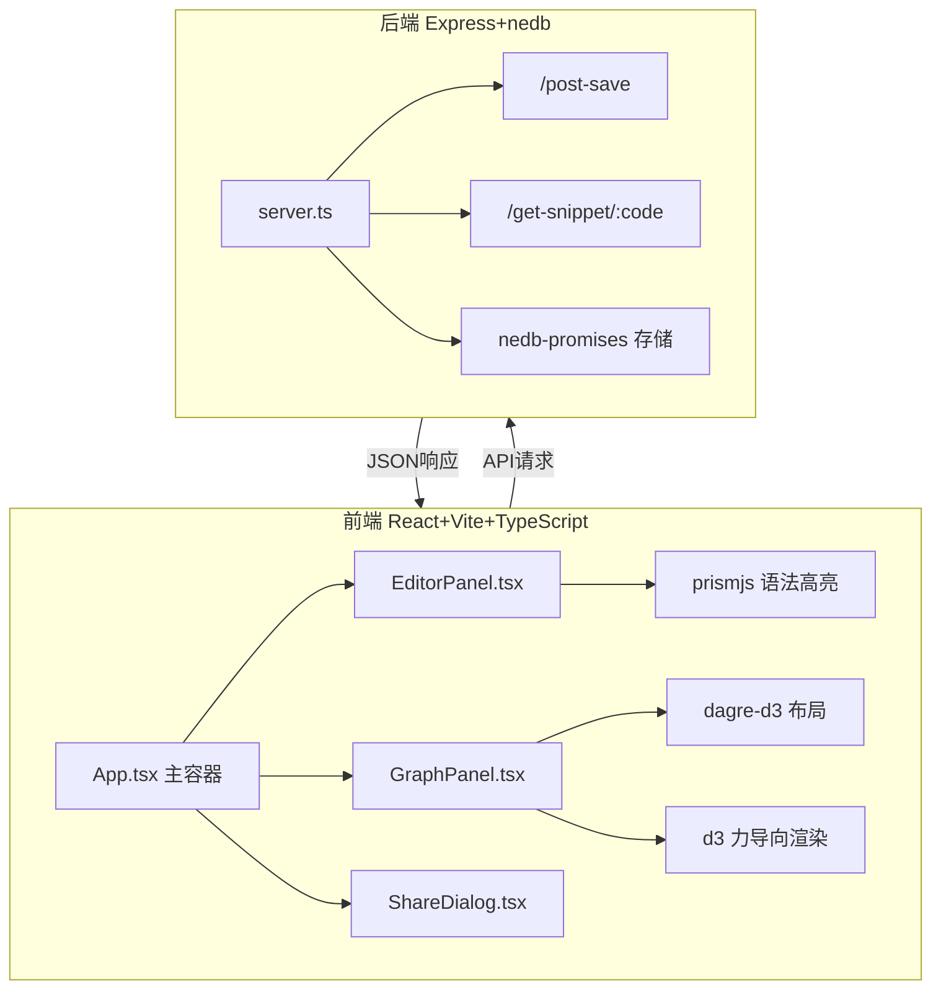
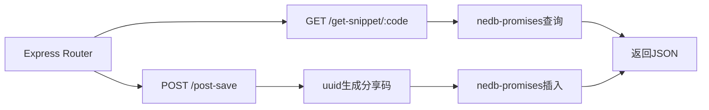
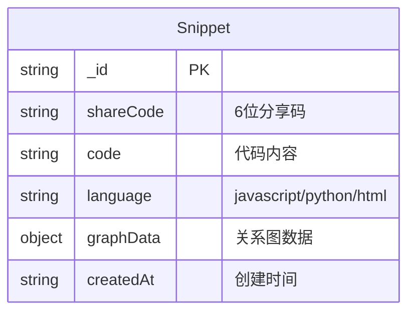

## 1. 架构设计



## 2. 技术说明
- 前端：React@18 + TypeScript + Vite + prismjs + dagre-d3 + d3
- 初始化工具：vite-init (react-express-ts模板)
- 后端：Express@4 + nedb-promises + uuid
- 数据库：nedb（嵌入式文档数据库，文件存储）
- 状态管理：useReducer（代码提交历史）+ 局部state
- 样式：CSS Modules / 内联样式（深色主题）

## 3. 路由定义
| 路由 | 用途 |
|------|------|
| / | 主编辑器页面（代码编辑+关系图） |
| /?code=分享码 | 通过分享码加载已保存的代码和关系图 |

## 4. API定义

### 4.1 POST /post-save
保存代码片段和关系图数据

请求体：
```typescript
interface SaveRequest {
  code: string;
  language: 'javascript' | 'python' | 'html';
  graphData: {
    nodes: GraphNode[];
    edges: GraphEdge[];
  };
}

interface GraphNode {
  id: string;
  label: string;
  type: 'function' | 'variable' | 'module';
  line: number;
  inDegree: number;
}

interface GraphEdge {
  source: string;
  target: string;
  type: 'call' | 'dependency' | 'import';
}

interface SaveResponse {
  success: boolean;
  code: string; // 6位分享码
}
```

### 4.2 GET /get-snippet/:code
通过分享码查询代码片段

响应体：
```typescript
interface SnippetResponse {
  success: boolean;
  data: {
    code: string;
    language: 'javascript' | 'python' | 'html';
    graphData: {
      nodes: GraphNode[];
      edges: GraphEdge[];
    };
    createdAt: string;
  } | null;
}
```

## 5. 服务端架构图



## 6. 数据模型

### 6.1 数据模型定义



### 6.2 数据定义语言

nedb集合：snippets
- 字段：_id(自增), shareCode(索引,唯一), code, language, graphData(JSON对象), createdAt
- 自动加载文件：data/snippets.db
