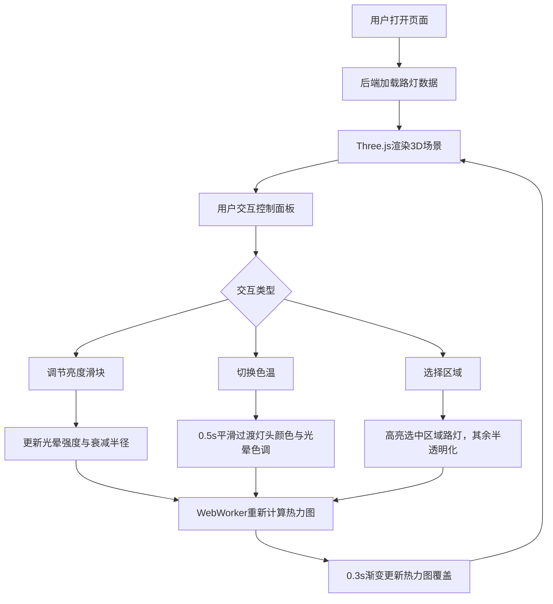

## 1. 产品概述
CityLightViz 是一个面向城市规划师和公众的3D城市路灯可视化平台，通过Three.js渲染的3D城市街区场景，结合动态热力图与光照参数实时调节，直观展示不同区域路灯布局与亮度覆盖数据，辅助照明方案的能耗与视觉舒适度决策。

## 2. 核心功能

### 2.1 用户角色
| 角色 | 使用方式 | 核心权限 |
|------|----------|----------|
| 城市规划师 | 直接访问 | 查看路灯布局、调节亮度/色温、切换区域、对比照明方案 |
| 公众用户 | 直接访问 | 查看路灯布局与亮度覆盖、浏览热力图 |

### 2.2 功能模块
1. **主3D场景页**：鸟瞰视角3D城市街区、200个路灯模型、地面网格、热力图覆盖层
2. **控制面板**：亮度全局滑块、色温切换、区域选择下拉菜单

### 2.3 页面详情
| 页面名称 | 模块名称 | 功能描述 |
|----------|----------|----------|
| 主3D场景页 | 3D城市街区场景 | Three.js渲染，鸟瞰45度倾斜视角，深灰#2a2a2a背景，200个路灯（圆柱灯柱+球形灯头+光晕），半透明网格地面，路灯数据从后端JSON接口加载 |
| 主3D场景页 | 动态热力图覆盖 | 蓝到红渐变，40%透明度，根据路灯光照强度和距离实时计算，WebWorker后台计算，滑块拖动0.3秒内渐变更新 |
| 控制面板 | 亮度全局滑块 | 范围0-100，实时调整所有路灯光晕强度与衰减半径 |
| 控制面板 | 色温切换按钮 | 暖光3000K/冷光5000K，切换时灯头颜色和光晕色调0.5s平滑过渡 |
| 控制面板 | 区域选择下拉菜单 | 五个预设区域，选中后对应区域路灯高亮，其余半透明化，浮动标签显示平均照度值 |

## 3. 核心流程

用户打开页面 → 后端加载200个路灯数据 → Three.js渲染3D城市街区场景 → 用户通过控制面板调节亮度/色温/区域 → WebWorker后台计算热力图 → 场景实时更新光晕和热力图 → 用户对比不同照明方案

## 4. 用户界面设计

### 4.1 设计风格
- 主色调：深灰#2a2a2a背景，#00bcd4青色作为主强调色，悬停#26c6da
- 辅助色：浅灰#ccc文字，蓝色到红色热力图渐变
- 按钮风格：圆角，青色填充，悬停上浮阴影
- 字体：Google Fonts - Rajdhani（显示字体）+ Source Sans 3（UI字体）
- 布局风格：全屏3D场景 + 左侧浮空可拖拽毛玻璃控制面板
- 动效：所有交互0.2s缓动动画，色温过渡0.5s，热力图更新0.3s

### 4.2 页面设计概览
| 页面名称 | 模块名称 | UI元素 |
|----------|----------|--------|
| 主3D场景页 | 3D城市街区场景 | 深灰背景、鸟瞰45度相机、网格地面、路灯模型、光晕效果、热力图覆盖 |
| 主3D场景页 | 控制面板 | 毛玻璃rgba(255,255,255,0.1)、圆角12px、宽300px、可拖拽、亮度滑块、色温按钮、区域下拉菜单 |

### 4.3 响应式设计
- 桌面优先，全屏3D场景自适应窗口大小
- 控制面板固定位置但可拖拽至任意位置

### 4.4 3D场景指引
- 环境：深灰色城市街区，科技感暗色调
- 灯光：路灯自带点光源和半透明光晕球体
- 相机：鸟瞰视角，初始倾斜45度，支持OrbitControls旋转缩放
- 构图：200个路灯分布在城市地面，热力图覆盖地面
- 交互：OrbitControls旋转缩放，控制面板实时调参
- 后处理：光晕半透明效果，热力图40%透明度叠加
- 性能：InstancedMesh合并路灯光晕渲染，WebWorker计算热力图，帧率≥45fps
