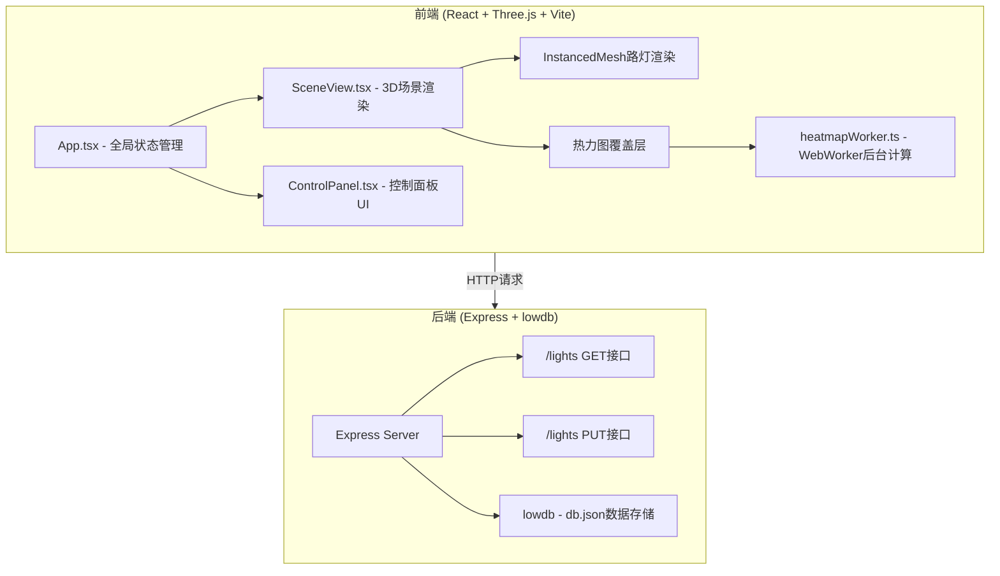
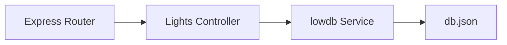
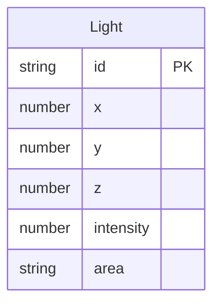

## 1. 架构设计



## 2. 技术说明
- 前端：React@18 + Three.js + @react-three/fiber + @react-three/drei + TypeScript + Vite
- 初始化工具：vite-init (react-express-ts模板)
- 后端：Express@4 + lowdb + TypeScript
- 数据库：lowdb (JSON文件存储)
- 状态管理：zustand

## 3. 路由定义
| 路由 | 用途 |
|------|------|
| / | 主页面，3D城市路灯可视化场景 |

## 4. API定义

### 4.1 获取路灯数据
```
GET /lights
Response: {
  lights: Array<{
    id: string;
    x: number;
    y: number;
    z: number;
    intensity: number;
    area: string;
  }>
}
```

### 4.2 更新路灯亮度参数
```
PUT /lights
Body: {
  intensity?: number;
  area?: string;
}
Response: {
  success: boolean;
  lights: Array<{
    id: string;
    x: number;
    y: number;
    z: number;
    intensity: number;
    area: string;
  }>
}
```

### 4.3 TypeScript类型定义
```typescript
interface Light {
  id: string;
  x: number;
  y: number;
  z: number;
  intensity: number;
  area: string;
}

interface LightsResponse {
  lights: Light[];
}

interface UpdateLightsRequest {
  intensity?: number;
  area?: string;
}
```

## 5. 服务端架构图



## 6. 数据模型

### 6.1 数据模型定义



### 6.2 数据定义

db.json初始数据结构：
```json
{
  "lights": [
    {
      "id": "uuid",
      "x": 0-100随机坐标,
      "y": 0,
      "z": 0-100随机坐标,
      "intensity": 50-100随机亮度,
      "area": "五个预设区域之一"
    }
  ]
}
```

五个预设区域：Downtown、Industrial、Residential、Park、Commercial
