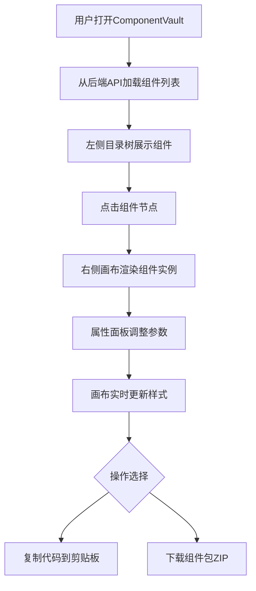

## 1. 产品概述
ComponentVault 是一个面向中型分布式团队的在线UI组件库管理与实时预览平台，解决团队成员无法统一预览、管理和下载前端组件代码的痛点。
- 目标用户：前端开发工程师、UI设计师、技术管理者
- 核心价值：将设计稿与标注图转化为可调用组件库，提供统一预览、属性调参、代码复制和组件包下载的一站式工作流

## 2. 核心功能

### 2.1 用户角色
| 角色 | 注册方式 | 核心权限 |
|------|----------|----------|
| 团队成员 | 邀请制 | 浏览组件、调整属性、复制/下载代码 |
| 管理员 | 邀请制 | 上述权限 + 新增/管理组件元数据 |

### 2.2 功能模块
1. **组件管理主页面**：左侧组件目录树 + 中央画布预览 + 右侧属性面板

### 2.3 页面详情
| 页面名称 | 模块名称 | 功能描述 |
|----------|----------|----------|
| 组件管理主页面 | 顶部导航栏 | 显示应用名称ComponentVault、用户头像菜单 |
| 组件管理主页面 | 左侧目录树 | 递归渲染文件夹分组（/Basic/Button等），组件项显示标签（React/TS），选中高亮#e6f0ff+左侧1px蓝色指示条 |
| 组件管理主页面 | 中央画布 | 480x320px可缩放至800x600，背景#f8f9fa，虚线参考框，上方居中显示组件名和版本号 |
| 组件管理主页面 | 右侧属性面板 | 固定宽280px，滑块/颜色选择器/下拉菜单，实时更新画布组件样式（200ms过渡动画） |
| 组件管理主页面 | 复制代码按钮 | 一键复制当前组件JSX代码到剪贴板，绿色toast提示3秒消失 |
| 组件管理主页面 | 下载组件包按钮 | 左下角按钮，JSZip打包所有组件为ZIP文件下载 |

## 3. 核心流程

用户打开ComponentVault → 从后端API加载组件列表 → 左侧目录树展示组件 → 点击组件节点 → 右侧画布渲染组件实例 → 属性面板调整参数 → 画布实时更新 → 点击复制代码/下载组件包

## 4. 用户界面设计

### 4.1 设计风格
- 主色调：#4A90D9（蓝色），辅助色：#50C878（绿色健康色），背景色：#f5f7fa
- 按钮样式：圆角6-8px，0.2s缓动过渡动画
- 字体：Google Fonts（DM Sans作为UI字体，JetBrains Mono作为代码字体）
- 布局：左中右三栏（260px / flex:1 / 280px），顶部56px深色导航栏#2c3e50
- 所有交互元素统一8px圆角和0.2s缓动过渡

### 4.2 页面设计概览
| 页面名称 | 模块名称 | UI元素 |
|----------|----------|--------|
| 组件管理主页面 | 顶部导航栏 | 深色背景#2c3e50，白色应用名称，右侧用户头像缩写 |
| 组件管理主页面 | 左侧目录树 | 260px宽，文件夹图标+展开/收起，组件项显示标签，选中#e6f0ff高亮+左侧1px #4A90D9指示条 |
| 组件管理主页面 | 中央画布 | 480x320→800x600可拖拽缩放，#f8f9fa背景，虚线#ccc参考框，上方14px #666组件名+版本号 |
| 组件管理主页面 | 右侧属性面板 | 280px固定宽，12px加粗标签#333，滑块/颜色选择器/下拉菜单，垂直滚动 |
| 组件管理主页面 | 复制代码按钮 | 主色#4A90D9，圆角6px，绿色toast通知 |
| 组件管理主页面 | 下载组件包按钮 | 次色#50C878，圆角6px，左下角位置 |

### 4.3 响应式适配
- 桌面优先设计（≥1024px）：三栏布局
- 屏幕宽度 < 1024px：属性面板收起为底部抽屉，通过画布右下角箭头展开
- 触摸设备优化：滑块和颜色选择器的触摸交互

### 4.4 性能要求
- 初始组件列表加载 ≤ 1秒（10个组件元数据）
- 切换组件预览响应 ≤ 300ms
- 样式过渡动画 200ms ease-in-out
