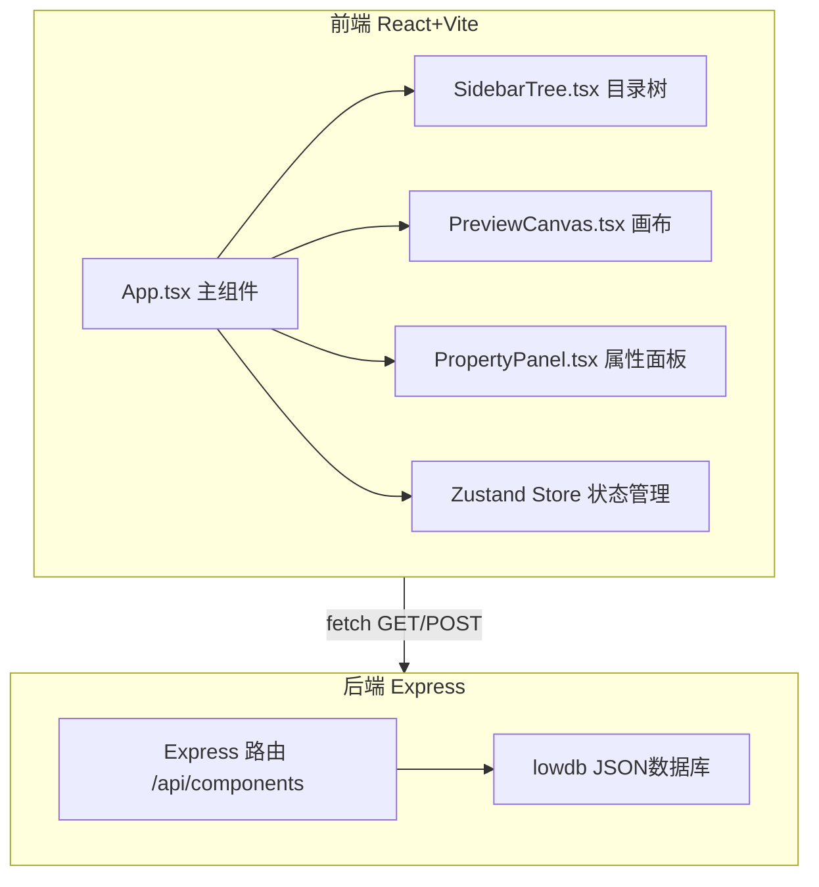
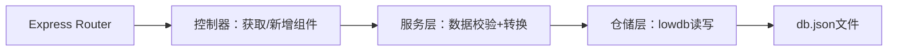
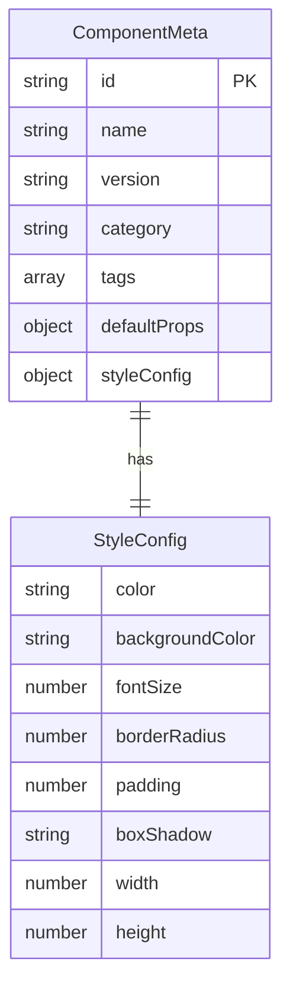

## 1. 架构设计



## 2. 技术说明
- 前端：React@18 + TypeScript + Vite + Tailwind CSS + Zustand
- 初始化工具：vite-init（react-express-ts模板）
- 后端：Express@4 + lowdb（JSON文件存储）
- 数据库：lowdb（db.json文件），存储组件元数据
- 工具库：JSZip（浏览器端ZIP打包）、uuid（唯一ID生成）

## 3. 路由定义
| 路由 | 用途 |
|------|------|
| / | 主页面，三栏布局组件管理界面 |

## 4. API定义

### 4.1 TypeScript类型定义

```typescript
interface ComponentMeta {
  id: string;
  name: string;
  version: string;
  category: string;
  tags: string[];
  defaultProps: Record<string, any>;
  styleConfig: StyleConfig;
}

interface StyleConfig {
  color: string;
  backgroundColor: string;
  fontSize: number;
  borderRadius: number;
  padding: number;
  boxShadow: string;
  width: number;
  height: number;
}

interface FolderNode {
  id: string;
  name: string;
  type: 'folder';
  children: TreeNode[];
}

interface ComponentNode {
  id: string;
  name: string;
  type: 'component';
  componentId: string;
  tags: string[];
  version: string;
}

type TreeNode = FolderNode | ComponentNode;
```

### 4.2 请求/响应模式

**GET /api/components**
- 响应：`{ components: ComponentMeta[] }`

**POST /api/components**
- 请求体：`Omit<ComponentMeta, 'id'>`
- 响应：`{ component: ComponentMeta }`

## 5. 服务端架构图



## 6. 数据模型

### 6.1 数据模型定义



### 6.2 初始数据

db.json 预置10个组件元数据：
- /Basic/Button、/Basic/Card、/Basic/Input
- /Layout/Grid、/Layout/Flex
- /Feedback/Modal、/Feedback/Alert
- /Navigation/Tab、/Navigation/Breadcrumb
- /Data/Table

## 7. 文件结构与调用关系

```
├── package.json
├── index.html
├── tsconfig.json
├── vite.config.ts          # 代理 /api → localhost:3001
├── server/
│   └── server.js           # Express路由，GET/POST /api/components
├── src/
│   ├── App.tsx             # 主组件，调用Store获取数据，渲染三栏
│   ├── main.tsx            # 入口
│   ├── index.css           # 全局样式+Tailwind
│   ├── store/
│   │   └── useAppStore.ts  # Zustand状态管理
│   ├── hooks/
│   │   └── useComponents.ts # 组件数据获取hook
│   ├── components/
│   │   ├── SidebarTree.tsx  # 递归目录树，onSelect回调
│   │   ├── PreviewCanvas.tsx # 画布渲染，transformComponent生成JSX
│   │   └── PropertyPanel.tsx # 属性控件，onChange回调
│   ├── utils/
│   │   ├── transformComponent.ts # 生成JSX代码
│   │   └── downloadZip.ts       # JSZip打包下载
│   └── data/
│       └── components.ts   # 前端组件渲染模板
└── db.json                 # lowdb数据文件
```

### 数据流向
1. App.tsx 启动 → useComponents hook fetch GET /api/components → 获取组件列表
2. 组件列表传递给 SidebarTree → 用户点击节点 → onSelect(selectedId) → App更新选中ID
3. App 将 selectedId + styleConfig 传递给 PreviewCanvas → 动态渲染组件
4. PropertyPanel 用户交互 → onChange(styleConfig) → App更新styleConfig → PreviewCanvas实时更新
5. 复制代码按钮 → transformComponent生成JSX → navigator.clipboard.writeText
6. 下载按钮 → downloadZip → JSZip打包 → 触发浏览器下载
